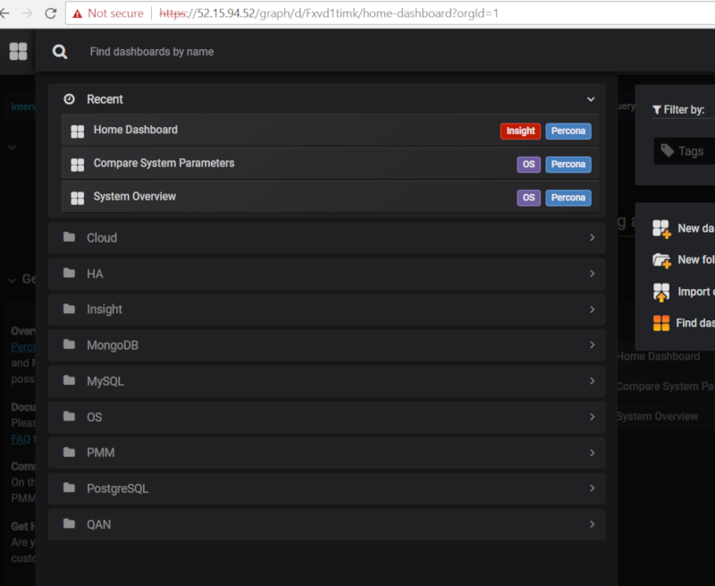
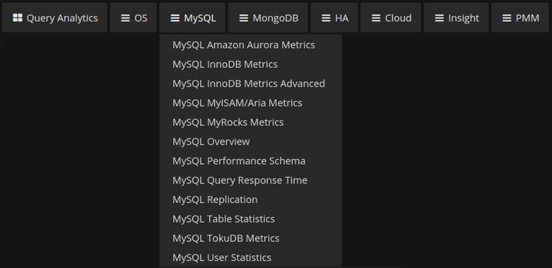
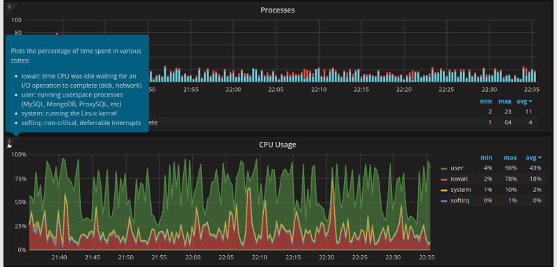
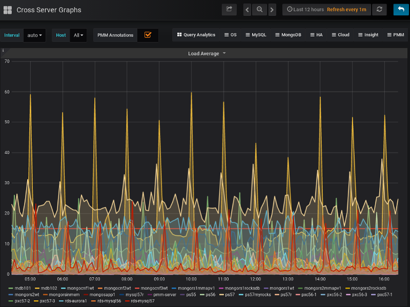
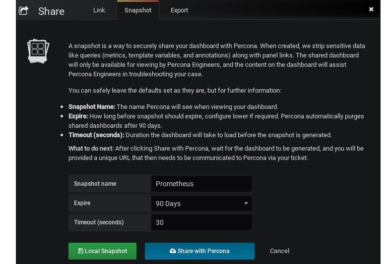

.. _pmm.metrics-monitor:

|metrics-monitor|
********************************************************************************

The |metrics-monitor| tool provides a |metrics-monitor.what-is|. Time-based
graphs are separated into dashboards by themes: some are related to |mysql| or
|mongodb|, others provide general system metrics.

.. rubric:: |section.toc|

.. contents::
   :local:

.. seealso::

   How to |qan.what-is|
      :ref:`pmm.qan`

.. _pmm.metrics-monitor.signing-in:

:ref:`Signing in <pmm.metrics-monitor.signing-in>`
================================================================================

The credentials used to sign in to |grafana| depend on the options that
you specified when :ref:`starting PMM Server <deploy-pmm.server.installing>`:

* If you do not specify either :option:`SERVER_USER` or
  :option:`SERVER_PASSWORD`, you will log in
  as an anonymous user.  You can change to a different existing |grafana| user.

* If you specify both |opt.server-user| and |opt.server-password|,
  then these credentials will be used to sign in to |grafana|.

* If you specify only |opt.server-password|, a single user (``pmm``) will be
  used to sign in to all components (including |qan|, |prometheus|, |grafana|,
  etc.).  You will not be able to change to a different |grafana| user.

* If you specify only |opt.server-user|, this parameter will be ignored.

.. warning::

   The value of the |opt.server-user| parameter may not contain the **#** or
   **:** symbols.

To access the dashboards, provide default user credentials:

* User: ``admin``
* Password: ``admin``

On the Home screen, select a dashboard from the list of available |percona|
dashboards.  For example, the following image shows the |dbd.mysql-overview|
dashboard:

.. image:: .res/graphics/png/metrics-monitor.png

.. _pmm.metrics-monitor.dashboard.opening:

:ref:`Opening a Dashboard <pmm.metrics-monitor.dashboard.opening>`
================================================================================	   

The default |pmm| installation provides more than thirty dashboards. To make it
easier to reach a specific dashboard, the system offers two tools. The
|gui.dashboard-dropdown| is a button in the header of any |pmm| page. It lists
all dashboards, organized into folders. Right sub-panel allows to rearrange
things, creating new folders and dragging dashboards into them. Also a text box
on the top allows to search the required dashboard by typing.

   With |gui.dashboard-dropdown|, search the alphabetical list for any
   dashboard.

You can also use a navigation menu which groups dashboards by
application. Click the required group and then select the dashboard
that matches your choice.

.. _table.pmm.metrics-monitor.navigation-menu-group:

=============  ==============================================================
Group          Dashboards for monitoring ...
=============  ==============================================================   
|qan.name|     |qan| component (see :ref:`pmm.qan`)
OS             The operating system status
|mysql|        |mysql| and |amazon-aurora|
|mongodb|      State of |mongodb| hosts
HA             High availability
Cloud          |amazon-rds| and |amazon-aurora|
Insight        Summary, cross-server and |prometheus|
|pmm|          Server settings
=============  ==============================================================

   |mysql| group selected in the navigation menu

.. seealso::

   |percona| support for high availability
      https://www.percona.com/services/support/mysql-ha-cluster-support

   List of |metrics-monitor| dashboards
      See section :ref:`pmm.dashboard.list`

.. .. _pmm.metrics-monitor.dashboard.enabling:

.. Enabling dashboards
.. ================================================================================

.. In |pmm|, you can disable the dashboards that you do not require. They will
.. disappear from the |gui.dashboard-dropdown| list. You can enable them back again.

.. _pmm.metrics-monitor.graph-description:

:ref:`Viewing More Information about a Graph <pmm.metrics-monitor.graph-description>`
=====================================================================================

Each graph has a descriptions to display more information about the monitored
data without cluttering the interface.

These are on-demand descriptions in the tooltip format that you can find by
hovering the mouse pointer over the |gui.more-information| icon at the top left
corner of a graph. When you move the mouse pointer away from the |gui.more-inf|
button the description disappears.

   Graph descriptions provide more information about a graph without claiming
   any space in the interface.

.. _pmm.metrics-monitor.metric.zooming-in:

:ref:`Zooming in on a single metric <pmm.metrics-monitor.metric.zooming-in>`
================================================================================
     
On dashboards with multiple metrics, it is hard to see how the value of a single
metric changes over time. Use the context menu to zoom in on the selected metric
so that it temporarily occupies the whole dashboard space.

Click the title of the metric that you are interested in and select the
|gui.view| option from the context menu that opens.

   The context menu of a metric

The selected metric opens to occupy the whole dashboard space. You may now set
another time range using the time and date range selector at the top of the
|metrics-monitor| page and analyze the metric data further.

.. note::

   If you are zooming in on a metric which is represented as a single number on
   its dashboard, you cannot change the level of detail by selecting a range on
   the graph itself.

To return to the dashboard, click the |gui.back-to-dashboard| button next to the time range selector.

   The |gui.back-to-dashboard| button returns to the dashboard; this button
   appears when you are zooming in on one metric.

.. seealso::

   More information about the time range selector
      :ref:`Selecting time or date range <pmm.qan.time-date-range.selecting>`

.. _pmm.metrics-monitor.annotation.application-event.marking:

:ref:`Marking Important Events with Annotations <pmm.metrics-monitor.annotation.application-event.marking>`
===========================================================================================================

Some events in your application may impact your database. Annotations
visualize these events on each dashboard of |pmm-server|.

.. figure:: .res/graphics/png/pmm-server.mysql-overview.mysql-client-thread-activity.1.png

   An annotation appears as a vertical line which crosses a graph at a
   specific point. Its text explains which event occurred at that time.

To create a new annotation, run |pmm-admin.annotate| command on
|pmm-client| passing it text which explains what event the new
annotation should represent. Use the |opt.tags| option to supply one
or more tags separated by a comma.

You may toggle displaying annotations on metric graphs by using the
|gui.pmm-annotations| checkbox.

.. figure:: .res/graphics/png/pmm-server.pmm-annotations.png

   Remove the checkmark from the |gui.pmm-annotations| checkbox to
   hide annotations from all dashboards.

.. seealso::

   Adding annotations
     :ref:`pmm-admin.annotate`

   |grafana| Documentation:
      - `Annotations <http://docs.grafana.org/reference/annotations/#annotations>`_
      - `Using annotations in queries <http://docs.grafana.org/reference/annotations/#querying-other-data-sources>`_
   
.. _pmm.metrics-monitor.dashboard.snapshot.creating:

:ref:`Creating Snapshots of a Dashboard <pmm.metrics-monitor.dashboard.snapshot.creating>`
==========================================================================================

A snapshot is a way to securely share your dashboard with |percona|. When
created, we strip sensitive data like queries (metrics, template variables, and
annotations) along with panel links. The shared dashboard will only be available
for viewing by |percona| engineers. The content on the dashboard will assist
|percona| engineers in troubleshooting your case.

You can safely leave the defaults set as they are, but for further information:

Snapshot name
   The name |percona| will see when viewing your dashboard.

Expire 
   How long before snapshot should expire, configure lower if
   required. |percona| automatically purges shared dashboards after 90 days.

Timeout (seconds)
   Duration the dashboard will take to load before the snapshot is
   generated.

First, open the dashboard that you would like to share. Click the
|gui.share| button at the top of the page and select the
|gui.snapshot| command. Finally, click the
|gui.share-with-percona-team| button.

   The |gui.snapshot| tab in the |gui.share| dialog window.

.. rubric:: What to do next

After clicking |gui.share-with-percona-team|, wait for the dashboard to be generated,
and you will be provided a unique URL that then needs to be communicated to
|percona| via the ticket.

.. include:: .res/replace.txt
