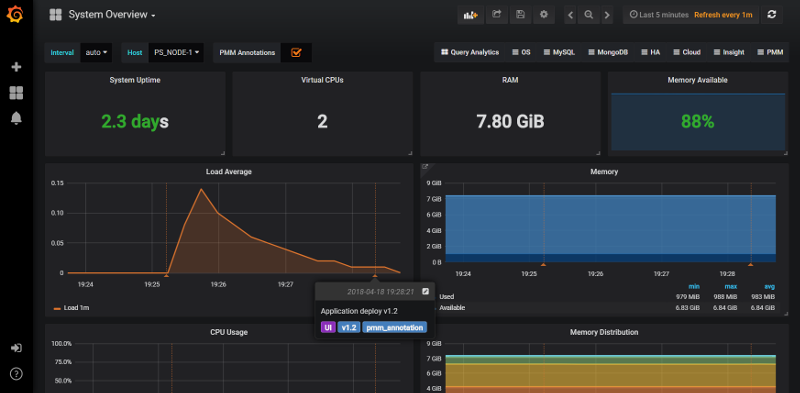
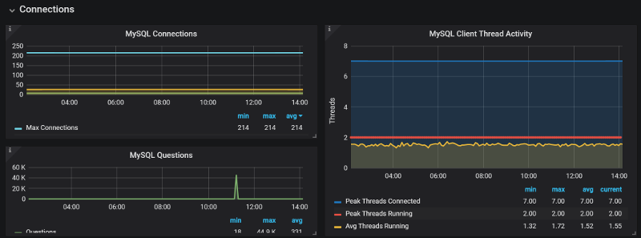
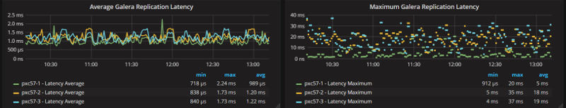

.. _1.10.0:

================================================================================
|pmm.name| |release|
================================================================================

:Date: April 20, 2018

|percona| announces the release of |pmm.name| |release|.  |info.pmm.about|
We focused mainly on two features in |release|, but there are also several
notable improvements worth highlighting:

- `Annotations`_ - Record and display application events as Annotations using
  |pmm-admin.annotate|
- `Grafana 5.0`_ - Improved visualization effects
- `Switching between Dashboards`_ - Now switching dashboards
- `New PXC Galera Replication Latency Graphs`_ - Added Galera Replication
  Latency graphs on PXC
  Overview dashboard with consistent colours

The `Issues in this release`_ includes 4 new features & improvements, and 8
bugs fixed.

Annotations
================================================================================

Application events are one of the contributors to changes in database
performance characteristics, and in this release |pmm| now supports receiving
events and displaying them as Annotations using the new command
|pmm-admin.annotate|. A recent |percona| survey reveals that database and DevOps
engineers highly value visibility into the application layer.  By displaying
application events on top of your |pmm| graphs, engineers can now correlate
application events to database events (common cases: application deploys,
outages, and upgrades) against Database and System level metric changes.

Usage
--------------------------------------------------------------------------------

For example, you have an application deployment that just completed to version
1.2, and it affects the UI only, so you want to set tags for the version and
interface impacted:

.. code-block:: bash

   $ pmm-admin annotate "Application deploy v1.2" --tags "UI, v1.2"

Using the optional |opt.tags| option allows you to filter which Annotations are
displayed on the dashboard via a toggle option. Read more about Annotations
utilization in the
`PMM documentation
<https://www.percona.com/doc/percona-monitoring-and-management/using.html#using-annotations-to-mark-important-application-events>`_.

|grafana| 5.0
================================================================================

We're extremely pleased to see |grafana| ship 5.0 and we were fortunate enough to
be at Grafanacon, including |percona|'s very own `@Dimitri Vanoverbeke <https://www.percona.com/blog/author/dimitri-vanoverbeke/>`_ (Dim0) who presented What we Learned Integrating
Grafana and Prometheus!

.. raw:: html

    <iframe width="560" height="315" src="https://www.youtube.com/embed/Mno1nYBmlIE" frameborder="0" allow="autoplay; encrypted-media" allowfullscreen></iframe>

    <iframe width="560" height="315" src="https://www.youtube.com/embed/nYCE24DV8xA" frameborder="0" allow="autoplay; encrypted-media" allowfullscreen></iframe>

Included in |grafana| 5.0 are a number of dramatic improvements, which in future
|pmm| releases we plan to extend our usage of each feature, and the one we like
best is the virtually unlimited way you can size and shape graphs.  No longer
are you bound by panel constraints to keep all objects at the same fixed height!
This improvement indirectly addresses the visualization error in |pmm-server|
where some graphs would appear to be on two lines and ended up wasting screen
space.

Switching Between Dashboards
================================================================================

|pmm| now allows you to navigate between dashboards while maintaining the same
host under observation, so that for example you can start on |dbd.mysql-overview|
looking at host serverA, switch to MySQL InnoDB Advanced dashboard and continue
looking at serverA, thus saving you a few clicks in the interface.

New PXC Galera Replication Latency Graphs
================================================================================

We have added new PXC Replication Latency graphs on our *PXC Galera Cluster
Overview* dashboard so that you can compare latency across all members in a
cluster in one view.

Issues in this release
================================================================================

New Features and Improvements
--------------------------------------------------------------------------------

- :pmmbug:`2293`: Add the *Galera Replication Latency* graph to the
  *PXC/Galera Cluster overview* dashboard.
- :pmmbug:`2295`: Improve colour selection on the *PXC/Galera Cluster Overview*
  dashboard
- :pmmbug:`2330`: Application Annotations
- :pmmbug:`2332`: Grafana 5 update

Bug fixes
--------------------------------------------------------------------------------

- :pmmbug:`2311`: Fix mis-alignment in Query Analytics Metrics table
- :pmmbug:`2341`: Typo in text on password page of OVF
- :pmmbug:`2359`: Trim leading and trailing whitespaces for all fields on
  AWS/OVF Installation wizard
- :pmmbug:`2360`: Include a "What's new?" link for Update widget
- :pmmbug:`2346`: Arithmetic on InnoDB AHI Graphs are invalid
- :pmmbug:`2364`: QPS are wrong in QAN
- :pmmbug:`2388`: Query Analytics does not render fingerprint section in some
  cases
- :pmmbug:`2371`: Pass host when switching between Dashboards

.. seealso::

   How to get |pmm|

      `Deploying Percona Monitoring and Management
      <https://www.percona.com/doc/percona-monitoring-and-management/deploy/index.html>`_

.. |release| replace:: 1.10.0
		       
.. include:: ../.res/replace.txt
