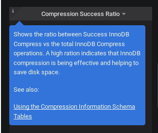

.. _1.17.2:

================================================================================
Percona Monitoring and Management 1.17.2
================================================================================

:Date: October 24, 2019

*PMM* (`Percona Monitoring and Management <https://www.percona.com/doc/percona-monitoring-and-management/index.html>`_) is a free and open-source platform for managing and monitoring |MySQL|, |MongoDB|, and |postgresql| performance. You can run *PMM* in your own environment for maximum security and reliability. It provides thorough time-based analysis for |MySQL|, |MongoDB|, and |postgresql| servers to ensure that your data works as efficiently as possible.

One of the improvements in this release is a substantial increase in available storage space for the AMI images, which allows now to reserve space for about 10 instances with 30 days retention. 

.. note:: The size is increased for new installations only. The size of any existing installations can be increased `in the usual way <https://www.percona.com/doc/percona-monitoring-and-management/deploy/server/ami.html#run-server-ami-ebs-volume-resizing>`_.

Another improvement is related to the Tooltips for the MySQL InnoDB Compression dashboard, which were updated by providing a description of what the graphs display, along with links to related documentation resources:

Besides these improvements, PMM 1.17.2 release provides fixes for a large number of vulnerabilities. Three fixed vulnerabilities have the Prototype Pollution type: CVE-2019-10747 (in set-value package), CVE-2019-10746 (in mixin-deep), and CVE-2019-10744 (inlodash). We have also fixed WS-2017-3737 (shelljs vulnerable to Command injection), CVE-2019-15043 (Grafana incorrect access control vulnerability), CVE-2019-8331 (possibility of the cross-site scripting in Bootstrap), WS-2019-0100 (fstream library vulnerable to Arbitrary File Overwrite), and CVE-2018-20834 (Improper Link Resolution Before File Access vulnerability in node-tar).

Also, PMM 1.17.2 is now based on Grafana 5.4.5.

In release 1.17.2 we have included 4 improvements and fixed 23 bugs:

Improvements
================================================================================

* :pmmbug:`3648`: RHEL 8 PMM Client support
* :pmmbug:`4311`: Debian 10 Buster PMM Client support
* :pmmbug:`2313`: Configure AMI images for a 100GB disk instead of a 16GB one
* :pmmbug:`3500`: Update tooltips for the MySQL InnoDB Compression dashboard

Fixed Bugs
================================================================================

* :pmmbug:`3089`: Problem with RDS after docker way upgrade
* :pmmbug:`511`: Group all metrics on MongoDB Cluster Summary dashboard by the 'replset' label
* :pmmbug:`2558`: Wrong time format in MySQL Table Statistics dashboard
* :pmmbug:`3251`: SystemOverview dashboard had Min Space Available zero with squashfs mounted
* :pmmbug:`3256`: Not possible to modify the list of collected metrics
* :pmmbug:`3389`: Link on "Advanced Memory Details" was leading to the same dashboard
* :pmmbug:`3497`: Network chart "bits in /out" labels were in MiB, which is an abbreviation for bytes and not bits.
* :pmmbug:`3515`: PostgreSQL Overview dashboard Total Stats are empty if a database is selected
* :pmmbug:`3655`: Typos on ProxySQL Dashboard
* :pmmbug:`3748`: Gaps in two MySQL Overview graphs
* :pmmbug:`3991`: Active Connections chart had wrong values on the  PostgreSQL Overview dashboard
* :pmmbug:`4146`: "Error on ingesting out-of-order samples" in Prometheus log when hostname used by PMM dashboards had a dash or a dot symbol
* :pmmbug:`4596`: Grafana vulnerability allowed partial access to theGrafana HTTP API without being authenticated, making it possible to run a DoS attack against the server(CVE-2019-15043)
* :pmmbug:`4604`: set-value package vulnerable to Prototype Pollution (CVE-2019-10747)
* :pmmbug:`4603`: mixin-deep vulnerable to Prototype Pollution (CVE-2019-10746)
* :pmmbug:`4337`: lodash vulnerable to Prototype Pollution (CVE-2019-10744)
* :pmmbug:`4253`: shelljs vulnerable to Command injection (WS-2017-3737)
* :pmmbug:`4212`: fstream library vulnerable to Arbitrary File Overwrite (WS-2019-0100)
* :pmmbug:`3976`: Improper Link Resolution Before File Access vulnerability in node-tar package (CVE-2018-20834)
* :pmmbug:`3549`: Possibility of the cross-site scripting in Bootstrap (CVE-2019-8331)
* :pmmbug:`4375`: Trying to export metrics from a containerized standalone MongoDB caused the exporter runtime error
* :pmmbug:`4370`: pmm-client didn't consider disabled mysql:metrics options and still tried to query the database
* :pmmbug:`4367`: PostgreSQL Overview dashboard was showing the wrong PostgreSQL version

Help us improve our software quality by reporting any Percona Monitoring and Management bugs you encounter using `our bug tracking system <https://jira.percona.com/secure/Dashboard.jspa>`_.

How to get PMM Server
================================================================================

PMM is available for installation using three methods:

* `Docker Hub <https://hub.docker.com/r/percona/pmm-server/>`_ – ``docker pull percona/pmm-server`` – `Documentation <https://www.percona.com/doc/percona-monitoring-and-management/deploy/server/docker.html>`_
* `AWS Marketplace <https://aws.amazon.com/marketplace/pp/B077J7FYGX>`_ – `Documentation <https://www.percona.com/doc/percona-monitoring-and-management/deploy/server/ami.html>`_
* `Open Virtualization Format (OVF) <https://www.percona.com/downloads/pmm/>`_ – `Documentation <https://www.percona.com/doc/percona-monitoring-and-management/deploy/server/virtual-appliance.html>`_

.. include:: .res/replace.txt
