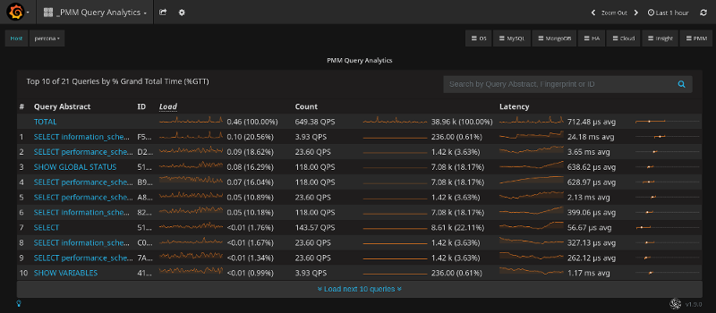
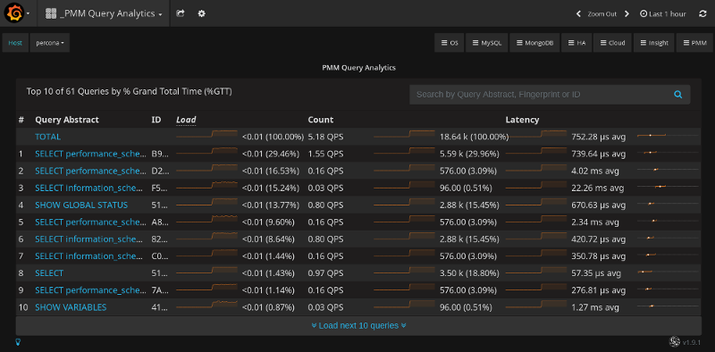

.. _1.9.1:

================================================================================
|pmm.name| |release|
================================================================================

:Date: April 12, 2018

|tip.bug-fix-release| |pmm.name| |prev-release|. This release
effectively solves the problem in |qan| when the |gui.count| column
actually displayed the number of queries per minute, not per second,
as the user would expect. The following screenshot demonstrates the
problem. The value of the |gui.count| column for the **TOTAL** row is
**649.38** *QPS* (queries per second). The total number **38.96
k** (38960) is only sixty times greater than the reported value of
QPS. Thus, queries were counted for each minute within the selected
time range of :option:`Last 1 hour`.

**Query Analytics in PMM version** |prev-release|.

The corrected version of |qan| in |pmm| |release| shows that queries
are now counted per second. The total number of queries is **60** *
**60** greater than the value of *QPS*, as should be expected for the
chosen time range.

**Query Analytics in PMM version** |release|.

Bug fixes
================================================================================

- :pmmbug:`2364`: QPS are wrong in |qan|
  
.. |release| replace:: 1.9.1
.. |prev-release| replace:: 1.9.0
		       
.. include:: ../.res/replace.txt

