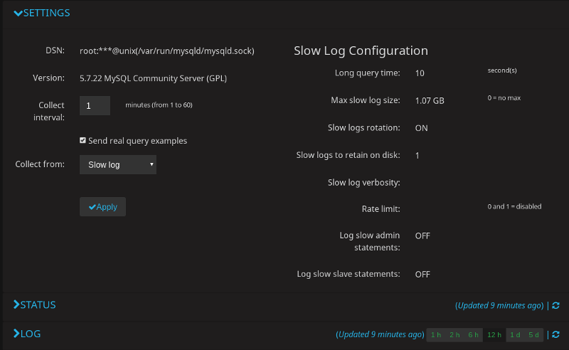

:orphan: true

.. _use-case.mysql-slow-log-rotation:

Use |logrotate| instead of the slow log rotation feature to manage the MySQL Slow Log
**************************************************************************************

By default, |pmm| manages the slow log for the added |mysql| monitoring service
on the computer where |pmm-client| is installed. This example demonstrates how
to substitute |logrotate| for this default behavior.

.. contents::
   :local:
   :depth: 1

.. _use-case.mysql-slow-log-rotation.disable-default:

:ref:`Disable the default behavior of the slow log rotation <use-case.mysql-slow-log-rotation.disable-default>`
===============================================================================================================

The first step is to disable the default slow log rotation when adding the
|mysql| monitoring service.

For this, set the |opt.slow-log-rotation| to *false*.

|tip.run-this.root|

.. include:: .res/code/pmm-admin.add.mysql.slow-log-rotation.txt

On |pmm-server|, you can check the value of the
|gui.slow-logs-rotation| field on the |qan| Settings page. It should
be *OFF*.

   See the |gui.slow-logs-rotation| field on the |qan| Settings page
   to determine whether or not the slow log rotation feature is
   disabled.

On |pmm-client| (the host where you ran |pmm-admin.add| command to add
the |mysql| monitoring service), use the |pmm-admin.list| command to
determine if the |slow-log| rotation is disabled.

.. include:: .res/code/pmm-admin.list.output.slow-log-rotation.txt
   
.. seealso::

   More information about monitoring |mysql| in |qan.name|
      :ref:`pmm-admin.add-mysql-queries`

   |qan| settings page
      :ref:`pmm.qan.configuring.settings-tab`

.. important::

   Disabling the slow log rotation feature for an already added |mysql|
   monitoring service is not supported.

   If you already have the |mysql| monitoring service where the slow log
   rotation was not disabled explicitly using the |opt.slow-log-rotation|
   option, remove this monitoring service.

   .. include:: .res/code/pmm-admin.rm.mysql.txt

   Add it again setting the |opt.slow-log-rotation| to *false*.

   .. include:: .res/code/pmm-admin.add.mysql.slow-log-rotation.txt

Set up |logrotate| to manage the slow log rotation
================================================================================

|logrotate| is a popular utility for managing log files. You can install it
using the package manager (apt or yum, for example) of your |linux|
distribution.

After you add a |mysql| with |opt.slow-log-rotation| set to **false**, you can
run |logrotate| as follows.

|tip.run-this.root|

.. include:: .res/code/logrotate.config-file.txt

*CONFIG_FILE* is a placeholder for a configuration file that you should supply to
|logrotate| as a mandatory parameter. To use |logrotate| to manage the
|slow-log| for |pmm|, you may supply a file with the following contents.

This is a basic example of |logrotate| for the |mysql| slow logs at 1G for 30
copies (30GB).

.. include:: .res/code/logrotate.slow-log.txt

.. important::

   In the given example, make sure to set the correct path to the
   |mysql-slow.log| file.

   When running |logrotate| with this example, the effective |mysql| user must
   have the following privileges:
   
   - |opt.reload| privilege in |mysql| so that it can run |sql.flush-slow-logs|
   - |opt.super| privilege so that it can run |sql.set-global|
     |opt.long-query-time|
   
For more information about how to use |logrotate|, refer to its documentation
installed along with the program. 

.. admonition:: |related-information|

   |mysql| Documentation:

      - |sql.flush-slow-logs|: https://dev.mysql.com/doc/refman/8.0/en/flush.html#flush-slow-logs
      - |opt.reload|: https://dev.mysql.com/doc/refman/8.0/en/privileges-provided.html#priv_reload

   |logrotate| on |github|

      https://github.com/logrotate/logrotate

.. include:: .res/replace.txt
