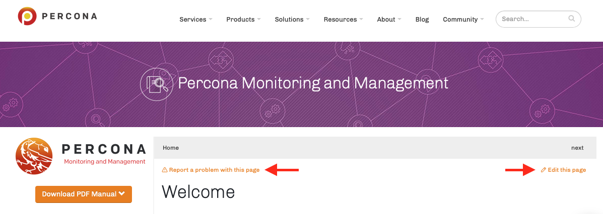

# Percona Monitoring and Management (PMM) Documentation

[Percona Monitoring and Management (PMM)](https://www.percona.com/software/database-tools/percona-monitoring-and-management) is a free, open-source, database monitoring solution.

This repo holds the source files for the PMM technical documentation published at <https://www.percona.com/doc/percona-monitoring-and-management/>.

To contribute to the documentation, you can:

- **report a general problem** -- open an [Issue in this repo](https://github.com/percona/pmm-doc/issues/new?title=PMM%20doc%20issue&body=Please%20describe%20the%20issue%20here) or use [Percona's Jira](https://jira.percona.com/browse/PMM).

- **report a problem on a page** -- on every page of our documentation is a link, *Report a problem with this page*, a shortcut to this repo's *Issues*. (The link pre-fills the issue's subject so we know what page you're on.) Click, explain, and we'll fix it.

- **fix a problem yourself** -- there is also an *Edit this page* link that will bring you to this repo to edit the Markdown source file for that page. Make your changes (you'll have to fork the repo unless you're Percona staff) and submit a PR which we'll review and adjust where necessary before merging and publishing. If the changes are more than a few lines, you might want to build the website locally to see how it looks in context. To do that, read on.

> 
>
> *Links on the [PMM Technical Documentation home page](https://www.percona.com/doc/percona-monitoring-and-management/)*

## Introduction

We use [MkDocs](https://www.mkdocs.org/) to convert [Markdown](https://daringfireball.net/projects/markdown/) files into a static HTML website (or [PDF](#pdf)). This process is called [*building the documentation*](#building-the-documentation).

The documentation is in the `docs` directory. To know about other files in this repo, jump to [Directories and files](#directories-and-files).

We use different branches for PMM versions:

- `main` is for PMM 2 (latest)
- `1.x` is for PMM 1

Before you start, you'll need to know:

- what [git](https://git-scm.com), [Python 3](https://www.python.org/downloads/) and [Docker](https://docs.docker.com/get-docker/) are;
- what [Markdown](https://daringfireball.net/projects/markdown/) is and how to write it;
- how to install and run those things on the command line.

(If you don't, open an [Issue](https://github.com/percona/pmm-doc/issues/new?title=PMM%20doc%20issue&body=Please%20describe%20the%20issue%20here) instead.)

## Building the documentation

1. Clone this repository
2. Change directory to `pmm-doc`
3. Either:
	- [Use Docker](#use-docker)
	- [Install MkDocs and dependencies](#install-mkdocs-and-dependencies)

### Use Docker

1. [Get Docker](https://docs.docker.com/get-docker/)

2. Use [our Docker image](https://hub.docker.com/repository/docker/perconalab/pmm-doc-md) to *build the documentation* (create a static web site in the `site` subdirectory):

		docker run --rm -v $(pwd):/docs perconalab/pmm-doc-md

3. Find the `site` directory, open `index.html` in a browser to view the first page of documentation.

We use a custom theme for our CMS so documentation built this way is unstyled (there's no outer `<html>` tag, the `<head>` tag is ignored, and there's some custom stuff for navigation and [version switching](#version-switching)).

A themed version looks much better and is just as easy. Run this instead:

	docker run --rm -v $(pwd):/docs perconalab/pmm-doc-md mkdocs build -t material

If you'd like to see how things look as you edit, MkDocs has a built-in server for live previewing. After (or instead of) building, run:

	docker run --rm -v $(pwd):/docs -p 8000:8000 perconalab/pmm-doc-md mkdocs serve -t material --dev-addr=0.0.0.0:8000

and point your browser to [http://localhost:8000](http://localhost:8000).

### Install MkDocs and dependencies

1. Install [Python 3](https://www.python.org/downloads/)

2. Install MkDocs and required extensions:

        pip install -r requirements.txt

3. Build the site:

		mkdocs build -t material

4. Open `site/index.html`

Or run the built-in web server:

    mkdocs serve -t material

And view the site at <http://localhost:8000>

## PDF

To generate a PDF version of the documentation:

with Docker:

	docker run --rm -v $(pwd):/docs perconalab/pmm-doc-md -e ENABLE_PDF_EXPORT=1 mkdocs build -t material

without:

	ENABLE_PDF_EXPORT=1 mkdocs build -t material

You'll find the PDF in `site/_pdf`.

## Directories and files

- `bin` (master only):
    - `glossary.tsv`: Export from a spreadsheet of glossary entries
    - `make_glossary.pl`: Script to write Markdown page from `glossary.tsv`
    - `grafana-dashboards-descriptions.py`: Script to extract dashboard descriptions from <https://github.com/percona/grafana-dashboards/>
- `docs`: Base directory for MkDocs
- `resources` (master only):
    - `*.puml`: [PlantUML](https://plantuml.com) diagrams (see comments inside each)
- `templates`: Stylesheet for PDF output (used by [mkdocs-with-pdf](https://github.com/orzih/mkdocs-with-pdf) extension)
- `theme`: MkDocs templates that produce HTML output for percona.com hosting
- `extra.yml`: Miscellaneous values and website links (some are also in the `extra` section of `mkdocs.yml`)
- `icon.yml`: A convenience list of icon variables. Use them in Markdown with `{{ icon.NAME }}` (master only)
- `mkdocs.yml`: Main configuration file for building HTML
- `release.yml`: The PMM release and version number
- `requirements.txt`: Python package dependencies

## Version switching

We are trialing the use of [mike](https://github.com/jimporter/mike) to build different versions.

With this, MkDocs is run locally and the HTML committed (and optionally pushed) to the `publish` branch. The whole branch is then copied (by us, naturally) to our web server.

(This is why the PMM1 docs (previously in <https://github.com/percona/pmm>) have been migrated from Sphinx/rst to Markdown/md and moved to the `1.x` branch of this repository.)

## License

