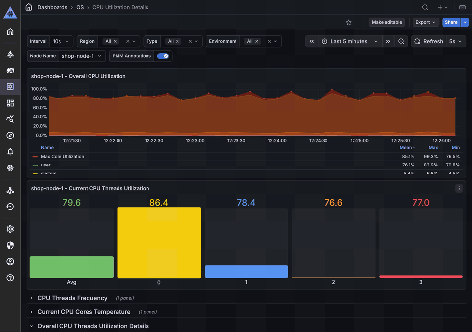
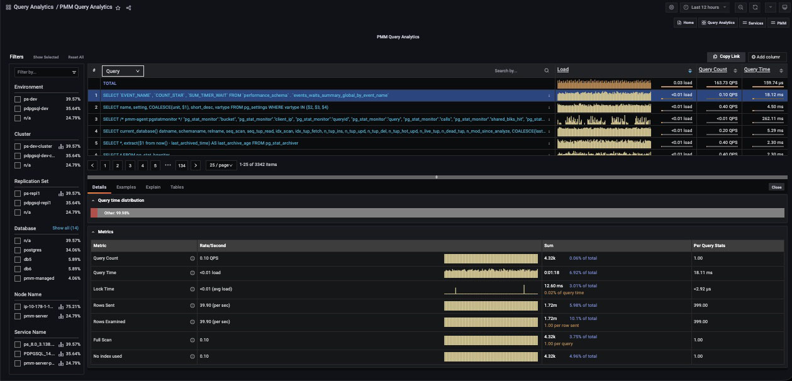
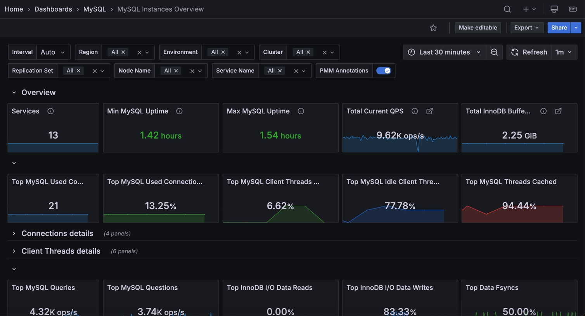
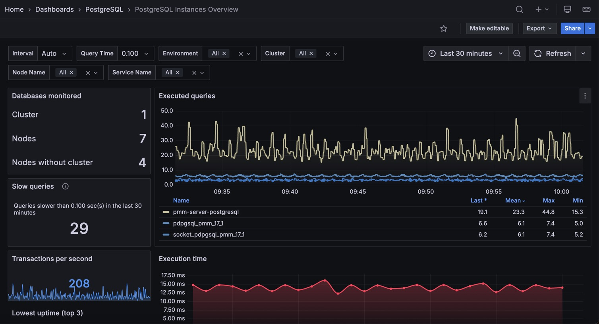
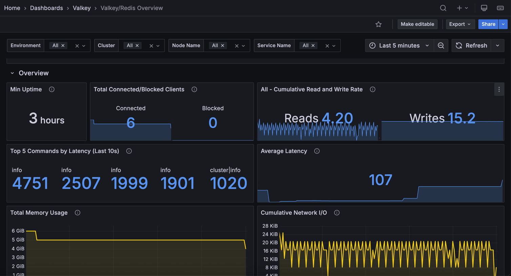
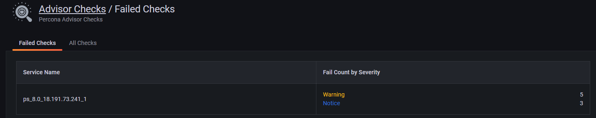
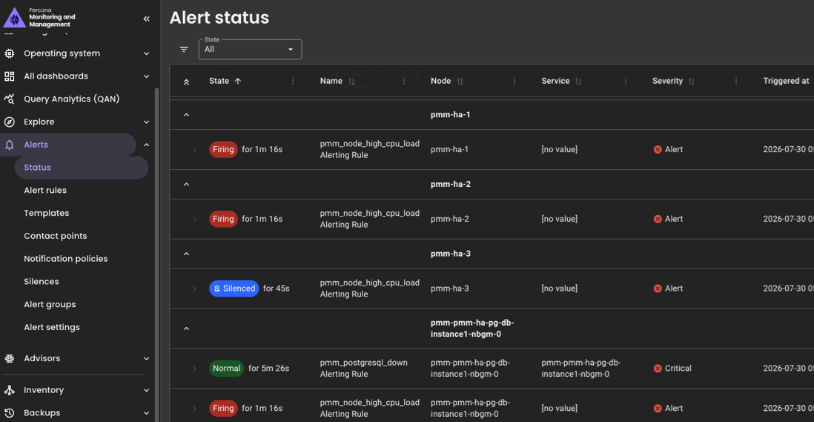
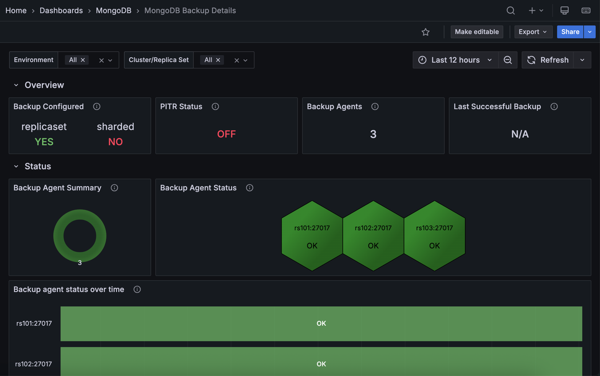

<p align="center">
  <picture>
    <source media="(prefers-color-scheme: dark)" srcset=".github/readme/pmm-logo-dark.png">
    
  </picture>
</p>

<h3 align="center">Find the slow query, not just the slow server.</h3>

<p align="center">
  Open source monitoring and query analytics for MySQL, PostgreSQL, MongoDB and Valkey/Redis.<br>
  Self-hosted, and every feature is open source: there is no paid edition.
</p>

<p align="center">
  <a href="https://github.com/percona/pmm/releases/latest"></a>
  <a href="https://hub.docker.com/r/percona/pmm-server"></a>
  <a href="#license"></a>
  <a href="https://forums.percona.com/c/percona-monitoring-and-management-pmm"></a>
  <a href="https://github.com/percona/pmm"></a>
</p>

<p align="center">
  <b><a href="https://pmmdemo.percona.com/">▶ Try the live demo</a></b> ·
  <a href="#quickstart">Quickstart</a> ·
  <a href="https://docs.percona.com/percona-monitoring-and-management/3/index.html">Docs</a> ·
  <a href="https://forums.percona.com/c/percona-monitoring-and-management-pmm">Forum</a>
</p>



<p align="center"><sub>From a CPU spike on the node to the PostgreSQL query behind it.</sub></p>

<p align="center">
  <a href="https://docs.percona.com/percona-monitoring-and-management/3/install-pmm/install-pmm-client/connect-database/mysql/mysql.html"></a>
  <a href="https://docs.percona.com/percona-monitoring-and-management/3/install-pmm/install-pmm-client/connect-database/mysql/mysql.html"></a>
  <a href="https://docs.percona.com/percona-monitoring-and-management/3/install-pmm/install-pmm-client/connect-database/mysql/mysql.html"></a>
  <a href="https://docs.percona.com/percona-monitoring-and-management/3/install-pmm/install-pmm-client/connect-database/postgresql.html"></a>
  <a href="https://docs.percona.com/percona-monitoring-and-management/3/install-pmm/install-pmm-client/connect-database/mongodb.html"></a>
  <a href="https://docs.percona.com/percona-monitoring-and-management/3/install-pmm/install-pmm-client/connect-database/valkey-redis.html"></a>
  <a href="https://docs.percona.com/percona-monitoring-and-management/3/install-pmm/install-pmm-client/connect-database/valkey-redis.html"></a>
  <a href="https://docs.percona.com/percona-monitoring-and-management/3/install-pmm/install-pmm-client/connect-database/proxysql.html"></a>
  <a href="https://docs.percona.com/percona-monitoring-and-management/3/install-pmm/install-pmm-client/connect-database/haproxy.html"></a>
  <a href="https://docs.percona.com/percona-monitoring-and-management/3/install-pmm/install-pmm-client/connect-database/aws.html"></a>
  <a href="https://docs.percona.com/percona-monitoring-and-management/3/install-pmm/install-pmm-client/connect-database/azure.html"></a>
  <a href="https://docs.percona.com/percona-monitoring-and-management/3/install-pmm/install-pmm-client/connect-database/google.html"></a>
</p>

<p align="center"><sub>Supported versions follow the <a href="https://www.percona.com/services/policies/percona-services-lifecycle-policy/">Percona lifecycle policy</a>.</sub></p>

## Quickstart

**1. Start PMM Server** (needs Docker; the script installs it if it's missing)

```sh
curl -fsSL https://www.percona.com/get/pmm | /bin/bash
```

Open `https://<server-ip>` and log in as `admin` / `admin`, then set a new password.

**2. Connect a database** (on the database host; Debian/Ubuntu shown)

```sh
wget https://repo.percona.com/apt/percona-release_latest.generic_all.deb
sudo dpkg -i percona-release_latest.generic_all.deb
sudo percona-release enable pmm3-client release
sudo apt update && sudo apt install -y pmm-client

sudo pmm-admin config --server-insecure-tls --server-url=https://admin:<password>@<server-ip>:443
sudo pmm-admin add mysql --username=pmm --password=<pass> --query-source=perfschema
```

This assumes a fresh server with its self-signed certificate. For production, use a trusted certificate (drop `--server-insecure-tls`) and register with a [service account token](https://docs.percona.com/percona-monitoring-and-management/3/api/authentication.html) instead of the admin password.

Open **Query Analytics** and your queries appear within a minute. The `pmm` database user needs [these privileges](https://docs.percona.com/percona-monitoring-and-management/3/install-pmm/install-pmm-client/connect-database/mysql/mysql.html). Guides for RHEL, Docker, [PostgreSQL, MongoDB, Valkey/Redis, Amazon RDS/Aurora, Azure and Google Cloud](https://docs.percona.com/percona-monitoring-and-management/3/install-pmm/install-pmm-client/connect-database/index.html) are in the [full quickstart](https://docs.percona.com/percona-monitoring-and-management/3/quickstart/quickstart.html).

<sub>Other ways to run PMM Server: [Docker](https://docs.percona.com/percona-monitoring-and-management/3/install-pmm/install-pmm-server/deployment-options/docker/index.html) · [Podman](https://docs.percona.com/percona-monitoring-and-management/3/install-pmm/install-pmm-server/deployment-options/podman/index.html) · [Kubernetes (Helm)](https://docs.percona.com/percona-monitoring-and-management/3/install-pmm/install-pmm-server/deployment-options/helm/index.html) · [AWS Marketplace](https://docs.percona.com/percona-monitoring-and-management/3/install-pmm/install-pmm-server/deployment-options/aws/deploy_aws.html)</sub>

## Product tour

<details open>
<summary><b>Query Analytics: find the queries that cost the most</b></summary>

Every query ranked by load, with examples, EXPLAIN plans and table stats. See the [Query Analytics docs](https://docs.percona.com/percona-monitoring-and-management/3/use/qan/index.html).



</details>

<details>
<summary><b>Dashboards for every layer: node → instance → query</b></summary>

For MySQL, PostgreSQL, MongoDB, Valkey/Redis, ProxySQL and HAProxy. Built on Grafana.

<table>
  <tr>
    <th>MySQL</th>
    <th>PostgreSQL</th>
    <th>Valkey / Redis</th>
  </tr>
  <tr>
    <td></td>
    <td></td>
    <td></td>
  </tr>
</table>

</details>

<details>
<summary><b>Advisors: automatic checks for security, configuration and performance</b></summary>



</details>

<details>
<summary><b>Alerting: ready-made templates, any Grafana contact point</b></summary>



</details>

<details>
<summary><b>Backup and restore: MongoDB with point-in-time recovery, MySQL in Technical Preview</b></summary>



</details>

**Runs where your databases run**: bare metal, VMs, Kubernetes, Amazon RDS/Aurora, Azure and Google Cloud.

## Why PMM?

|                                          | PMM               | Prometheus + Grafana, self-built | Hosted DB monitoring |
|------------------------------------------|-------------------|----------------------------------|----------------------|
| Per-query analytics                      | Built in          | Build it yourself                | Yes                  |
| DB dashboards, advisors, alert templates | Built in          | Assemble by hand                 | Yes                  |
| Where your data lives                    | Your servers      | Your servers                     | Vendor cloud         |
| Cost                                     | Free, open source | Free + your time                 | Per host, per month  |

### Compared with tools you know

**Prometheus + exporters**<br>
Good if you want to assemble it yourself. PMM ships the exporters, curated dashboards, query analytics, advisors and alert templates as one install with one upgrade path.

**Datadog Database Monitoring**<br>
SaaS, priced per database host. PMM is self-hosted, so query text and samples stay on your servers.

**pganalyze**<br>
Commercial and PostgreSQL only. PMM covers PostgreSQL, MySQL, MongoDB and Valkey in one tool.

## How it works

**PMM Server** (Grafana, VictoriaMetrics, ClickHouse, PostgreSQL) stores metrics and query data. **PMM Client** (`pmm-agent` plus exporters) runs next to each database and sends them. Details are in the [architecture reference](https://docs.percona.com/percona-monitoring-and-management/3/reference/index.html).

<details>
<summary>Architecture diagrams</summary>

<picture>
  <source media="(prefers-color-scheme: dark)" srcset="./documentation/docs/images/arch/C_S_Architecture-dark.png">
  
</picture>

<picture>
  <source media="(prefers-color-scheme: dark)" srcset="./documentation/docs/images/arch/PMM-Server-Component-Based-View-dark.png">
  
</picture>

<picture>
  <source media="(prefers-color-scheme: dark)" srcset="./documentation/docs/images/arch/PMM-Client-Component-Based-View-dark.png">
  
</picture>

</details>

## FAQ

<details>
<summary><b>How is PMM different from Prometheus + Grafana?</b></summary>

PMM is built on Grafana and VictoriaMetrics (PromQL-compatible) and adds the database parts: exporters configured for you, query analytics stored in ClickHouse, curated dashboards, advisors, alert templates and backups. It installs and upgrades as one product.

</details>

<details>
<summary><b>Will it slow down my database?</b></summary>

The client reads statistics the database already collects (Performance Schema or the slow log, `pg_stat_statements` or `pg_stat_monitor`, the MongoDB profiler or log), and you choose the query source for each service. See [choosing a query source](https://docs.percona.com/percona-monitoring-and-management/3/install-pmm/install-pmm-client/connect-database/mysql/mysql.html).

</details>

<details>
<summary><b>Can I monitor Amazon RDS, Aurora or Azure without access to the host?</b></summary>

Yes. Add the instance from the PMM web interface; nothing is installed on the database host. For RDS, PMM also reads Enhanced Monitoring metrics through the AWS API. See [Connect Amazon RDS](https://docs.percona.com/percona-monitoring-and-management/3/install-pmm/install-pmm-client/connect-database/aws.html).

</details>

<details>
<summary><b>Is any feature paid?</b></summary>

No. Every feature is in the open source release. Percona sells [support](https://hubs.ly/Q02_Fs100), not features.

</details>

<details>
<summary><b>How do I upgrade?</b></summary>

PMM Server: pull the new image for Docker or Podman, or run `helm upgrade` for Helm. PMM Client: your package manager. See the [upgrade guide](https://docs.percona.com/percona-monitoring-and-management/3/pmm-upgrade/index.html).

</details>

## Community and support

- **Questions and ideas**: [Percona Forum](https://forums.percona.com/c/percona-monitoring-and-management-pmm)
- **Bugs**: [PMM on Jira](https://perconadev.atlassian.net/issues/?jql=project=PMM). See [how to report a bug](CONTRIBUTING.md#submitting-a-bug).
- **Contributing**: [CONTRIBUTING.md](CONTRIBUTING.md) · [good first issues](https://github.com/percona/pmm/labels/good%20first%20issue)
- **Commercial support**: [Percona Support](https://hubs.ly/Q02_Fs100) for production deployments

If PMM saves you time, give the repo a ⭐. It helps other DBAs find it.

## License

- PMM Server: [GNU AGPLv3](./LICENSE)
- PMM Client: [Apache 2.0](./agent/LICENSE)
- PMM Documentation: [GNU AGPLv3](./documentation/LICENSE)
