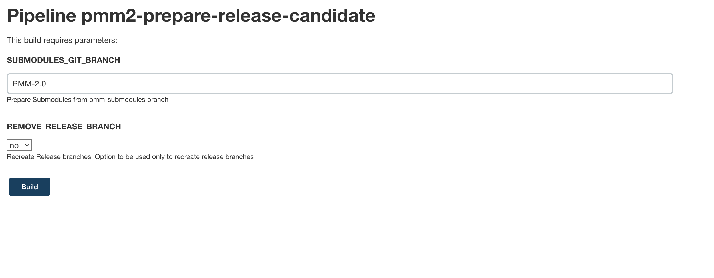

# Prepare release candidate (RC)

If you want to create a new RC then you need to follow [Create RC](#create-rc) section.

If you have new commits in release branches and want to rebuild them then you need [Rebuild RC](#rebuild-rc).

If you want **remove** current release branches and recreate them from PMM-2.0 then your choice is [Recreate RC](#recreate-rc) section

## Create RC

If you want to create RC you need:
* Run [release candidate job](https://pmm.cd.percona.com/blue/organizations/jenkins/pmm2-prepare-release-candidate). You should leave all fields by default and just press "Build". [[Jenkinsfile for the job](https://github.com/Percona-Lab/jenkins-pipelines/blob/master/pmm/pmm2-prepare-release-candidate.groovy)]

* After the job will be finished you need to upgrade [VERSION](https://github.com/Percona-Lab/pmm-submodules/blob/PMM-2.0/VERSION) file in [pmm-submodules](https://github.dev/Percona-Lab/pmm-submodules) repo. [Example of commit](https://github.com/Percona-Lab/pmm-submodules/commit/3186a3fca76c6c5f7d2c33e65e5f62f09b51f9bc)
* Also, you should upgrade current version in tests and add a new AMI. You can take AMI id from [pmm2-ami](https://pmm.cd.percona.com/job/pmm2-ami/) job. [Example of commit](https://github.com/Percona-Lab/jenkins-pipelines/commit/0c812715db45981c0e38f1e5ea54d075d2160b18)

## Rebuild RC

if you want to upgrade RC you need to run [release candidate job](https://pmm.cd.percona.com/blue/organizations/jenkins/pmm2-prepare-release-candidate) with custom value for `SUBMODULES_GIT_BRANCH`
field. Usually it should be something like: `pmm-2.20.0` for 2.20.0 release.

## Recreate RC

If you want recreate RC and RC branches you can use option: REMOVE_RELEASE_BRANCH in [release candidate job](https://pmm.cd.percona.com/blue/organizations/jenkins/pmm2-prepare-release-candidate). Be careful, branches will be recreated from PMM-2.0 branch.