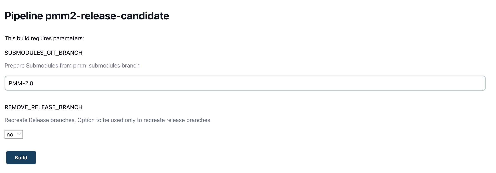
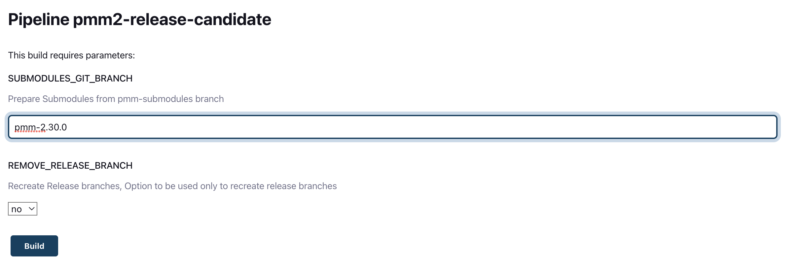
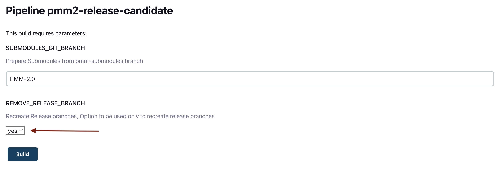

# Build release candidate (RC)

If you want to **create** a new RC, please follow [Create RC](#create-rc) section.

If you have new commits in release branches and want to **rebuild** them, please follow [Rebuild RC](#rebuild-rc).

If you want **remove** current release branches and recreate them from v3, go to the section [Recreate RC](#recreate-rc).

## Create RC

If you want to create RC you need:

- Run [release candidate job](https://pmm.cd.percona.com/blue/organizations/jenkins/pmm3-release-candidate). You should leave all fields by default and just press "Build". [[Jenkinsfile for the job](https://github.com/Percona-Lab/jenkins-pipelines/blob/master/pmm/pmm3-release-candidate.groovy)]
  
- After the job is finished, you have to upgrade [VERSION](https://github.com/Percona-Lab/pmm-submodules/blob/v3/VERSION) file in [pmm-submodules](https://github.dev/Percona-Lab/pmm-submodules) repo. [Example of commit](https://github.com/Percona-Lab/pmm-submodules/commit/3186a3fca76c6c5f7d2c33e65e5f62f09b51f9bc)
- Right before the release, you must add the new AMI [version](https://github.com/Percona-Lab/jenkins-pipelines/blob/master/vars/pmmVersion.groovy) for tests. You can take the AMI id from [pmm3-ami](https://pmm.cd.percona.com/job/pmm3-ami/) job. [Example of commit](https://github.com/Percona-Lab/jenkins-pipelines/commit/0c812715db45981c0e38f1e5ea54d075d2160b18)

## Rebuild RC

If you want to upgrade the RC, you have to run [release candidate job](https://pmm.cd.percona.com/blue/organizations/jenkins/pmm3-release-candidate) with a custom value for `SUBMODULES_GIT_BRANCH` field. For example: `pmm-3.30.0` for 2.30.0 release.

## Recreate RC

If you want recreate the RC and its branches, you must set the parameter `REMOVE_RELEASE_BRANCH` to `yes` in [release candidate job](https://pmm.cd.percona.com/blue/organizations/jenkins/pmm3-release-candidate). Be careful, branches will be recreated from v3 branch.
