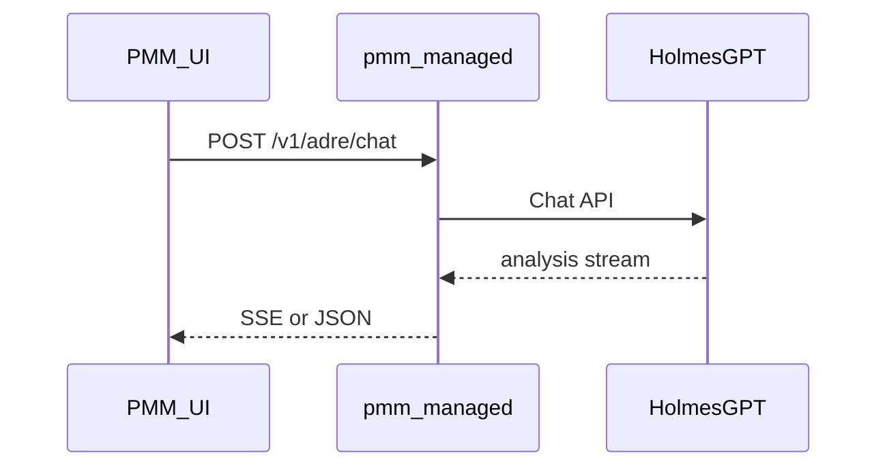

# Autonomous Database Reliability Engineer (ADRE) / HolmesGPT Integration

ADRE integrates [HolmesGPT](https://holmesgpt.dev) with PMM to provide AI-assisted database reliability analysis, chat, and alert investigation.

## Prerequisites

- HolmesGPT running in a container (or elsewhere) and reachable from the PMM server
- Optional: [mcp-clickhouse](https://github.com/ClickHouse/mcp-clickhouse) for ClickHouse/otel.logs/QAN analysis

## Configuration

1. Enable ADRE in **PMM Settings** (Configuration → Settings → Advanced) or on the ADRE / AI Assistant page (admin only).
2. Set the **HolmesGPT base URL** to a reachable HTTPS (or HTTP in lab) origin, for example `https://holmes.example.internal` — **do not** commit real hosts or secrets to documentation.
3. If HolmesGPT requires authentication, configure it through **PMM settings** (preferred) or follow HolmesGPT’s documented URL/header patterns. **Never** paste API keys, Grafana tokens, or passwords into public docs or chat logs.

HolmesGPT and PMM must be able to communicate. If using Docker or Kubernetes, ensure network policies and TLS match your security requirements.

### Chat backends (`chat_backend` in PMM settings JSON)

| Value | Meaning |
| ----- | ------- |
| `holmesgpt` (default) | PMM proxies chat to the configured **HolmesGPT** base URL. |
| `holmes_agent` | Chat goes through the **PMM Agent** path with a built-in system prompt (`agent_prompt`) and trimmed history (`chat_history_length`). |

Investigations and QAN insights use the Holmes client against **`Adre.URL`** (HolmesGPT URL), independent of this toggle for the floating chat widget label in the UI.

## HolmesGPT Configuration

Configure HolmesGPT to use PMM data sources:

- **Prometheus**: `https://<pmm-host>/victoriametrics/` (with auth if required)
- **Alertmanager**: `https://<pmm-host>/prometheus/alerts` (or internal URL if same network)

## ClickHouse (Logs, QAN)

HolmesGPT has no built-in ClickHouse toolset. To enable log and QAN analysis:

1. Run [mcp-clickhouse](https://github.com/ClickHouse/mcp-clickhouse) in a container
2. Point it at PMM’s ClickHouse (host, port, user, password must be reachable from HolmesGPT)
3. Add it as an MCP server in HolmesGPT config (streamable-http transport)
   - Example: `url: "http://mcp-clickhouse:8000/mcp/messages"`, `mode: streamable-http`

PMM does not run or configure mcp-clickhouse; you manage it and HolmesGPT configuration yourself.

## Adding custom tools to HolmesGPT

HolmesGPT supports two ways to add your own tools:

### 1. Custom toolsets (YAML)

Define tools as shell commands in a `toolsets.yaml` file. Each tool has a `name`, `description`, and `command`; the LLM infers parameters from `{{ variable }}` placeholders. Use this for scripts, `curl` calls to APIs, or `kubectl`/CLI commands.

- **CLI:** `holmes ask "your question" --custom-toolsets=toolsets.yaml`; after editing run `holmes toolset refresh`.
- **Helm:** Configure under `holmes.customToolsets` in your values.

See [HolmesGPT Custom Toolsets](https://holmesgpt.dev/data-sources/custom-toolsets/).

### 2. MCP servers (recommended for new integrations)

Implement an [MCP](https://modelcontextprotocol.io/) server that exposes tools; HolmesGPT connects to it and discovers tools dynamically.

- **Transport:** Prefer `streamable-http`: your server exposes an HTTP endpoint (e.g. `http://your-mcp:8000/mcp/messages`); HolmesGPT calls it with `mode: streamable-http`.
- **Config:** Add the server under `mcp_servers` in `~/.holmes/config.yaml` or in Helm under `holmes.mcp_servers`, with `config.url`, `config.mode`, optional `config.headers`, and `llm_instructions` (when/how the LLM should use it).

Example (config file):

```yaml
mcp_servers:
  my_tools:
    description: "My custom PMM tools"
    config:
      url: "http://my-mcp-server:8000/mcp/messages"
      mode: streamable-http
    llm_instructions: "Use these tools for schema, EXPLAIN, and index inspection when investigating database issues."
```

If your MCP server runs inside or alongside PMM, ensure HolmesGPT can reach it (network, auth, and security as discussed earlier).

See [HolmesGPT MCP Servers](https://holmesgpt.dev/data-sources/remote-mcp-servers/).

## Grafana context in ADRE Chat (PMM UI)

The PMM shell injects **structured Grafana context** into the chat system message when the user is on Grafana routes (`/graph/d/...`, `d-solo`, `explore`, etc.): normalized path, dashboard UID, `viewPanel` when present, `from`/`to`, `var-*` parameters, optional **document title** from the iframe. Implementation: `ui/apps/pmm/src/components/adre/grafana-context.ts` (builds the fragment; `GrafanaProvider` supplies `grafanaDocumentTitle`).

This reduces hallucinated “current panel” answers; models must still follow prompt rules.

## Holmes operator configuration (not shipped inside PMM)

PMM **does not** ship `holmes_config.yaml` or Markdown **runbooks** in the repository. Operators maintain them on the **HolmesGPT** deployment:

- **Toolsets** — Often defined in YAML (custom toolsets) or via **MCP** servers. Point Prometheus/VictoriaMetrics, PMM inventory tools, ClickHouse (QAN/logs), and optional `curl` tools at URLs reachable from Holmes (see [HolmesGPT docs](https://holmesgpt.dev)).
- **Runbooks** — Markdown files plus a **catalog** (e.g. `catalog.json`) so the `fetch_runbook` tool can load steps. Paths are configured in Holmes, not in PMM.
- **PMM-facing URLs** — Use a **browser-reachable** PMM base URL for markdown images and Grafana links where Holmes embeds `/v1/grafana/render` or `/graph/...`.

## `GET /v1/grafana/render` (panel image proxy)

Served by **pmm-managed**. Used by Holmes toolsets or scripts to fetch a **PNG** of a dashboard panel or to return **JSON** with URLs for the PMM UI.

**Required query parameters:** `dashboard_uid`, `panel_id`, `from`, `to`.

**Common optional parameters:** `width`, `height`, `format=json` (returns JSON with `image_url` and `dashboard_url` instead of raw PNG), `cache=1` (optional **disk cache** under `/srv/pmm/grafana_render_cache` on the server), `tz`, and any `var-*` Grafana template variables needed for the dashboard (e.g. `var-service_id`).

**Validation:** `dashboard_uid` and `panel_id` must match safe character classes enforced by the handler.

**Auth:** Forwarding uses the caller’s `Authorization` header when calling Grafana’s render path.

For **end-user** documentation, panel-image behaviour is intentionally **not** expanded in MkDocs; this section is for **integrators**.

## Grafana panel render and dashboard links (Holmes / tools)

When Holmes (or a tool) renders a Grafana panel image via PMM’s render API and includes an “Open in Grafana” link in the same message, follow this contract so the UI shows one correct link per panel:

1. **Use the render tool’s `dashboard_url`.** When the render tool (e.g. calling PMM `GET /v1/grafana/render?format=json`) returns `image_url` and `dashboard_url`, the model must use that exact `dashboard_url` for any “Open in Grafana” (or “Open the … panel”) link in the same message as the panel image. Do not construct the dashboard link from other parameters or default time ranges; otherwise the link can have the wrong timeframe.

2. **Match panel to narrative.** The panel id (and dashboard) used for the render must match what the model describes (e.g. if the answer says “QPS graph”, the rendered panel must be the QPS panel, not a different one like “MySQL Connections”).

3. **Duplicate links are suppressed by PMM.** Duplicate “Open in Grafana” links in markdown are suppressed by the PMM UI when they refer to a panel that already has a render image in the message; the only link shown is the one under the image (with the correct timeframe). So one link per panel from the render tool response is enough.

## API

PMM proxies requests to HolmesGPT where noted. Endpoints **require PMM authentication** unless stated otherwise.

| Method | Path | Description |
|--------|------|-------------|
| GET | /v1/adre/settings | Get ADRE settings (includes `chat_backend`, Holmes URL flags, QAN prompt display fields, ServiceNow configured flag — no secrets in GET) |
| POST | /v1/adre/settings | Update ADRE settings (admin); may set `servicenow_url`, `servicenow_api_key`, `servicenow_client_token` — store securely |
| GET | /v1/adre/models | List available models from HolmesGPT when ADRE enabled |
| POST | /v1/adre/chat | Chat; `stream: true` for SSE streaming; optional `mode` for server-side prompt selection |
| GET | /v1/adre/alerts | Firing alerts from Grafana Alertmanager (ADRE enabled) |
| POST | /v1/adre/investigate | Legacy alert investigation helper (streaming supported) |
| POST | /v1/adre/qan-insights | Body: `service_id`, `query_text` (required); optional `query_id`, `fingerprint`, `time_from`, `time_to`, `force`. Returns analysis JSON; caches by `(query_id, service_id)` when `query_id` set |
| GET | /v1/adre/qan-insights | Query params: `query_id`, `service_id` — returns cached analysis or 404 |
| GET | /v1/grafana/render | Panel PNG or JSON (`format=json`); see section above |

**Investigations** live under `/v1/investigations/*` — see [dev/investigations/README.md](../investigations/README.md).

### End-to-end flow (mermaid)


