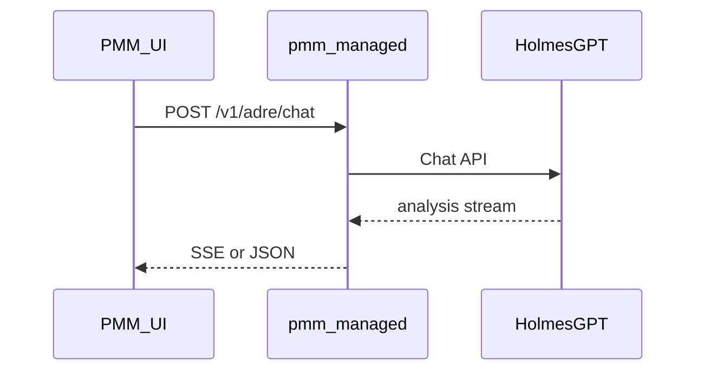

# Autonomous Database Reliability Engineer (ADRE) / HolmesGPT Integration

ADRE integrates [HolmesGPT](https://holmesgpt.dev) with PMM to provide AI-assisted database reliability analysis, chat, and alert investigation.

This branch targets **HolmesGPT 0.22+**: PMM uses **`POST /api/chat` only** (no `/api/investigate`), and tunes behaviour via **`behavior_controls`** in settings.

## Prerequisites

- HolmesGPT running in a container (or elsewhere) and reachable from the PMM server
- Optional: ADRE ClickHouse proxy (`POST /v1/adre/clickhouse/query`) for QAN/logs — preferred over direct ClickHouse or mcp-clickhouse

## Configuration

1. Enable ADRE in **PMM Settings** (Configuration → Settings → Advanced) or on the ADRE / AI Assistant page (admin only).
2. Set the **HolmesGPT base URL** to a reachable HTTPS (or HTTP in lab) origin, for example `https://holmes.example.internal` — **do not** commit real hosts or secrets to documentation.
3. If HolmesGPT requires authentication, configure it through **PMM settings** (preferred) or follow HolmesGPT’s documented URL/header patterns. **Never** paste API keys, Grafana tokens, or passwords into public docs or chat logs.

HolmesGPT and PMM must be able to communicate. If using Docker or Kubernetes, ensure network policies and TLS match your security requirements.

### Fast vs Investigation (`default_chat_mode`, `mode` on chat)

The ADRE panel and `POST /v1/adre/chat` use **Fast** (quick answers, minimal Holmes skills / TodoWrite by default) vs **Investigation** (full investigation behaviour). Differences are driven by Holmes **`behavior_controls`** maps stored in PMM settings (`behavior_controls_fast`, `behavior_controls_investigation`) plus separate **`additional_system_prompt`** texts (`chat_prompt`, `investigation_prompt`). See [Holmes fast mode / prompt controls](https://holmesgpt.dev/dev/reference/http-api/?h=fast#fast-mode--prompt-controls).

A third map, **`behavior_controls_format_report`**, applies only to the investigation report formatting pass.

**`adre_max_conversation_messages`** caps how many messages PMM sends as `conversation_history` to Holmes (mitigates context overflow when Holmes fails fast on oversized prompts).

**`ENABLED_PROMPTS` on the Holmes container** can override what the HTTP API is allowed to enable; if operators set it restrictively, PMM behaviour-control toggles may appear ineffective — document this next to AI Assistant settings for your environment.

Investigations and QAN insights call the Holmes client against **`Adre.URL`** only (no separate PMM Agent path).

## HolmesGPT Configuration

Configure HolmesGPT to use PMM data sources:

- **Prometheus**: `https://<pmm-host>/victoriametrics/` (with auth if required)
- **Alertmanager**: `https://<pmm-host>/prometheus/alerts` (or internal URL if same network)

## ClickHouse (Logs, QAN)

Holmes should **not** connect to ClickHouse directly. PMM exposes a read-only proxy:

**`POST /v1/adre/clickhouse/query`** — same Grafana viewer auth as other ADRE routes (Bearer service account token from Holmes).

Request body:

```json
{
  "database": "pmm",
  "query": "SELECT fingerprint, schema, any(queryid) AS queryid FROM metrics WHERE service_id = '...' GROUP BY fingerprint, schema LIMIT 5",
  "max_rows": 500
}
```

- `database`: `pmm` (QAN table `metrics`) or `otel` (logs table `logs`)
- Single SELECT only; PMM enforces table allowlist, row cap (max 1000), and 30s timeout
- ClickHouse stays on localhost; Holmes uses `PMM_URL` + `PMM_API_TOKEN` only

In Holmes config, use the **`pmm-clickhouse`** custom toolset (`pmm_clickhouse_query` curl tool). Disable legacy `clickhouse-pmm-http` / `clickhouse-logs-http` database toolsets that pointed at `:8123`.

### Legacy: external mcp-clickhouse

Optional alternative (not required when ADRE proxy is deployed):

1. Run [mcp-clickhouse](https://github.com/ClickHouse/mcp-clickhouse) on the PMM Docker network (ClickHouse remains localhost-only)
2. Add as MCP server in HolmesGPT config

PMM does not run or configure mcp-clickhouse.

## Adding custom tools to HolmesGPT

HolmesGPT supports two ways to add your own tools:

### 1. Custom toolsets (YAML)

Define tools as shell commands in a `toolsets.yaml` file. Each tool has a `name`, `description`, and `command`; the LLM infers parameters from `{{ variable }}` placeholders. Use this for scripts, `curl` calls to APIs, or `kubectl`/CLI commands.

- **CLI:** `holmes ask "your question" --custom-toolsets=toolsets.yaml`; after editing run `holmes toolset refresh`.
- **Helm:** Configure under `holmes.customToolsets` in your values.

See [HolmesGPT Custom Toolsets](https://holmesgpt.dev/data-sources/custom-toolsets/).

### 2. MCP servers (recommended for new integrations)

Implement an [MCP](https://modelcontextprotocol.io/) server that exposes tools; HolmesGPT connects to it and discovers tools dynamically.

- **Transport:** Prefer `streamable-http`: your server exposes an HTTP endpoint (e.g. `http://your-mcp:8000/mcp/messages`); HolmesGPT calls it with `mode: streamable-http`.
- **Config:** Add the server under `mcp_servers` in `~/.holmes/config.yaml` or in Helm under `holmes.mcp_servers`, with `config.url`, `config.mode`, optional `config.headers`, and `llm_instructions` (when/how the LLM should use it).

Example (config file):

```yaml
mcp_servers:
  my_tools:
    description: "My custom PMM tools"
    config:
      url: "http://my-mcp-server:8000/mcp/messages"
      mode: streamable-http
    llm_instructions: "Use these tools for schema, EXPLAIN, and index inspection when investigating database issues."
```

If your MCP server runs inside or alongside PMM, ensure HolmesGPT can reach it (network, auth, and security as discussed earlier).

See [HolmesGPT MCP Servers](https://holmesgpt.dev/data-sources/remote-mcp-servers/).

## Grafana context in ADRE Chat (PMM UI)

The PMM shell builds **structured Grafana context** when the user is on Grafana routes (`/graph/d/...`, `d-solo`, `explore`, etc.): normalized path, dashboard UID, `viewPanel` when present, `from`/`to`, `var-*` parameters, optional **document title** from the iframe. Implementation: `ui/apps/pmm/src/components/adre/grafana-context.ts` (fragment; `GrafanaProvider` supplies `grafanaDocumentTitle`).

The UI sends it as **`dashboard_context`** on `POST /v1/adre/chat`. **pmm-managed** appends it to Holmes **`additional_system_prompt`** (alongside the mode-specific prompt).

## Holmes operator configuration (not shipped inside PMM)

PMM **does not** ship `holmes_config.yaml` or Holmes **skills** (`SKILL.md` trees) in the repository. Operators maintain them on the **HolmesGPT** deployment:

- **Toolsets** — Often defined in YAML (custom toolsets) or via **MCP** servers. Point Prometheus/VictoriaMetrics, PMM inventory tools, and **`pmm_clickhouse_query`** (ADRE proxy for QAN/logs — not direct ClickHouse) at URLs reachable from Holmes (see [HolmesGPT docs](https://holmesgpt.dev)).
- **Skills** — Directories of `SKILL.md` files plus Holmes **`custom_skill_paths`** so the `fetch_skill` tool can load methodology. Paths are configured in Holmes, not in PMM.
- **PMM-facing URLs** — Use a **browser-reachable** PMM base URL for markdown images and Grafana links where Holmes embeds `/v1/grafana/render/blob/...` or `/graph/...`.

## Grafana panel render (Tier 1 — `POST /v1/grafana/render/resolve`)

Served by **pmm-managed**. Holmes (or any client) calls **`POST /v1/grafana/render/resolve`** with a JSON body. PMM loads the dashboard from Grafana, merges **overrides** with the dashboard’s template variables, renders once via the image renderer, stores the PNG under **`/srv/pmm/grafana_render_cache/{content_hash}.png`**, and returns JSON including **`image_url`** (`/v1/grafana/render/blob/{content_hash}.png`) and **`dashboard_url`**. Identical logical requests reuse the same **content hash** and hit the **disk cache** without calling Chromium again.

**Request (typical):** `dashboard_uid`, `panel_id`, `from`, `to`, optional `width` / `height` / `scale` / `org_id` / `tz` / `theme`, and **`overrides`** (e.g. `service_name`, `node_name` — must match variable names on that dashboard).

**GET** `/v1/grafana/render/blob/{sha256}.png` serves immutable cached PNGs (`Cache-Control: public, max-age=31536000`).

**Legacy:** **`GET /v1/grafana/render?…`** returns **410 Gone** with a pointer to **`POST /resolve`** — do not build long query-string render URLs.

**Auth:** The resolve handler forwards **`Authorization`** / **`Cookie`** to Grafana’s dashboard and render APIs (same as the previous proxy).

For **end-user** documentation, panel-image behaviour is intentionally **not** expanded in MkDocs; this section is for **integrators**.

## Grafana panel render and dashboard links (Holmes / tools)

When Holmes (or a tool) renders a Grafana panel image via PMM’s render API and includes an “Open in Grafana” link in the same message, follow this contract so the UI shows one correct link per panel:

1. **Use the render tool’s `dashboard_url`.** When the render tool (e.g. calling PMM `POST /v1/grafana/render/resolve`) returns `image_url` and `dashboard_url`, the model must use that exact `dashboard_url` for any “Open in Grafana” (or “Open the … panel”) link in the same message as the panel image. Do not construct the dashboard link from other parameters or default time ranges; otherwise the link can have the wrong timeframe.

2. **Match panel to narrative.** The panel id (and dashboard) used for the render must match what the model describes (e.g. if the answer says “QPS graph”, the rendered panel must be the QPS panel, not a different one like “MySQL Connections”).

3. **Duplicate links are suppressed by PMM.** Duplicate “Open in Grafana” links in markdown are suppressed by the PMM UI when they refer to a panel that already has a render image in the message; the only link shown is the one under the image (with the correct timeframe). So one link per panel from the render tool response is enough.

## API

PMM proxies requests to HolmesGPT where noted. Endpoints **require PMM authentication** unless stated otherwise.

| Method | Path | Description |
|--------|------|-------------|
| GET | /v1/adre/settings | Get ADRE settings (Holmes URL, `behavior_controls_*`, prompts, `adre_max_conversation_messages`, QAN prompt display fields, ServiceNow configured flag — no secrets in GET) |
| POST | /v1/adre/settings | Update ADRE settings (admin); may set `servicenow_url`, `servicenow_api_key`, `servicenow_client_token` — store securely |
| GET | /v1/adre/models | List available models from HolmesGPT when ADRE enabled |
| POST | /v1/adre/chat | Chat; `stream: true` for SSE streaming; optional `mode`: `fast` or `investigation` (legacy `chat` treated as `fast`); optional `dashboard_context` merged into Holmes `additional_system_prompt` |
| GET | /v1/adre/alerts | Firing alerts from Grafana Alertmanager (ADRE enabled) |
| POST | /v1/adre/qan-insights | Body: `service_id`, `query_text` (required); optional `query_id`, `fingerprint`, `time_from`, `time_to`, `force`. Returns analysis JSON; caches by `(query_id, service_id)` when `query_id` set |
| GET | /v1/adre/qan-insights | Query params: `query_id`, `service_id` — returns cached analysis or 404 |
| POST | /v1/grafana/render/resolve | Resolve vars server-side, return `image_url` (blob) + `dashboard_url`; see section above |
| GET | /v1/grafana/render/blob/{hash}.png | Cached panel PNG |
| GET | /v1/grafana/render | **410 Gone** — use `POST /v1/grafana/render/resolve` |
| GET | /v1/grafana/observability-map | Intent-based dashboard/panel routing for ADRE/Holmes (see below) |
| POST | /v1/adre/metrics/snapshot | Tier-1 compressed metrics stats for a PromQL range query (see below) |
| POST | /v1/adre/clickhouse/query | Read-only ClickHouse SQL for QAN (`database=pmm`) and logs (`database=otel`) — see below |

**Investigations** live under `/v1/investigations/*` — see [dev/investigations/README.md](../investigations/README.md).

### Observability map (`GET /v1/grafana/observability-map`)

Returns a compact routing payload for Holmes/ADRE: primary dashboard UID, optional panel PromQL `expr` values extracted from Grafana JSON, secondary dashboards, and scoped fallback hints. **Does not require ADRE to be enabled** — only PMM authentication (viewer role).

Query parameters:

| Param | Required | Description |
|-------|----------|-------------|
| `engine` | yes | `mysql`, `postgresql`, `mongodb`, `valkey`, `node` |
| `intent` | yes | e.g. `workload`, `connections`, `slow_queries`, `replication`, `innodb`, `wal`, `locks`, `latency`, `memory`, `cpu_memory`, `disk_io`, `network`, `availability` |
| `service_id` | no | Used to build `fallback.scoped_series_match` for scoped series discovery |
| `include_panel_queries` | no | Default `true`; set `false` to skip Grafana dashboard fetch |
| `panel_ids` | no | Comma-separated override of default panel IDs for the route |
| `org_id` | no | Grafana org (default `1`) |

Panels without a PromQL target are omitted from `panels` and listed in `warnings`.

### Metrics snapshot (`POST /v1/adre/metrics/snapshot`)

Runs a PromQL **range** query against VictoriaMetrics and returns **server-computed** summaries per series — not raw matrices. **Requires ADRE enabled** and a configured Holmes URL (same gate as other `/v1/adre/*` endpoints).

**Request body (JSON):**

```json
{
  "query": "rate(mysql_global_status_questions[5m])",
  "start": "2026-05-24T00:00:00Z",
  "end": "2026-05-24T06:00:00Z",
  "step": "5m",
  "max_series": 5
}
```

**Time bounds:** `start` is required. `end` omitted defaults to now. Accepted formats:

- RFC3339 UTC (e.g. `2026-05-24T12:00:00Z`)
- Unix epoch seconds (positive = absolute time)
- Negative Unix seconds = relative to `end` (or now if `end` omitted), e.g. `-43200` = 12 hours before end

**Stats semantics:** For each series, PMM loads the query range from VictoriaMetrics, keeps the **last up to 500 points** (most recent window), then computes min/max/mean/median/p25/p75/p95/p99, top change points (largest step deltas), and top anomalies (z-score &gt; 2σ, capped at 10). This is **not** `quantile_over_time()` in PromQL — percentiles describe the sampled point window only. Response field `truncated: true` when any series had more than 500 raw points before sampling.

**Limits:** Default `max_series` is 5; queries returning more series get HTTP 400 with a hint to tighten matchers or use `topk`.

### ClickHouse query proxy (`POST /v1/adre/clickhouse/query`)

Executes a **single read-only SELECT** against PMM’s local ClickHouse (`pmm.metrics` or `otel.logs`). **Requires ADRE enabled.** Auth: Grafana viewer (Bearer service account for Holmes).

**Request body (JSON):**

```json
{
  "database": "pmm",
  "query": "SELECT count() FROM metrics WHERE service_id = '…' LIMIT 10",
  "max_rows": 500
}
```

| Field | Description |
|-------|-------------|
| `database` | `pmm` (QAN) or `otel` (logs) |
| `query` | Single SELECT; tables limited to `metrics` / `pmm.metrics` or `logs` / `otel.logs` |
| `max_rows` | Default 500, hard cap 1000 |

**Guardrails:** SELECT-only, no multi-statement, 30s execution timeout, `readonly=1` ClickHouse setting. Response: `columns`, `rows`, `row_count`, `truncated`, `execution_ms`.

### End-to-end flow (mermaid)


