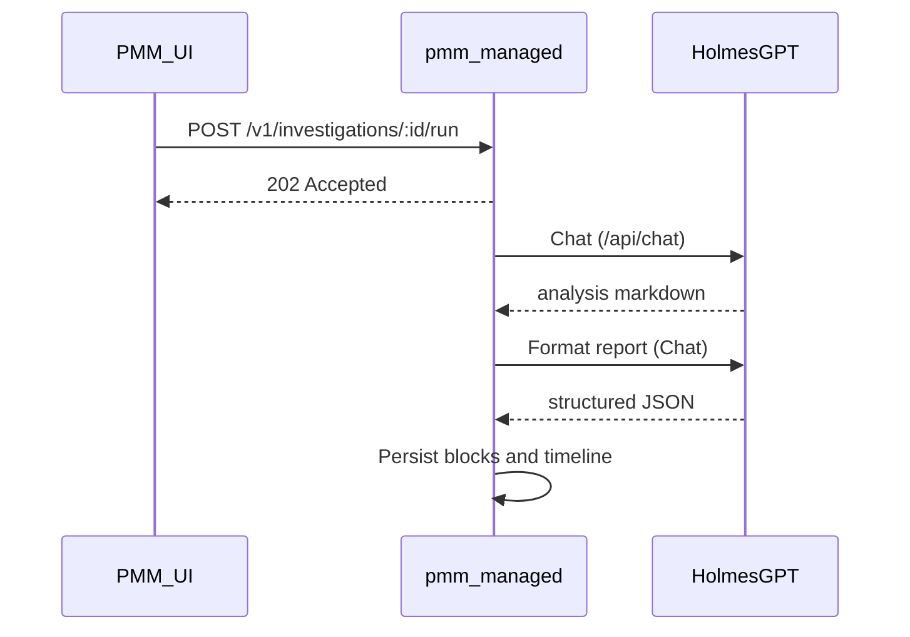

# PMM Investigations (developer / operator notes)

**Investigations** are persisted incident pages under `/v1/investigations` in **pmm-managed**. The UI lists investigations, shows block-based reports, supports chat, **Run investigation**, **PDF export**, and optional **ServiceNow** ticket creation.

This file is **not** part of the published Percona MkDocs site; it lives next to the Go sources for contributors and operators.

## Architecture reference

- **ADR-001** — [0001-pmm-ai-investigations.md](../../documentation/docs/adr/0001-pmm-ai-investigations.md) (original orchestrator/Ollama narrative; see note below).
- **ADR-002** — [0002-investigations-data-model-and-api.md](../../documentation/docs/adr/0002-investigations-data-model-and-api.md) (data model and REST shape).

**Implementation note:** Investigation **chat** and **run** use **HolmesGPT** only (`adre.NewClient(settings.GetAdreURL())`): `POST /api/chat` with `investigation_prompt`, **`behavior_controls_investigation`**, and (for the formatting pass) **`behavior_controls_format_report`**. A separate Ollama orchestrator process is **not** required for that deployment model. ADR-001 remains historical context; align product docs with the code path you ship.

## Prerequisites

- **HolmesGPT URL** configured in PMM **AI Assistant / ADRE** settings (`GetAdreURL()` non-empty). Chat and run return HTTP 400 if missing.

## REST API summary

All routes are prefixed with `/v1/investigations`. Authenticate like other PMM APIs.

| Method | Path pattern | Purpose |
| ------ | ------------ | ------- |
| GET | `/v1/investigations` | List investigations |
| POST | `/v1/investigations` | Create investigation |
| GET | `/v1/investigations/:id` | Get one |
| PATCH | `/v1/investigations/:id` | Update metadata / status |
| DELETE | `/v1/investigations/:id` | Delete |
| GET/POST | `/v1/investigations/:id/blocks` | List / create blocks |
| PATCH/DELETE | `/v1/investigations/:id/blocks/:blockId` | Update / delete block |
| GET/POST | `/v1/investigations/:id/timeline` | Timeline events |
| GET/POST | `/v1/investigations/:id/artifacts` | Artifacts |
| GET/POST | `/v1/investigations/:id/comments` | Comments |
| GET | `/v1/investigations/:id/messages` | Chat message history |
| POST | `/v1/investigations/:id/chat` | One chat round (Holmes `/api/chat`) |
| POST | `/v1/investigations/:id/run` | Start background **Run investigation** (202 Accepted) |
| GET | `/v1/investigations/:id/export/pdf` | Download PDF report |
| POST | `/v1/investigations/:id/servicenow` | Create ServiceNow ticket (requires settings) |

Details and JSON shapes: **ADR-002** and `managed/services/investigations/handlers.go`.

## Chat flow (`POST .../chat`)

1. Load investigation; validate Holmes URL.
2. Persist the user `message`.
3. Build `conversation_history` from stored messages (roles `user`, `assistant`, `tool`).
4. Call `adre.Client.Chat` with investigation context, **`behavior_controls_investigation`**, and trimmed history (`adre_max_conversation_messages`).
5. Persist assistant reply; return `{ "content": "..." }`.

## Run investigation (`POST .../run`)

Returns **202** immediately; work continues in `runInvestigationBackground`:

1. Calls Holmes **`Chat`** (`/api/chat`) with a structured ask, investigation prompt, context, and **`behavior_controls_investigation`**.
2. **`FormatInvestigationReport`** — second LLM pass via `adre.Client.Chat` with **`behavior_controls_format_report`** to normalize markdown into JSON sections.
4. **`ParseFormattedReport`** — creates **blocks** and **timeline** rows; updates investigation summary fields.

Timeouts: **5 minutes** for run and chat (see `investigationRunTimeout` / `investigationChatTimeout` in `chat.go`).

## ServiceNow (`POST .../servicenow`)

Requires **non-empty** `Adre.ServiceNowURL`, `ServiceNowAPIKey`, and `ServiceNowClientToken` in PMM settings (set via `POST /v1/adre/settings`). The handler POSTs JSON to the configured create URL and sets header **`x-sn-apikey`** from the API key field. **Do not** log or document real values.

## PDF export

`GET /v1/investigations/:id/export/pdf` returns an HTML-based report suitable for PDF conversion in the UI pipeline (see `managed/services/investigations/export.go`).

## Related code

| Area | Path |
| ---- | ---- |
| HTTP dispatch | `managed/services/investigations/handlers.go` |
| Chat + run + background | `managed/services/investigations/chat.go` |
| ServiceNow | `managed/services/investigations/servicenow.go` |
| Report formatting | `managed/services/investigations/format_report.go` |
| Holmes client | `managed/services/adre/client.go` |

## End-to-end sequence (mermaid)

User-facing overview: [investigations.md](../../documentation/docs/use/ai-features/investigations.md).
