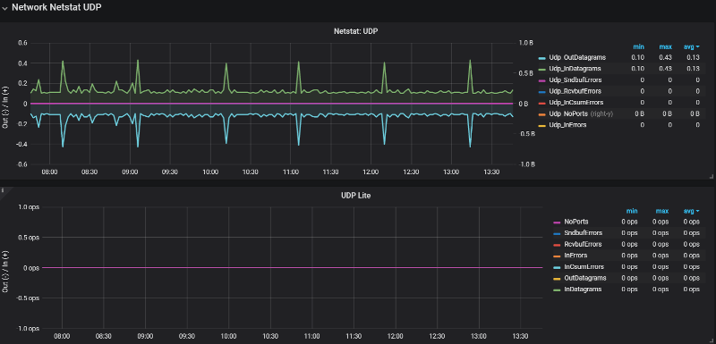
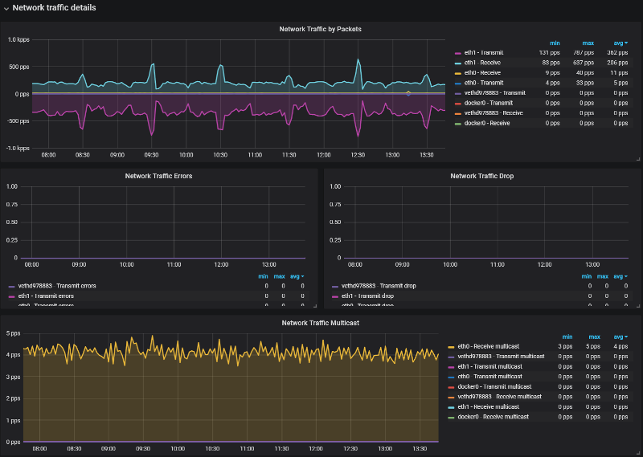

# Percona Monitoring and Management 1.13.0

* **Date**

    August 1, 2018

The most significant feature in this release is Prometheus 2, however we also packed a lot of visual changes into release 1.13:

Prometheus 2 - Consumes less resources, and Dashboards load faster!

* **New Dashboard: Network Overview** - New dashboard for all things IPv4!
* **New Dashboard: NUMA Overview** - New Dashboard! Understand memory allocation across DIMMs
* **Snapshots and Updates Improvements** - Clearer instructions for snapshot sharing, add ability to disable update reporting
* **System Overview Dashboard improvements** - See high level summary, plus drill in on CPU, Memory, Disk, and Network
* **Improved SingleStat for percentages** - Trend line now reflects percentage value

We addressed 13 new features and improvements, and fixed 13 bugs.

## Prometheus 2

The long awaited Prometheus 2 release is here!  By upgrading to PMM release 1.13, Percona's internal testing has shown you will achieve a 3x-10x reduction in CPU usage, which translates into PMM Server being able to handle more instances than you could in 1.12.  You won't see any gaps in graphs since internally PMM Server will run two instances of Prometheus and leverage *remote_read* in order to provide consistent graphs!

Our Engineering teams have worked very hard to make this upgrade as transparent as possible - hats off to them for their efforts!!

Lastly on Prometheus 2, we also included a new set of graphs to the Prometheus Dashboard to help you better understand when your PMM Server may run out of space. We hope you find this useful!


## Network Overview Dashboard

We're introducing a new dashboard that focuses on all things Networking - we placed a Last Hour panel highlighting high-level network metrics, and then drill into Network Traffic + Details, then focus on TCP, UDP, and ICMP behavior.








## Snapshots and Updates Improvements

Of most interest to current Percona Customers, we’ve clarified the instructions on how to take a snapshot of a Dashboard in order to highlight that you are securely sharing with Percona.  We’ve also configured the sharing timeout to 30 seconds (up from 4 seconds) so that we more reliably share useful data to Percona Support Engineers, as shorter timeout led to incomplete graphs being shared.


Packed into this feature is also a change to how we report installed version,
latest version, and what’s new information:


Lastly, we modified the behavior of the docker environment option
DISABLE_UPDATES to remove the Update button.  As a reminder, you can choose to
disable update reporting for environments where you want tighter control over
(i.e. lock down) who can initiate an update by launching the PMM docker
container along with the environment variable as follows:

```
docker run ... -e DISABLE_UPDATES=TRUE
```

System Overview Dashboard Improvements We’ve updated our System Overview
Dashboard to focus on the four criteria of CPU, Memory, Disk, and Network, while
also presenting a single panel row of high level information (uptime, count of
CPUs, load average, etc)


Our last feature we're introducing in 1.13 is a fix to [SingleStat panels](http://docs.grafana.org/features/panels/singlestat/#singlestat-panel) where the percentage value is reflected in the level of the trend line in the background.  For example, if you have a stat panel at 20% and 86%, the line in the background should fill the respective amount of the box:Improved SingleStat for percentages.


## Issues in this release

### New Features & Improvements

* [PMM-2225](https://jira.percona.com/browse/PMM-2225): Add new Dashboard: Network Overview
* [PMM-2485](https://jira.percona.com/browse/PMM-2485): Improve Singlestat for percentage values to accurately display trend line
* [PMM-2550](https://jira.percona.com/browse/PMM-2550): Update to Prometheus 2
* [PMM-1667](https://jira.percona.com/browse/PMM-1667): New Dashboard: NUMA Overview
* [PMM-1930](https://jira.percona.com/browse/PMM-1930): Reduce Durability for MySQL
* [PMM-2291](https://jira.percona.com/browse/PMM-2291): Add Prometheus Disk Space Utilization Information
* [PMM-2444](https://jira.percona.com/browse/PMM-2444): Increase space for legends
* [PMM-2594](https://jira.percona.com/browse/PMM-2594): Upgrade to Percona Toolkit 3.0.10
* [PMM-2610](https://jira.percona.com/browse/PMM-2610): Configure Snapshot Timeout Default Higher and Update Instructions
* [PMM-2637](https://jira.percona.com/browse/PMM-2637): Check for Updates and Disable Updates Improvements
* [PMM-2652](https://jira.percona.com/browse/PMM-2652): Fix “Unexpected error” on Home dashboard after upgrade
* [PMM-2661](https://jira.percona.com/browse/PMM-2661): Data resolution on Dashboards became 15sec min instead of 1sec
* [PMM-2663](https://jira.percona.com/browse/PMM-2663): System Overview Dashboard Improvements

### Bug fixes

* [PMM-1977](https://jira.percona.com/browse/PMM-1977): after upgrade pmm-client (1.6.1-1) can’t start mysql:metrics - can’t find .my.cnf
* [PMM-2379](https://jira.percona.com/browse/PMM-2379): Invert colours for Memory Available graph
* [PMM-2413](https://jira.percona.com/browse/PMM-2413): Charts on MySQL InnoDB metrics are not fully displayed
* [PMM-2427](https://jira.percona.com/browse/PMM-2427): Information loss in CPU Graph with Grafana 5 upgrade
* [PMM-2476](https://jira.percona.com/browse/PMM-2476): AWS PMM is broken on C5/M5 instances
* [PMM-2576](https://jira.percona.com/browse/PMM-2576): Error in logs for MySQL 8 instance on CentOS
* [PMM-2612](https://jira.percona.com/browse/PMM-2612): Wrong information in PMM Scrapes Task
* [PMM-2639](https://jira.percona.com/browse/PMM-2639): mysql:metrics does not work on Ubuntu 18.04
* [PMM-2643](https://jira.percona.com/browse/PMM-2643): Socket detection and MySQL 8
* [PMM-2698](https://jira.percona.com/browse/PMM-2698): Misleading Graphs for Rare Events
* [PMM-2701](https://jira.percona.com/browse/PMM-2701): MySQL 8 - Innodb Checkpoint Age
* [PMM-2722](https://jira.percona.com/browse/PMM-2722): Memory auto-configuration for Prometheus evaluates to minimum of 128MB in entrypoint.sh
