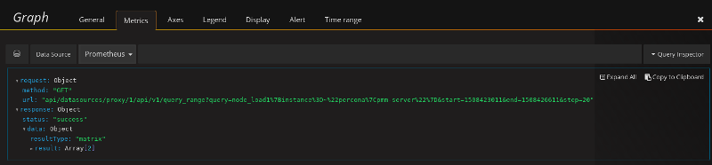

# Percona Monitoring and Management 1.4.0

* **Date**

    October 20, 2017


Percona announces the release of Percona Monitoring and Management 1.4.0.

This release introduces the support of external Prometheus exporters so that you can create dashboards in the Metrics monitor even for the monitoring services other than those provided with PMM client packages. To attach an existing external Prometheus exporter, run **pmm-admin add external:metrics NAME_OF_EXPORTER URL:PORT**.

```
{"Version":"1.4.0",
 "ServerAddress":"127.0.0.1:80",
 "ServerSecurity":"",
 "ClientName":"percona",
 "ClientAddress":"172.17.0.1",
 "ClientBindAddress":"",
 "Platform":"linux-systemd",
 "Err":"",
 "Services":[{"Type":"linux:metrics","Name":"percona","Port":"42000","Running":true,"DSN":"-","Options":"","SSL":"","Password":""}],
 "ExternalErr":"",
 "ExternalServices":[{"JobName":"postgres","ScrapeInterval":1000000000,"ScrapeTimeout":1000000000,"MetricsPath":"/metrics","Scheme":"http","StaticTargets":["127.0.0.1:5432"]}]}
```

The list of attached monitoring services is now available not only in the tabular format but also as a JSON file to enable automatic verification of your configuration. To view the list of monitoring services in the JSON format run **pmm-admin list --json**.

In this release, Prometheus and Grafana have been upgraded. Prometheus version 1.7.2, shipped with this release, offers a number of bug fixes that will contribute to its smooth operation inside PMM. For more information, see [the Prometheus change log](https://github.com/prometheus/prometheus/blob/v1.7.2/CHANGELOG.md#172--2017-09-26).

Version 4.5.2 of Grafana, included in this release of PMM, offers a number of new tools that will facilitate data analysis in PMM:

* New `query editor` for Prometheus expressions which features syntax highlighting and autocompletion for metrics, functions and range vectors.

    

* `Query inspector` which provides detailed information about the query. The primary goal of graph inspector is to enable analyzing a graph which does not display data as expected.

    

The complete list of new features in **Grafana** 4.5.0 is available from [What’s New in Grafana v4.5](http://docs.grafana.org/guides/whats-new-in-v4-5/).

For install and upgrade instructions, see [Deploying Percona Monitoring and Management](../deploy/index.md#deploy-pmm).

## New features

* [PMM-1520](https://jira.percona.com/browse/PMM-1520): Prometheus upgraded to version 1.7.2.
* [PMM-1521](https://jira.percona.com/browse/PMM-1521): Grafana upgraded to version 4.5.2.
* [PMM-1091](https://jira.percona.com/browse/PMM-1091): The **pmm-admin list** produces a JSON document as output if the `--json` option is supplied.
* [PMM-507](https://jira.percona.com/browse/PMM-507): External exporters are supported with **pmm-admin**.
* [PMM-1622](https://jira.percona.com/browse/PMM-1622): **docker** images of PMM Server are [available for downloading](https://www.percona.com/downloads/pmm/) as **tar** packages.

## Bug fixes

* [PMM-1172](https://jira.percona.com/browse/PMM-1172): In some cases, the `TABLES` section of a query in **QAN** could contain no data and display the *List of tables is empty* error. The `Query` and `Explain` sections had the relevant values.
* [PMM-1519](https://jira.percona.com/browse/PMM-1519): A Prometheus instance could be forced to shut down if it contained too many targets (more than 50).  When started the next time, Prometheus initiated a time consuming crash recovery routine which took long on large installations.
