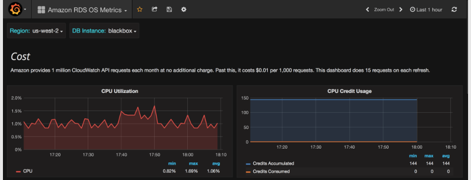
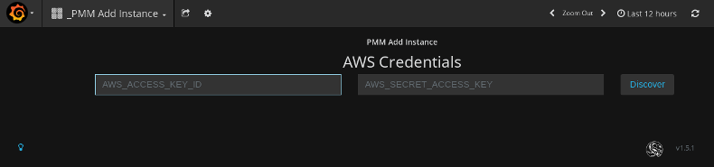

.. _amazon-rds:

================================================================================
Using |pmm| with |amazon-rds|
================================================================================

It is possible to use |pmm| for monitoring |amazon-rds| (just like any remote
|mysql| instance).

First of all, ensure that there is minimal latency between |pmm-server|
and the |amazon-rds| instance.
Network connectivity can become an issue for |prometheus| to scrape metrics
with 1 second resolution.
We strongly suggest that you run |pmm-server| on AWS.

.. note:: If latency is higher than 1 second, you should change the minimum
	  resolution by setting the |term.metrics-resolution| environment
	  variable when :ref:`creating and running the PMM Server container
	  <server-container>`.  For more information, see
	  :ref:`metrics-resolution`.

|qan.name| requires :ref:`perf-schema` as the query source,
because the slow query log is stored on AWS side,
and |qan| agent is not able to read it.
Enable the ``performance_schema`` option under **Parameter Groups** on RDS
(you will probably need to create a new **Parameter Group**
and set it to the database instance).

.. TODO: Check if the explanation about how to enable the performance schema is needed

It also requires the ``statements_digest`` and ``events_statements_history``
to be enabled on the RDS instance.
For more information, see :ref:`perf-schema-settings`.

.. note:: Because of the previous requirements,
   it is not possible to collect query analytics for |amazon-rds|
   running a |mysql| version prior to 5.6.
   For |mysql| version 5.5 on |amazon-rds|, see :ref:`cloudwatch`.

.. TODO: Check if the referenced cloudwatch material is still relevant.

When adding a monitoring instance for |amazon-rds|,
specify a unique name to distinguish it from the local |mysql| instance.
If you do not specify a name, it will use the client's host name.

Create the ``pmm`` user with the following privileges
on the |amazon-rds| instance that you want to monitor::

 GRANT SELECT, PROCESS, REPLICATION CLIENT ON *.* TO 'pmm'@'%' IDENTIFIED BY 'pass' WITH MAX_USER_CONNECTIONS 10;
 GRANT SELECT, UPDATE, DELETE, DROP ON performance_schema.* TO 'pmm'@'%';

If you have |amazon-rds| with a |mysql| version prior to 5.7,
`REPLICATION CLIENT` privilege is not available there
and has to be excluded from the above statement.

The following example shows how to enable |qan| and |mysql| metrics monitoring
on |amazon-rds|:

.. include:: .res/code/sh.org
   :start-after: +pmm-admin.add.mysql-metrics.rds+
   :end-before: #+end-block

.. note:: General system metrics cannot be monitored remotely,
   because ``node_exporter`` requires access to the local file system.
   This means that the ``linux:metrics`` service cannot be used
   to monitor |amazon-rds| instances or any remote |mysql| instance.

.. _cloudwatch:

Monitoring |amazon-rds| OS Metrics
================================================================================

You can use |cloudwatch| as the data source in |grafana|
to monitor OS metrics for |amazon-rds| instances.
PMM provides the |amazon-rds-aurora-mysql-metrics| dashboard for this.

To set up OS metrics monitoring for |rds| in |pmm| via |cloudwatch|:

1. Create an IAM user on the AWS panel for accessing CloudWatch data,
   and attach the managed policy ``CloudWatchReadOnlyAccess`` to it.

#. Create a credentials file on the host running PMM Server
   with the following contents::

    [default]
    aws_access_key_id = <your_access_key_id>
    aws_secret_access_key = <your_secret_access_key>

#. Start the ``pmm-server`` container with an additional ``-v`` flag
   that specifies the location of the file with the IAM user credentials
   and mounts it to :file:`/usr/share/grafana/.aws/credentials`
   in the container. For example:

   .. include:: .res/code/sh.org
      :start-after: +docker.run.iam-user-credential+
      :end-before: #+end-block

The |amazon-rds-aurora-mysql-metrics| dashboard uses 60 second resolution
and shows the average value for each data point.
An exception is the |cpu-credit-usage| graph,
which has a 5 minute average and interval length.
All data is fetched in real time and not stored anywhere.

This dashboard can be used with any |amazon-rds| database engine,
including |mysql|, |amazon-aurora|, etc.

.. note:: |amazon| provides one million |amazon-cloudwatch| API requests
   per month at no additional cost.
   Past this, it costs $0.01 per 1,000 requests.
   The pre-defined dashboard performs 15 requests on each refresh
   and an extra two on initial loading.

   For more information, see
   `Amazon CloudWatch Pricing <https://aws.amazon.com/cloudwatch/pricing/>`_.

Connecting to an |amazon-rds| instance using the |pmm-add-instance| dashboard
================================================================================

.. versionadded:: 1.5.0

The |pmm-add-instance| is now a preferred method to add an |amazon-rds| instance
to |pmm|:

   
   *Enter the access key ID and the secret access key of your IAM user to view*
   |amazon-rds| *instances*.

1. Open the |pmm| web interface and select the |pmm-add-instance| dashboard.
#. Select the |gui.add-rds-aurora-instance| option in the dashboard.
#. Enter the access key ID and the secret access key of your IAM user.
#. Click the |gui.discover| button for |pmm| to retrieve the available |amazon-rds|
   instances.

.. figure:: .res/graphics/png/pmm.metrics-monitor.add-instance.1.png

   |pmm| *displays the available*
   |amazon-rds| *instances*

For each instance that you would like to monitor, select the |gui.enabled| button
and enter the user name and password. Click |gui.connect|. You can now monitor your
instances in the |amazon-rds-aurora-mysql-metrics|.

.. figure:: .res/graphics/png/pmm.metrics-monitor.add-instance.rds-instances.1.png

   *Enter the DB user name and password to connect to the selected* |rds| or
   |aurora| *instance*.

.. include:: .res/replace/name.txt
.. include:: .res/replace/option.txt
