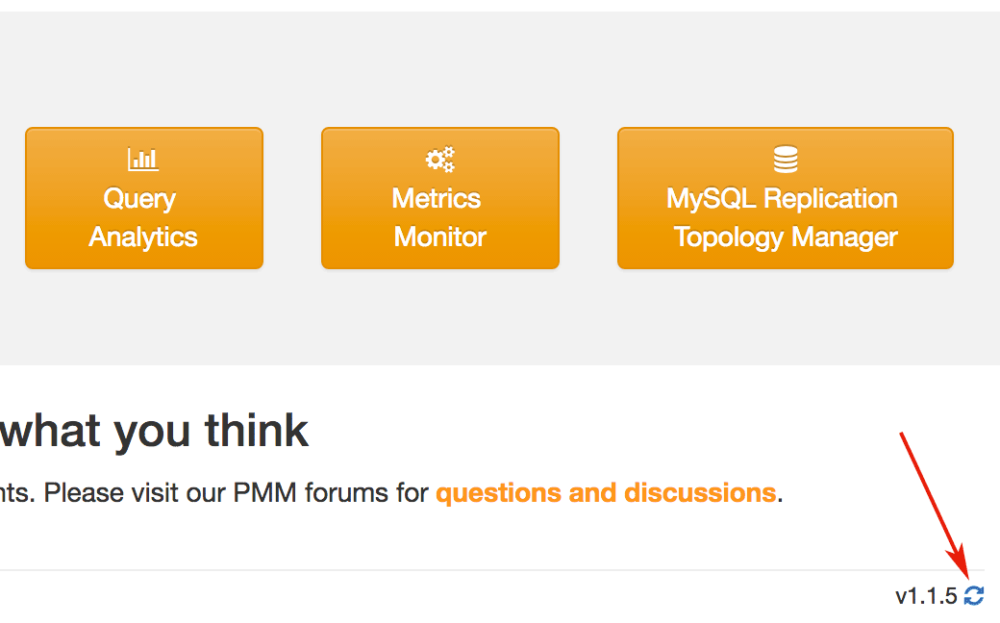

.. _deploy-pmm:

================================================================================
Deploying |pmm.name|
================================================================================

|pmm.intro| is designed to be scalable for various environments.  If you have
just one |mysql| or |mongodb| server, you can install and run both |pmm.abbrev|
server and |pmm.abbrev| clients on one database host.

It is more typical to have several |mysql| and |mongodb| server instances
distributed over different hosts. In this case, you need to install the
|pmm.abbrev| client package on each database host that you want to monitor. In
this scenario, the |pmm.abbrev| server is set up on a dedicated monitoring host.

.. _deploy-pmm.server.installing:

Installing |pmm-server|
================================================================================

To install and set up the |pmm-server|, use one of the following
options:

-  :ref:`run-server-docker`
-  :ref:`run-server-ova`
-  :ref:`run-server-ami`

.. toctree::
   :hidden:

   server/docker
   server/virtual-appliance
   server/ami

.. seealso::

   Default ports
      :term:`Ports` in :ref:`pmm/glossary/terminology-reference`

.. _deploy-pmm.server.verifying:

Verifying |pmm-server|
--------------------------------------------------------------------------------

In your browser, go to the server by its IP address. If you run your server as a
virtual appliance or by using an |amazon| machine image, you will need to setup
the user name, password and your public key if you intend to connect to the
server by using ssh. This step is not needed if you run |pmm-server| using
|docker|.

In the given example, you would need to direct your browser to
*http://192.168.100.1*. Since you have not added any monitoring
services yet, the site will not show any data.

.. table:: Accessing the Components of the Web Interface

   ==================================== ======================================
   Component                            URL
   ==================================== ======================================
   :term:`PMM Home Page`                ``http://192.168.100.1``
   :term:`Query Analytics (QAN)`        ``http://192.168.100.1/qan/``
   :term:`Metrics Monitor (MM)`         | ``http://192.168.100.1/graph/``
                                        | User name: ``admin``
                                        | Password: ``admin``
   Orchestrator                         ``http://192.168.100.1/orchestrator``
   ==================================== ======================================

.. _deploy-pmm.client.installing:

Installing Clients
================================================================================

|percona| provides |pmm-client| packages through
software repositories of popular Linux distributions:

* :ref:`DEB packages for Debian or Ubuntu <install-client-apt>`
* :ref:`RPM packages for Red Hat or CentOS <install-client-yum>`

It is recommended that you install your |pmm.abbrev| client by using the
software repository for your system. If this option does not work for you,
|percona| provides downloadable |pmm-client| packages
from the `Download Percona Monitoring and Management
<https://www.percona.com/downloads/pmm-client>`_ page.

In addition to DEB and RPM packages, this site also offers:

* Generic tarballs that you can extract and run the included ``install`` script.
* Source code tarball to build your |pmm.abbrev| client from source.
   
.. _deploy-pmm.client_server.connecting:

Connecting |pmm.abbrev| Clients to the |pmm-server|
================================================================================

With your server and clients set up, you need to establish connection
from clients to the server by specifying the IP address of the server
as a parameter to the
|pmm-admin.config|
|opt.server| command.

For example, if your |pmm-server| is running on `192.168.100.1`,
and you have installed |pmm-client| on a machine with IP
`192.168.200.1`, run the following in the terminal of your client:

|tip.run-all.root|

.. include:: ../.res/code/sh.org
   :start-after: +pmm-admin.config.server.url+
   :end-before: #+end-block

If you change the default port **80**   when :ref:`running PMM Server <deploy-pmm.server.installing>`,
specify it after the server's IP address. For example:

.. include:: ../.res/code/sh.org
   :start-after: +pmm-admin.config.server.url.port+
   :end-before: #+end-block

.. _deploy-pmm.data-collecting:

Collecting Data from |pmm.abbrev| Clients on |pmm.abbrev| Server
========================================================================

To start collecting data on each |pmm.abbrev| client connected to a
|pmm.abbrev| server, run the |pmm-admin.add| command along with the
name of the selected monitoring service.

For example, to enable general system metrics, MySQL metrics,
as well as MySQL query analytics, run |pmm-admin.add| as follows. |tip.run-all.root|.

.. code-block:: bash

   $ sudo pmm-admin add mysql

To enable general system metrics, MongoDB metrics,
and MongoDB query analytics, run:

.. code-block:: bash

   $ sudo pmm-admin add mongodb

To enable ProxySQL performance metrics, run:

.. code-block:: bash

   $ sudo pmm-admin add proxysql:metrics

To see what is being monitored, run:

.. code-block:: bash

   $ sudo pmm-admin list

For example, if you enable general OS and MongoDB metrics monitoring,
the output should be similar to the following:

.. code-block:: text

   $ sudo pmm-admin list

   ...

   PMM Server      | 192.168.100.1
   Client Name     | ubuntu-amd64
   Client Address  | 192.168.200.1
   Service manager | linux-systemd

   ---------------- ----------- ----------- -------- ---------------- --------
   SERVICE TYPE     NAME        LOCAL PORT  RUNNING  DATA SOURCE      OPTIONS
   ---------------- ----------- ----------- -------- ---------------- --------
   linux:metrics    mongo-main  42000       YES      -
   mongodb:metrics  mongo-main  42003       YES      localhost:27017

For more information about the available commands of :program:`pmm-admin add`,
run :program:`pmm-admin add --help` in your terminal.

.. _deploy-pmm.updating:

Updating
================================================================================

When changing to a new version of |pmm.abbrev|, you update the |pmm.abbrev|
server and each |pmm.abbrev| client separately.

The updating procedure of your |pmm.abbrev| server, depends on the option
that you selected for installing it. If you have installed your |pmm.abbrev|
server from a |docker| image, follow instructions in the
:ref:`update-server.docker` section.

If you are running |pmm-server| as a :ref:`virtual appliance <run-server-ova>`
or using :ref:`Amazon Machine Image <run-server-ami>`, you can use the update
button in the bottom right corner of the |pmm.abbrev| home page (see
:term:`PMM Home Page`).

.. TODO: Replace screenshot with Grafana looks

   *Update your server by clicking the*
   |gui.update|
   *button on the*
   |pmm.abbrev|
   *landing page.*

.. rubric:: **Updating clients**

When a newer version of |pmm-client| becomes available, you can update to it
from the Percona software repositories:

* For |debian| or |ubuntu|::

   $ sudo apt-get update && sudo apt-get install pmm-client

* For |red-hat| or |centos|::

   $ yum update pmm-client

If you have installed your |pmm.abbrev| client manually, you need
to :ref:`remove it <deploy-pmm.removing>` and then :ref:`download and
install a newer version <deploy-pmm.client.installing>`.

.. _deploy-pmm.removing:

Removing the |pmm.abbrev| Client and |pmm.abbrev| Server
================================================================================

Each |pmm.abbrev| client and the |pmm.abbrev| server are removed
separately. First, remove all monitored services by using the
|pmm-admin.remove| command (see :ref:`pmm-admin.rm`). Then you can
remove each |pmm.abbrev| client and the |pmm.abbrev| server.

Removing the |pmm-client|
--------------------------------------------------------------------------------

The exact procedure of removing the |pmm.abbrev| client, depends
on the method of installation.

|tip.run-all.root|

- Removing an installed package using YUM:

  .. include:: ../.res/code/sh.org
     :start-after: +yum.remove.pmm-client+
     :end-before: #+end-block
		  
- Removing an installed package using APT:

  .. include:: ../.res/code/sh.org
     :start-after: +apt-get.remove.pmm-client+
     :end-before: #+end-block
		  
- Removing a manually installed RPM package:

  .. include:: ../.res/code/sh.org
     :start-after: +rpm.e.pmm-client+
     :end-before: #+end-block

- Removing a manually installed DEB package:

  .. include:: ../.res/code/sh.org
     :start-after: +dpkg.r.pmm-client+
     :end-before: #+end-block

- Removing a binary installed by using the generic |pmm-client|
  tarball. Changed into the directory where the tarball contents was
  extracted to. Then, run the :file:`unistall` script:
  
  .. include:: ../.res/code/sh.org
     :start-after: +uninstall+
     :end-before: #+end-block

Removing the |pmm-server|
--------------------------------------------------------------------------------

If you run your |pmm-server| using |docker|, stop the container as follows:

.. include:: ../.res/code/sh.org
   :start-after: +docker.stop.pmm-server&docker.rm.pmm-server+
   :end-before: #+end-block

To discard all collected data (if you do not plan to use
|pmm-server| in the future), remove the ``pmm-data``
container:

.. include:: ../.res/code/sh.org
   :start-after: +docker.rm.pmm-data+
   :end-before: #+end-block

If you run your |pmm-server| using a virtual appliance, just stop and
remove it.

To terminate the |pmm-server| running from an |amazon| machine image, run
the following command in your terminal:

.. include:: ../.res/code/sh.org
   :start-after: +aws.ec2.terminate-instances+
   :end-before: #+end-block

.. toctree::
   :hidden:

   client/index
   connect-client
   start-collect

.. seealso::

   - :ref:`architecture`
   - :ref:`pmm-admin.add`.

.. include:: ../.res/replace/name.txt
.. include:: ../.res/replace/option.txt
.. include:: ../.res/replace/program.txt
.. include:: ../.res/replace/fragment.txt
