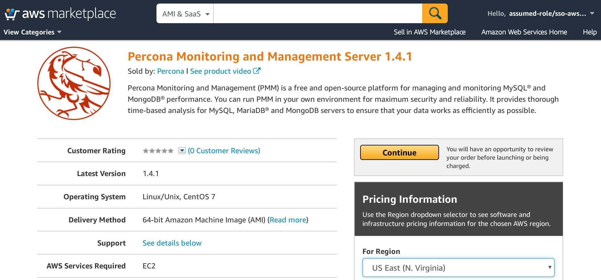
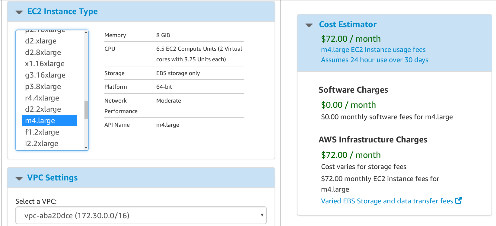
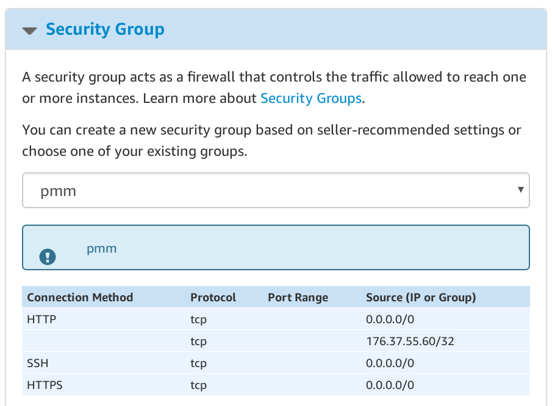
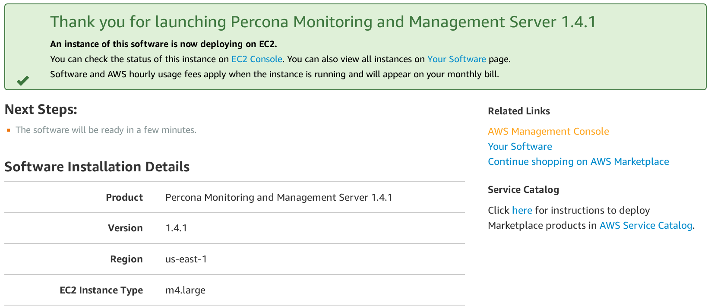
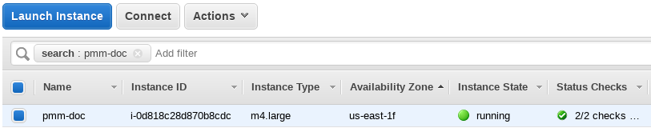
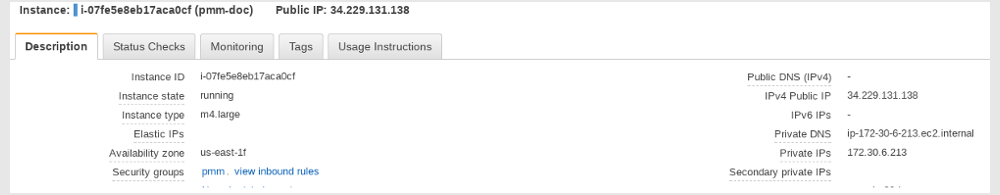
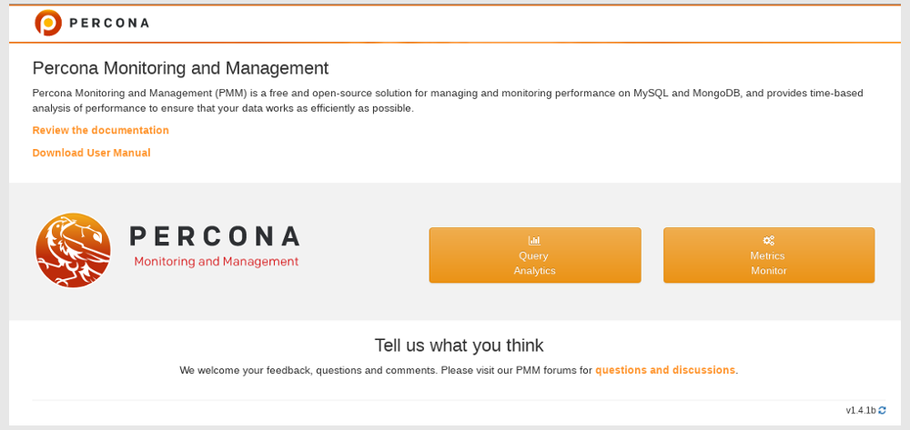

.. _run-server-ami:

==============================================
Running PMM Server Using AWS Marketplace
==============================================

You can run an instance of |pmm-server| hosted at AWS Marketplace. This
method replaces the outdated method where you would have to accessing
an AMI (Amazon Machine Image) by using its ID, different for each region.

.. _figure/pmm/deploying/aws-marketplace/home-page.1:

   *The home page of PMM in AWS Marketplace. Click the Continue button to start
   setting up your instance. You can also preselect your region on this screen.*

Assuming that you have an AWS (Amazon Web Services) account, locate
*Percona Monitoring and Management Server 1.4.1* in `AWS Marketplace
<https://aws.amazon.com/marketplace>`_.

.. note:: **Available versions**

   Currently, you can use this method to run an instance of |pmm| version 1.4.1.

Click the :guilabel:`Continue` button to start setting up your instance. There
are two options available to you. The ``1-Click Launch`` option is a quick way
to make your instance ready. For more control, use the ``Manual Launch`` option.

.. figure:: ../../images/aws-marketplace.pmm.launch-on-ec2.png

   *Percona Monitoring and Management is now available from AWS Marketplace*
	    
Setting up a |pmm| instance using the ``1-Click Launch`` option
================================================================================

With the ``1-Click Launch`` tab selected, make sure that all sections match your
preferences. In this demonstration, we use the :option:`US East (N. Virginia)`
region and the VPC (virtual private cloud) named :option:`vpc-aba20dce`. To
reduce cost, you need to choose the region closest to your location.

On the :guilabel:`1-Click Launch` tab, you select your region in the
:guilabel:`Region` section. Note that your choice of the region is preserved
from
:ref:`the previous screen <figure/pmm/deploying/aws-marketplace/home-page.1>`
where it is available next to the :guilabel:`Continue` button.

Setting up a VPC and an EC2 instance type
--------------------------------------------------------------------------------

Depending on your choice of a VPC some configurations of CPU and RAM may be disabled
in the :guilabel:`EC2 Instance Type` section.

In this demonstration, we select the :option:`vpc-aba20dce` in the
:guilabel:`VPC Settings` section. Then, we choose :option:`m4.large` as the EC2
instance type.

   *Select VPC in the VPC Settings section and then choose an EC2 instance type
   that suits your planned configuration.*

Instead of a VPC (virtual private cloud) you may choose the :option:`EC2 Classic (no VPC)`
option and use a public cloud.

Selecting a subnet, you effectively choose an availability zone in the selected
region. We recommend that you choose the availability zone where your RDS is
located.

Note that the cost estimation is automatically updated based on your choice.

Limiting Access to the instance: security group and a key pair
--------------------------------------------------------------------------------

In the Security group, which acts like a firewall, select a preconfigured
security group in the :guilabel:`Security group` section. In the :guilabel:`Key
Pair` select an already set up EC2 key pair to limit access to your instance.

It is important that the security group allow communication via the following
ports: 22, 80, and 443. |pmm| should also be able to access port 3306 on the RDS
that uses the instance.

   *Select a security group which manages firewall settings.*
   
Applying settings
--------------------------------------------------------------------------------

Scroll up to the top of the page to view your settings. Then, click the
:guilabel:`Launch with 1 click` button to continue and adjust your settings in
the :program:`EC2 console`.

.. figure:: ../../images/aws-marketplace.pmm.launch-on-ec2.1-click-launch.3.png
	    
   *Your instance settings are summarized in a special area. Click
   the Launch with 1 click button to continue.*

.. note:: The :guilabel:`Launch with 1 click` button may alternatively be titled
          as :guilabel:`Accept Software Terms & Launch with 1-Click`.

.. _pmm/ami/instance-setting/ec2-console.adjusting:

Adjusting instance settings in the EC2 Console
--------------------------------------------------------------------------------

Your clicking the :guilabel:`Launch with 1 click` button, deploys your
instance. To continue setting up your instance, run the :program:`EC2
console`. It is available as a link at the top of the page that opens after you
click the :guilabel:`Launch with 1 click` button.

   *Adjust your settings in the EC2 console. To run it, click the EC2 Console
   link in the message at the top of the page.*

Your instance appears in the :program:`EC2 console` in a table that lists all
instances available to you. When a new instance is only created, it has no
name. Make sure that you give it a name to distinguish from other instances
managed via the :program:`EC2 console`.

   *The newly created instance selected.*

Running the instance
--------------------------------------------------------------------------------

After you add your new instance it will take some time to initialize it. When
the :guilabel:`Instance State` contains :option:`running` for your instance, you
can run it.

.. note::

   When started the next time after rebooting, your instance may acquire another
   IP address. You may choose to set up an elastic IP to avoid this problem.

   For more information, see
   `Elastic IP Addresses <http://docs.aws.amazon.com/AWSEC2/latest/UserGuide/elastic-ip-addresses-eip.html>`_
   in AWS documentation.

With your instance selected, open its IP address in a web browser. The IP
address appears in the :guilabel:`IPv4 Public IP` column or as value of the
:guilabel:`Public IP` field at the top of the :guilabel:`Properties` panel.

   *To run the instance, copy and paste its public IP address to the location bar
   of your brower.*

In the |pmm.name| welcome page that opens, enter the instance ID in the
:guilabel:`Instance ID` field.

.. figure:: ../../images/aws-marketplace.pmm.ec2.dialog.instance-id.1.png

   *Enter the instance ID on the welcome page.*

You can copy the instance ID in the :guilabel:`Properties` panel of your
instance, select the :guilabel:`Description` tab back in the :program:`EC2
console`. Click the :guilabel:`Copy` button next to the :guilabel:`Instance
ID` field. This button appears as soon as you hover the cursor of your mouse
over the ID.

.. figure:: ../../images/aws-marketplace.pmm.ec2.properties.instance-id.png

   *Hover the cursor over the instance ID for Copy button to appear.*

Paste the instance in the :guilabel:`Instance ID` field of the |pmm.name|
welcome page and click :guilabel:`Submit`.

The next screen offers to create a user and a password that you will later use
to run your instance. Create a user name, assign a password, and click
:guilabel:`Submit`.

.. figure:: ../../images/aws-marketplace.pmm.ec2.dialog.user-name.png

   *Create credentials for your instance.*

The system authentication window then appears for you to use
your newly created credentials. Enter the user name and password that you have
just created. Your instance is now ready.

   *Percona Monitoring and Management is now ready*

.. note:: **Accessing the instance by using an SSH client.**

   For instructions about how to access your instances by using an SSH client, see
   `Connecting to Your Linux Instance Using SSH <http://docs.aws.amazon.com/AWSEC2/latest/UserGuide/AccessingInstancesLinux.html>`_
	     
   Make sure to replace the user name ``ec2-user`` used in this document with
   ``admin``.

Next Steps
==========

:ref:`Verify that PMM Server is running <deploy-pmm.server.verifying>`
by connecting to the PMM web interface using the IP address
from the console output,
then :ref:`install PMM Client <install-client>`
on all database hosts that you want to monitor.

.. seealso::

   AWS Documentation:

   - `Elastic IP Addresses <http://docs.aws.amazon.com/AWSEC2/latest/UserGuide/elastic-ip-addresses-eip.html>`_.
   - `Amazon EC2 Security Groups for Linux Instances <http://docs.aws.amazon.com/AWSEC2/latest/UserGuide/using-network-security.html>`_.
   - `Connecting to Your Linux Instance Using SSH <http://docs.aws.amazon.com/AWSEC2/latest/UserGuide/AccessingInstancesLinux.html>`_ (use ``admin`` as the user name)

Running PMM Server Using Amazon Machine Images
==============================================

Percona provides public Amazon Machine Images (AMI) with *PMM Server*
in all regions where Amazon Web Services (AWS) is available.
You can launch an instance using the web console
for the corresponding image:

.. list-table::
   :header-rows: 1

   * - Region
     - String
     - AMI ID
   * - US East (N. Virginia)
     - ``us-east-1``
     - `ami-fef59384 <https://console.aws.amazon.com/ec2/v2/home?region=us-east-1#Images:visibility=public-images;imageId=ami-fef59384>`_
   * - US East (Ohio)
     - ``us-east-2``
     - `ami-0ae8c16f <https://console.aws.amazon.com/ec2/v2/home?region=us-east-2#Images:visibility=public-images;imageId=ami-0ae8c16f>`_
   * - US West (N. California)
     - ``us-west-1``
     - `ami-e099a380 <https://console.aws.amazon.com/ec2/v2/home?region=us-west-1#Images:visibility=public-images;imageId=ami-e099a380>`_
   * - US West (Oregon)
     - ``us-west-2``
     - `ami-ad31ebd5 <https://console.aws.amazon.com/ec2/v2/home?region=us-west-2#Images:visibility=public-images;imageId=ami-ad31ebd5>`_
   * - Canada (Central)
     - ``ca-central-1``
     - `ami-1010ab74 <https://console.aws.amazon.com/ec2/v2/home?region=ca-central-1#Images:visibility=public-images;imageId=ami-1010ab74>`_
   * - EU (Ireland)
     - ``eu-west-1``
     - `ami-6618a61f <https://console.aws.amazon.com/ec2/v2/home?region=eu-west-1#Images:visibility=public-images;imageId=ami-6618a61f>`_
   * - EU (Frankfurt)
     - ``eu-central-1``
     - `ami-e71d9388 <https://console.aws.amazon.com/ec2/v2/home?region=eu-central-1#Images:visibility=public-images;imageId=ami-e71d9388>`_
   * - EU (London)
     - ``eu-west-2``
     - `ami-dfd4cabb <https://console.aws.amazon.com/ec2/v2/home?region=eu-west-2#Images:visibility=public-images;imageId=ami-dfd4cabb>`_
   * - Asia Pacific (Singapore)
     - ``ap-southeast-1``
     - `ami-4efa9f32 <https://console.aws.amazon.com/ec2/v2/home?region=ap-southeast-1#Images:visibility=public-images;imageId=ami-4efa9f32>`_
   * - Asia Pacific (Sydney)
     - ``ap-southeast-2``
     - `ami-787e8a1a <https://console.aws.amazon.com/ec2/v2/home?region=ap-southeast-2#Images:visibility=public-images;imageId=ami-787e8a1a>`_
   * - Asia Pacific (Seoul)
     - ``ap-northeast-2``
     - `ami-2bad0b45 <https://console.aws.amazon.com/ec2/v2/home?region=ap-northeast-2#Images:visibility=public-images;imageId=ami-2bad0b45>`_
   * - Asia Pacific (Tokyo)
     - ``ap-northeast-1``
     - `ami-19f3747f <https://console.aws.amazon.com/ec2/v2/home?region=ap-northeast-1#Images:visibility=public-images;imageId=ami-19f3747f>`_
   * - Asia Pacific (Mumbai)
     - ``ap-south-1``
     - `ami-fea3ea91 <https://console.aws.amazon.com/ec2/v2/home?region=ap-south-1#Images:visibility=public-images;imageId=ami-fea3ea91>`_
   * - South America (São Paulo)
     - ``sa-east-1``
     - `ami-0263246e <https://console.aws.amazon.com/ec2/v2/home?region=sa-east-1#Images:visibility=public-images;imageId=ami-0263246e>`_

Running from Command Line
--------------------------------------------------------------------------------

1. Launch the *PMM Server* instance using the ``run-instances`` command
   for the corresponding region and image.
   For example:

   .. code-block:: bash

      aws ec2 run-instances \
        --image-id ami-fef59384 \
        --security-group-ids sg-3b6e5e46 \
        --instance-type t2.micro \
        --subnet-id subnet-4765a930 \
        --region us-east-1 \
        --key-name SSH-KEYNAME

   .. note:: Providing the public SSH key is optional.
      Specify it if you want SSH access to *PMM Server*.

#. Set a name for the instance using the ``create-tags`` command.
   For example:

   .. code-block:: bash

      aws ec2 create-tags  \
        --resources i-XXXX-INSTANCE-ID-XXXX \
        --region us-east-1 \
        --tags Key=Name,Value=OWNER_NAME-pmm

#. Get the IP address for accessing *PMM Server* from console output
   using the ``get-console-output`` command.
   For example:

   .. code-block:: bash

      aws ec2 get-console-output \
        --instance-id i-XXXX-INSTANCE-ID-XXXX \
        --region us-east-1 \
        --output text \
        | grep cloud-init

.. include:: ../../.res/replace/name.txt
.. include:: ../../.res/replace/program.txt
.. include:: ../../.res/replace/option.txt
