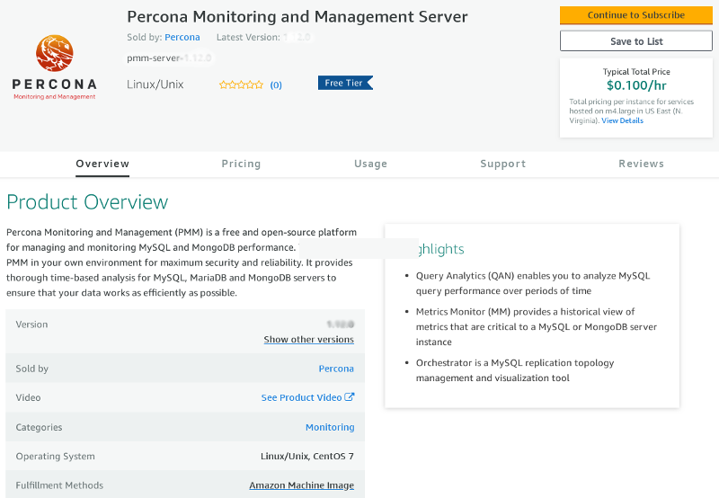
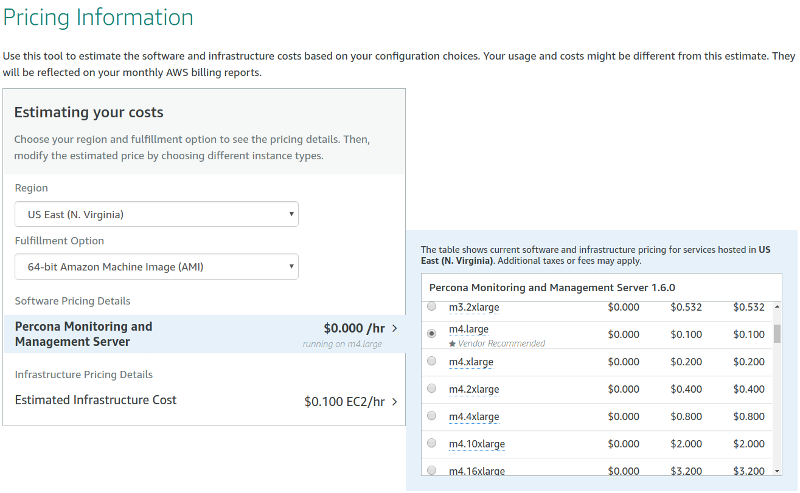
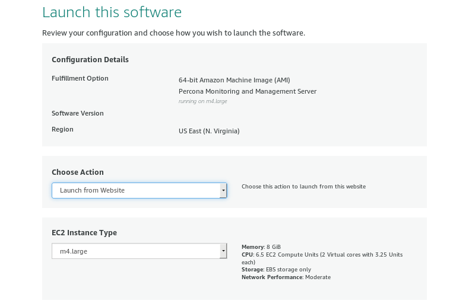
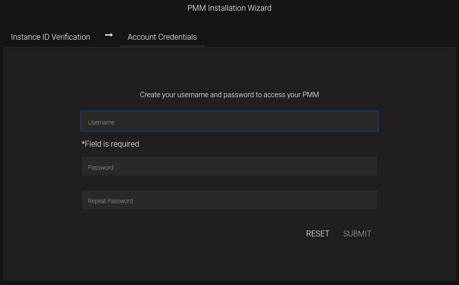

.. _run-server-ami:

Running PMM Server Using AWS Marketplace
********************************************************************************

You can run an instance of |pmm-server| hosted at AWS Marketplace. This
method replaces the outdated method where you would have to accessing
an AMI (Amazon Machine Image) by using its ID, different for each region.

   The home page of PMM in AWS Marketplace.

Assuming that you have an AWS (Amazon Web Services) account, locate
*Percona Monitoring and Management Server* in `AWS Marketplace
<https://aws.amazon.com/marketplace/pp/B077J7FYGX>`_.

The |gui.pricing-information| section allows to select your region and choose an
instance type in the table that shows the pricing for the software and
infrastructure hosted in the region you have selected (the recommended
EC2 instance type is preselected for you). Note that actual choice will be done
later, and this table serves the information purposes, to plan costs.

   As soon as you select your region, you can choose the EC2 instance in it and
   see its price. |pmm| comes for no cost, you may only need to pay for the
   infrastructure provided by |amazon|.

.. note::

   Disk space consumed by |pmm-server| depends on the number of hosts under
   monitoring. Each environment will be unique, however consider modeling your data consumption based on `PMM Demo <https://pmmdemo.percona.com/>`_ web site, which consumes ~230MB/host/day, or ~6.9GB/host at the default 30 day retention period. See `this blog post <https://www.percona.com/blog/2017/05/04/how-much-disk-space-should-i-allocate-for-percona-monitoring-and-management/>`_ for more details.

Clicking the |gui.continue-to-subscribe| button will proceed to the terms and
conditions page. Clicking |gui.continue-to-configuration| there will bring a
new page to start setting up your instance.

   Percona Monitoring and Management on AWS Marketplace - launch options.

Available launch options in the drop-down menu include *Launch from Website* and
*Launch through EC2*. The first one is a quick way to make your instance ready.
For more control, use the Manual Launch through EC2 option.

|chapter.toc|

.. contents::
   :local:
   :depth: 1

.. _run-server-ami.pmm-instance.1-click-launch-option.setting-up:

`Setting Up a PMM Instance Using the website GUI <ami.html#run-server-ami-pmm-instance-1-click-launch-option-setting-up>`_
===============================================================================================================================

Choose *Launch from Website* option, your region, and the EC2 instance type on
the launch options page. On the previous screenshot, we use the
:option:`US East (N. Virginia)` region and the :guilabel:`EC2 Instance Type` named
:option:`m4.large`. To reduce cost, you need to choose the region closest to
your location.

When all choices are done, click the |gui.continue-to-launch| button to proceed.

.. _run-server-ami.pmm-instance.1-click-launch-option.vpc.ec2-instance-type:

`Setting up a VPC and an EC2 Instance Type <ami.html#run-server-ami-pmm-instance-1-click-launch-option-vpc-ec2-instance-type>`_
---------------------------------------------------------------------------------------------------------------------------------

 In this demonstration, we use the VPC (virtual private cloud) named
:option:`vpc-484bb12f`. The exact name of VPC may be different from the example
discussed here.

.. _figure.run-server-ami.aws-marketplace.pmm.launch-on-ec2.1-click-launch.vpc.ec2-instance-type:

.. figure:: ../../.res/graphics/png/aws-marketplace.pmm.launch-on-ec2.1-click-launch.1.png

   Select VPC in the VPC Settings section.

Instead of a VPC (virtual private cloud) you may choose the :option:`EC2 Classic
(no VPC)` option and use a public cloud.

Selecting a subnet, you effectively choose an availability zone in the selected
region. We recommend that you choose the availability zone where your RDS is
located.

Note that the cost estimation is automatically updated based on your choice.

.. seealso::

   |aws| Documentation: Availability zones
      https://docs.aws.amazon.com/AWSEC2/latest/UserGuide/using-regions-availability-zones.html

.. _run-server-ami.security-group.key-pair:

`Limiting Access to the instance: security group and a key pair <ami.html#run-server-ami-security-group-key-pair>`_
--------------------------------------------------------------------------------------------------------------------

In the |gui.security-group| section, which acts like a firewall, you may use the
preselected option :option:`Create new based on seller settings` to create a
security group with recommended settings. In the :guilabel:`Key Pair` select an
already set up EC2 key pair to limit access to your instance.

.. _figure.run-server-ami.aws-marketplace.pmm.launch-on-ec2.1-click-launch.key-pair.selecting:

.. figure:: ../../.res/graphics/png/aws-marketplace.pmm.launch-on-ec2.1-click-launch.3.png

   Select an already existing key pair (use the EC2 console to create one if necessary)

.. important::

   It is important that the security group allow communication via the the
   :ref:`following ports <Ports>`: *22*, *80*, and *443*. |pmm| should also be
   able to access port *3306* on the RDS that uses the instance.

.. _figure.run-server-ami.aws-marketplace.pmm-launch-on-ec2.1-click-launch.security-group.selecting:

.. figure:: ../../.res/graphics/png/aws-marketplace.pmm.launch-on-ec2.1-click-launch.2.png

   Select a security group which manages firewall settings.

.. seealso::

   |amazon| Documentation: Security groups
      https://docs.aws.amazon.com/AWSEC2/latest/UserGuide/using-network-security.html
   |amazon| Documentation: Key pairs
      https://docs.aws.amazon.com/AWSEC2/latest/UserGuide/ec2-key-pairs.html
   |amazon| Documentation: Importing your own public key to |amazon| EC2
      https://docs.aws.amazon.com/AWSEC2/latest/UserGuide/ec2-key-pairs.html#how-to-generate-your-own-key-and-import-it-to-aws

.. _run-server-ami.setting.applying:

`Applying settings <ami.html#run-server-ami-setting-applying>`_
--------------------------------------------------------------------------------

Scroll up to the top of the page to view your settings. Then, click the
:guilabel:`Launch with 1 click` button to continue and adjust your settings in
the :program:`EC2 console`.

.. _figure.run-server-ami.aws-marketplace.pmm.launch-on-ec2.1-click-launch:

.. figure:: ../../.res/graphics/png/aws-marketplace.pmm.launch-on-ec2.1-click-launch.3.png

   Your instance settings are summarized in a special area. Click
   the Launch with 1 click button to continue.

.. note:: The :guilabel:`Launch with 1 click` button may alternatively be titled
          as :guilabel:`Accept Software Terms & Launch with 1-Click`.

.. _pmm.ami.instance-setting.ec2-console.adjusting:

`Adjusting instance settings in the EC2 Console <ami.html#pmm-ami-instance-setting-ec2-console-adjusting>`_
------------------------------------------------------------------------------------------------------------

Your clicking the :guilabel:`Launch with 1 click` button, deploys your
instance. To continue setting up your instance, run the :program:`EC2
console`. It is available as a link at the top of the page that opens after you
click the :guilabel:`Launch with 1 click` button.

Your instance appears in the :program:`EC2 console` in a table that lists all
instances available to you. When a new instance is only created, it has no
name. Make sure that you give it a name to distinguish from other instances
managed via the :program:`EC2 console`.

.. _figure.run-server-ami.aws-marketplace.ec2-console.pmm:

.. figure:: ../../.res/graphics/png/aws-marketplace.ec2-console.pmm.1.png

   The newly created instance selected.

.. _pmm.server.ami.running-instance:

`Running the instance <ami.html#pmm-server-ami-running-instance>`_
--------------------------------------------------------------------------------

After you add your new instance it will take some time to initialize it. When
the AWS console reports that the instance is now in a running state, you many
continue with configuration of |pmm-server|.

.. note::

   When started the next time after rebooting, your instance may acquire another
   IP address. You may choose to set up an elastic IP to avoid this problem.

   .. seealso::

      |amazon| Documentation: Elastic IP Addresses
         http://docs.aws.amazon.com/AWSEC2/latest/UserGuide/elastic-ip-addresses-eip.html

With your instance selected, open its IP address in a web browser. The IP
address appears in the :guilabel:`IPv4 Public IP` column or as value of the
:guilabel:`Public IP` field at the top of the :guilabel:`Properties` panel.

.. _figure.run-server-ami.aws-marketplace.pmm.ec2.properties:

.. figure:: ../../.res/graphics/png/aws-marketplace.pmm.ec2.properties.png

   The public IP address of the instance

To run the instance, copy and paste its public IP address to the location bar of
your browser. In the |pmm.name| welcome page that opens, enter the instance ID.

.. _figure.run-server-ami.installation-wizard.ami.instance-id-verification:

.. figure:: ../../.res/graphics/png/installation-wizard.ami.instance-id-verification.png

   Entering the instance ID when installing |pmm-server|

You can copy the instance ID from the :guilabel:`Properties` panel of your
instance, select the :guilabel:`Description` tab back in the :program:`EC2
console`. Click the :guilabel:`Copy` button next to the :guilabel:`Instance
ID` field. This button appears as soon as you hover the cursor of your mouse
over the ID.

.. _figure.run-server-ami.aws-marketplace.pmm.ec2.properties.instance-id:

.. figure:: ../../.res/graphics/png/aws-marketplace.pmm.ec2.properties.instance-id.png

   Hover the cursor over the instance ID for the Copy button to appear.

Paste the instance in the :guilabel:`Instance ID` field of the |pmm.name|
welcome page and click |gui.submit|.

.. _figure.run-server-ami.installation-wizard.ami.account-credentials:

   Create credentials for your instance.

Click |gui.submit| and enter your user name and password in the dialog window
that pops up. The |pmm-server| is now ready and the home page opens.

.. _figure.run-server-ami.pmm-server.home-page:

.. figure:: ../../.res/graphics/png/pmm.home-page.png

   |pmm-server| home page

You are creating a username and password that will be used for two purposes:

1. authentication as a user to PMM - this will be the credentials you need in order
   to log in to PMM.
#. authentication between PMM Server and PMM Clients - you will
   re-use these credentials when configuring pmm-client for the first time on a
   server, for example:

   |tip.run-this.root|

   .. code-block:: sh

      $ pmm-admin config --username= --password= --server=1.2.3.4

.. note:: **Accessing the instance by using an SSH client.**

   For instructions about how to access your instances by using an SSH client, see
   `Connecting to Your Linux Instance Using SSH
   <http://docs.aws.amazon.com/AWSEC2/latest/UserGuide/AccessingInstancesLinux.html>`_

   Make sure to replace the user name ``ec2-user`` used in this document with
   ``admin``.

.. seealso::

   How to verify that the |pmm-server| is running properly?
      :ref:`deploy-pmm.server.verifying`

   How to connect a |pmm-client| to the |pmm-server|?
      :ref:`deploy-pmm.client_server.connecting`

.. _run-server-ami.ebs-volume.resizing:

`Resizing the EBS Volume <ami.html#run-server-ami-ebs-volume-resizing>`_
--------------------------------------------------------------------------------

Your instance comes with a predefined size which can become a limitation. To
make more disk space available to your instance, you need to increase the size
of the EBS volume as needed and then your instance will reconfigure itself to
use the new size.

The procedure of resizing EBS volumes is described in the |amazon|
documentation: `Modifying the Size, IOPS, or Type of an EBS Volume on Linux
<https://docs.aws.amazon.com/AWSEC2/latest/UserGuide/ebs-modify-volume.html>`_.

After the EBS volume is updated, |pmm-server| instance will autodetect changes
in approximately 5 minutes or less and will reconfigure itself for the updated
conditions.

.. admonition:: More information in |aws| documentation

   Elastic IP Addresses
      http://docs.aws.amazon.com/AWSEC2/latest/UserGuide/elastic-ip-addresses-eip.html

   |amazon| EC2 Security Groups for Linux Instances
      http://docs.aws.amazon.com/AWSEC2/latest/UserGuide/using-network-security.html

   Connecting to Your Linux Instance Using SSH (use ``admin`` as the user name)
      http://docs.aws.amazon.com/AWSEC2/latest/UserGuide/AccessingInstancesLinux.html

.. _run-server-ami.amazon-machine-image:

`Running PMM Server Using Amazon Machine Images <ami.html#run-server-ami-amazon-machine-image>`_
=================================================================================================

|percona| provides public |amazon| Machine Images (AMI) with |pmm-server|
in all regions where Amazon Web Services (AWS) is available.
You can launch an instance using the web console
for the corresponding image:

.. list-table::
   :header-rows: 1

   * - Region
     - String
     - AMI ID

   * - Asia Pacific (Tokyo)
     - **ap-northeast-1**
     - `ami-0d7cd5d91dba7a337 <https://console.aws.amazon.com/ec2/v2/home?region=us-east-1#Images:visibility=public-images;imageId=ami-0d7cd5d91dba7a337>`_

   * - Asia Pacific (Seoul)
     - **ap-northeast-2**
     - `ami-0606a76833698d66b <https://console.aws.amazon.com/ec2/v2/home?region=us-east-1#Images:visibility=public-images;imageId=ami-0606a76833698d66b>`_

   * - Asia Pacific (Mumbai)
     - **ap-south-1**
     - `ami-0a4b0afc6926b8625 <https://console.aws.amazon.com/ec2/v2/home?region=us-east-1#Images:visibility=public-images;imageId=ami-0a4b0afc6926b8625>`_

   * - Asia Pacific (Singapore)
     - **ap-southeast-1**
     - `ami-004ded7fa924ce4ec <https://console.aws.amazon.com/ec2/v2/home?region=us-east-1#Images:visibility=public-images;imageId=ami-004ded7fa924ce4ec>`_

   * - Asia Pacific (Sydney)
     - **ap-southeast-2**
     - `ami-0a3f98b8b6c34a2e2 <https://console.aws.amazon.com/ec2/v2/home?region=us-east-1#Images:visibility=public-images;imageId=ami-0a3f98b8b6c34a2e2>`_

   * - Canada (Central)
     - **ca-central-1**
     - `ami-00b46791100d4c097 <https://console.aws.amazon.com/ec2/v2/home?region=us-east-1#Images:visibility=public-images;imageId=ami-00b46791100d4c097>`_

   * - EU (Frankfurt)
     - **eu-central-1**
     - `ami-0669bea2272632747 <https://console.aws.amazon.com/ec2/v2/home?region=us-east-1#Images:visibility=public-images;imageId=ami-0669bea2272632747>`_

   * - EU (Stockholm)
     - **eu-north-1**
     - `ami-01ae93772f26921ec <https://console.aws.amazon.com/ec2/v2/home?region=us-east-1#Images:visibility=public-images;imageId=ami-01ae93772f26921ec>`_

   * - EU (Ireland)
     - **eu-west-1**
     - `ami-0ecd45316fe33441c <https://console.aws.amazon.com/ec2/v2/home?region=us-east-1#Images:visibility=public-images;imageId=ami-0ecd45316fe33441c>`_

   * - EU (London)
     - **eu-west-2**
     - `ami-0edcc115190b77ed8 <https://console.aws.amazon.com/ec2/v2/home?region=us-east-1#Images:visibility=public-images;imageId=ami-0edcc115190b77ed8>`_

   * - EU (Paris)
     - **eu-west-3**
     - `ami-0640656f6400a870b <https://console.aws.amazon.com/ec2/v2/home?region=us-east-1#Images:visibility=public-images;imageId=ami-0640656f6400a870b>`_

   * - South America (São Paulo)
     - **sa-east-1**
     - `ami-07934243233049aa6 <https://console.aws.amazon.com/ec2/v2/home?region=us-east-1#Images:visibility=public-images;imageId=ami-07934243233049aa6>`_

   * - US East (N. Virginia)
     - **us-east-1**
     - `ami-05d0d72221501bdff <https://console.aws.amazon.com/ec2/v2/home?region=us-east-1#Images:visibility=public-images;imageId=ami-05d0d72221501bdff>`_

   * - US East (Ohio)
     - **us-east-2**
     - `ami-0b8eb1cbcb6dfe2f2 <https://console.aws.amazon.com/ec2/v2/home?region=us-east-1#Images:visibility=public-images;imageId=ami-0b8eb1cbcb6dfe2f2>`_

   * - US West (N. California)
     - **us-west-1**
     - `ami-0178d5a07344e01e4 <https://console.aws.amazon.com/ec2/v2/home?region=us-east-1#Images:visibility=public-images;imageId=ami-0178d5a07344e01e4>`_

   * - US West (Oregon)
     - **us-west-2**
     - `ami-0b2b7fcd5341e75a9 <https://console.aws.amazon.com/ec2/v2/home?region=us-east-1#Images:visibility=public-images;imageId=ami-0b2b7fcd5341e75a9>`_

.. _run-server-ami.command-line:

`Running from Command Line <ami.html#run-server-ami-command-line>`_
--------------------------------------------------------------------------------

1. Launch the |pmm-server| instance using the ``run-instances`` command
   for the corresponding region and image.
   For example:

   .. include:: ../../.res/code/aws.ec2.run-instances.txt

   .. note:: Providing the public SSH key is optional.
      Specify it if you want SSH access to |pmm-server|.

#. Set a name for the instance using the ``create-tags`` command.
   For example:

   .. include:: ../../.res/code/aws.ec2.create-tags.txt

#. Get the IP address for accessing |pmm-server| from console output
   using the ``get-console-output`` command.
   For example:

   .. include:: ../../.res/code/aws.ec2.get-console-output.txt

.. _upgrade-pmm-server:

`Upgrading PMM Server <ami.html#upgrade-pmm-server>`_
================================================================================

.. _upgrade-ec2-instance-class:

:ref:`Upgrading EC2 instance class <upgrade-ec2-instance-class>`
--------------------------------------------------------------------------------

Upgrading to a larger EC2 instance class is supported by PMM provided you follow
the instructions from the `AWS manual <https://docs.aws.amazon.com/AWSEC2/latest/UserGuide/ec2-instance-resize.html>`_.
The |pmm| AMI image uses a distinct EBS volume for the |pmm| data volume which
permits independent resize of the EC2 instance without impacting the EBS volume.

.. _expand-pmm-data-volume:

`Expanding the PMM Data EBS Volume <ami.html#expand-pmm-data-volume>`_
--------------------------------------------------------------------------------

The |pmm| data volume is mounted as an XFS formatted volume on top of an LVM
volume. There are two ways to increase this volume size:

1. Add a new disk via EC2 console or API, and expand the LVM volume to include
   the new disk volume.
2. Expand existing EBS volume and grow the LVM volume.

Expand existing EBS volume
^^^^^^^^^^^^^^^^^^^^^^^^^^^^^^^^^^^^^^^^^^^^^^^^^^^^^^^^^^^^^^^^^^^^^^^^^^^^^^^^
To expand the existing EBS volume in order to increase capacity, the following
steps should be followed.

1. Expand the disk from AWS Console/CLI to the desired capacity.
2. Login to the |pmm| EC2 instance and verify that the disk capacity has
   increased. For example, if you have expanded disk from 100G to 200G, ``dmesg``
   output should look like below::

     [  535.994494] xvdb: detected capacity change from 107374182400 to 214748364800

3. You can check information about volume groups and logical volumes with the
   ``vgs`` and ``lvs`` commands::

    [root@ip-10-1-2-70 ~]# vgs
     VG     #PV #LV #SN Attr   VSize   VFree
     DataVG   1   2   0 wz--n- 100.00g 0

    [root@ip-10-1-2-70 ~]# lvs
     LV       VG     Attr       LSize   Pool Origin Data%  Meta% Move Log Cpy%Sync Convert
     DataLV   DataVG Vwi-aotz--  79.69g ThinPool     1.74
     ThinPool DataVG twi-aotz--  99.61g              1.39  0.43

4. Now we can use the ``lsblk`` command to see that our disk size has been
   identified by the kernel correctly, but LVM2 is not yet aware of the new size.
   We can use ``pvresize`` to make sure the PV device reflects the new size.
   Once ``pvresize`` is executed, we can see that the VG has the new free space
   available.

   .. code-block:: bash

      [root@ip-10-1-2-70 ~]# lsblk | grep xvdb
       xvdb                      202:16 0 200G 0 disk

      [root@ip-10-1-2-70 ~]# pvscan
       PV /dev/xvdb   VG DataVG    lvm2 [<16.00 GiB / 0    free]
       Total: 1 [100.00 GiB] / in use: 1 [100.00 GiB] / in no VG: 0 [0   ]

      [root@ip-10-1-2-70 ~]# pvresize /dev/xvdb
       Physical volume "/dev/xvdb" changed
       1 physical volume(s) resized / 0 physical volume(s) not resized

      [root@ip-10-1-2-70 ~]# pvs
       PV         VG     Fmt  Attr PSize   PFree
       /dev/xvdb  DataVG lvm2 a--  199.30g 99.30g

5. We then extend our logical volume. Since the PMM image uses thin
   provisioning, we need to extend both the pool and the volume::

      [root@ip-10-1-2-70 ~]# lvs
       LV       VG     Attr       LSize   Pool     Origin Data%  Meta% Move Log Cpy%Sync Convert
       DataLV   DataVG Vwi-aotz--  79.69g ThinPool        1.77
       ThinPool DataVG twi-aotz--  99.61g                 1.42   0.43

      [root@ip-10-1-2-70 ~]# lvextend /dev/mapper/DataVG-ThinPool -l 100%VG
       Size of logical volume DataVG/ThinPool_tdata changed from 99.61 GiB (25499 extents) to 198.91 GiB (50921 extents).
       Logical volume DataVG/ThinPool_tdata successfully resized.

      [root@ip-10-1-2-70 ~]# lvs
       LV       VG     Attr       LSize   Pool     Origin Data%  Meta% Move Log Cpy%Sync Convert
       DataLV   DataVG Vwi-aotz--  79.69g ThinPool        1.77
       ThinPool DataVG twi-aotz-- 198.91g                 0.71   0.83

6. Once the pool and volumes have been extended, we need to now extend the thin
   volume to consume the newly available space. In this example we've grown
   available space to almost 200GB, and already consumed logical volume size,
   so we're extending an additional 119GB:

   .. code-block:: bash

      [root@ip-10-1-2-70 ~]# lvs
       LV       VG     Attr       LSize   Pool     Origin Data%  Meta% Move Log Cpy%Sync Convert
       DataLV   DataVG Vwi-aotz--  79.69g ThinPool        1.77
       ThinPool DataVG twi-aotz-- 198.91g                 0.71   0.83

      [root@ip-10-1-2-70 ~]# lvextend /dev/mapper/DataVG-DataLV -L +119G
       Size of logical volume DataVG/DataLV changed from 79.69 GiB (20401 extents) to 198.91 GiB (50865 extents).
       Logical volume DataVG/DataLV successfully resized.

      [root@ip-10-1-2-70 ~]# lvs
       LV       VG     Attr       LSize   Pool    Origin Data%  Meta% Move Log Cpy%Sync Convert
       DataLV   DataVG Vwi-aotz-- 198.69g ThinPool        0.71
       ThinPool DataVG twi-aotz-- 198.91g                 0.71   0.83

7. We then expand the XFS filesystem to reflect the new size using
   ``xfs_growfs``, and confirm the filesystem is accurate using the ``df``
   command.

   .. code-block:: bash

      [root@ip-10-1-2-70 ~]# df -h /srv
      Filesystem                  Size Used Avail Use% Mounted on
      /dev/mapper/DataVG-DataLV   100G 249M  100G   0% /srv

      [root@ip-10-1-2-70 ~]# xfs_growfs /srv
      meta-data=/dev/mapper/DataVG-DataLV isize=512    agcount=103, agsize=1305648 blks
               =                          sectsz=512   attr=2, projid32bit=1
               =                          crc=1        finobt=0 spinodes=0
      data     =                          bsize=4096   blocks=20890368, imaxpct=25
               =                          sunit=16     swidth=16 blks
      naming   =version 2                 bsize=4096   ascii-ci=0 ftype=1
      log      =internal                  bsize=4096   blocks=10208, version=2
               =                          sectsz=512   sunit=16 blks, lazy-count=1
      realtime =none                      extsz=4096   blocks=0, rtextents=0
      data blocks changed from 20890368 to 52085760

      [root@ip-10-1-2-70 ~]# df -h /srv
      Filesystem                 Size Used Avail Use% Mounted on
      /dev/mapper/DataVG-DataLV   32G 254M   32G   1% /srv

.. include:: ../../.res/replace.txt
