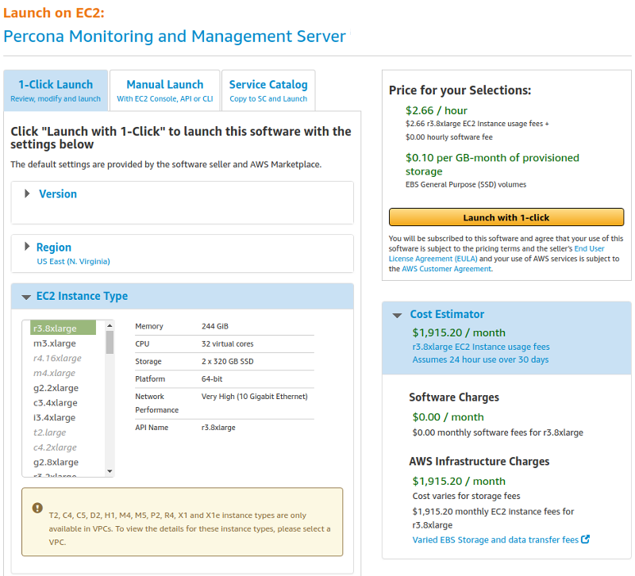

.. _run-server-ami:

==============================================
Running PMM Server Using AWS Marketplace
==============================================

You can run an instance of |pmm-server| hosted at AWS Marketplace. This
method replaces the outdated method where you would have to accessing
an AMI (Amazon Machine Image) by using its ID, different for each region.

.. figure:: ../../.res/graphics/png/aws-marketplace.pmm.home-page.1.png

   The home page of PMM in AWS Marketplace. Click the Continue button to start
   setting up your instance. You can also preselect your region on this screen.

Assuming that you have an AWS (Amazon Web Services) account, locate
*Percona Monitoring and Management Server* in `AWS Marketplace
<https://aws.amazon.com/marketplace>`_.

In the |gui.pricing-information| section, select your region and choose an
instance type in the table that shows the pricing for the software and
infrastructure hosted in the region you have selected. Note that the recommended
EC2 instance type is preselected for you.

.. figure:: ../../.res/graphics/png/aws-marketplace.pmm.home-page.2.png

   As soon as you select your region, you can choose the EC2 instance in it and
   see its price. |pmm| comes for no cost, you may only need to pay for the
   infrastructure provided by |amazon|.

Click the |gui.continue-to-subscribe| button to start setting up your instance. There
are two options available to you. The ``1-Click Launch`` option is a quick way
to make your instance ready. For more control, use the ``Manual Launch`` option.

   Percona Monitoring and Management is now available from AWS Marketplace
	    
.. _run-server-ami.pmm-instance.1-click-launch-option.setting-up:

Setting Up a |pmm| Instance Using the 1-Click Launch Option
================================================================================

With the |gui.1-click-launch| tab selected, make sure that all sections match
your preferences. In this demonstration, we use the :option:`US East
(N. Virginia)` region and the VPC (virtual private cloud) named
:option:`vpc-484bb12f`. To reduce cost, you need to choose the region closest to
your location.

.. note::

   The exact name of VPC may be different from the example discussed here.

On the |gui.1-click-launch| tab, select your region in the |gui.region|
section. By default, the region is the same as the one you chose in the
|gui.pricing-information| section.

.. _run-server-ami.pmm-instance.1-click-launch-option.vpc.ec2-instance-type:

Setting up a VPC and an EC2 Instance Type
--------------------------------------------------------------------------------

Depending on your choice of a VPC, some configurations of CPU and RAM may be disabled
in the :guilabel:`EC2 Instance Type` section.

In this demonstration, we select the :option:`vpc-aba20dce` in the
:guilabel:`VPC Settings` section. Then, we choose :option:`m4.large` as the EC2
instance type.

.. _figure.run-server-ami.aws-marketplace.pmm.launch-on-ec2.1-click-launch.vpc.ec2-instance-type:

.. figure:: ../../.res/graphics/png/aws-marketplace.pmm.launch-on-ec2.1-click-launch.1.png

   Select VPC in the VPC Settings section and then choose an EC2 instance type
   that suits your planned configuration.

Instead of a VPC (virtual private cloud) you may choose the :option:`EC2 Classic
(no VPC)` option and use a public cloud.

Selecting a subnet, you effectively choose an availability zone in the selected
region. We recommend that you choose the availability zone where your RDS is
located.

Note that the cost estimation is automatically updated based on your choice.

.. seealso::

   |aws| Documentation: Availability zones
      https://docs.aws.amazon.com/AWSEC2/latest/UserGuide/using-regions-availability-zones.html
   
.. _run-server-ami.security-group.key-pair:

Limiting Access to the instance: security group and a key pair
--------------------------------------------------------------------------------

In the |gui.security-group| section, which acts like a firewall, you may use the
preselected option :option:`Create new based on seller settings` to create a
security group with recommended settings. In the :guilabel:`Key Pair` select an
already set up EC2 key pair to limit access to your instance.

.. _figure.run-server-ami.aws-marketplace.pmm.launch-on-ec2.1-click-launch.key-pair.selecting:

.. figure:: ../../.res/graphics/png/aws-marketplace.pmm.launch-on-ec2.1-click-launch.3.png

   Select an already existing key pair (use the EC2 console to create one if necessary)

.. important::

   It is important that the security group allow communication via the following
   ports: *22*, *80*, and *443*. |pmm| should also be able to access port *3306* on
   the RDS that uses the instance.

.. _figure.run-server-ami.aws-marketplace.pmm-launch-on-ec2.1-click-launch.security-group.selecting:

.. figure:: ../../.res/graphics/png/aws-marketplace.pmm.launch-on-ec2.1-click-launch.2.png

   Select a security group which manages firewall settings.
   
.. seealso::

   |amazon| Documentation: Security groups
      https://docs.aws.amazon.com/AWSEC2/latest/UserGuide/using-network-security.html
   |amazon| Documentation: Key pairs
      https://docs.aws.amazon.com/AWSEC2/latest/UserGuide/ec2-key-pairs.html
   |amazon| Documentation: Importing your own public key to |amazon| EC2
      https://docs.aws.amazon.com/AWSEC2/latest/UserGuide/ec2-key-pairs.html#how-to-generate-your-own-key-and-import-it-to-aws
      
.. _run-server-ami.setting.applying:

Applying settings
--------------------------------------------------------------------------------

Scroll up to the top of the page to view your settings. Then, click the
:guilabel:`Launch with 1 click` button to continue and adjust your settings in
the :program:`EC2 console`.

.. _figure.run-server-ami.aws-marketplace.pmm.launch-on-ec2.1-click-launch:

.. figure:: ../../.res/graphics/png/aws-marketplace.pmm.launch-on-ec2.1-click-launch.3.png
	    
   Your instance settings are summarized in a special area. Click
   the Launch with 1 click button to continue.

.. note:: The :guilabel:`Launch with 1 click` button may alternatively be titled
          as :guilabel:`Accept Software Terms & Launch with 1-Click`.

.. _pmm/ami/instance-setting/ec2-console.adjusting:

Adjusting instance settings in the EC2 Console
--------------------------------------------------------------------------------

Your clicking the :guilabel:`Launch with 1 click` button, deploys your
instance. To continue setting up your instance, run the :program:`EC2
console`. It is available as a link at the top of the page that opens after you
click the :guilabel:`Launch with 1 click` button.

Your instance appears in the :program:`EC2 console` in a table that lists all
instances available to you. When a new instance is only created, it has no
name. Make sure that you give it a name to distinguish from other instances
managed via the :program:`EC2 console`.

.. _figure.run-server-ami.aws-marketplace.ec2-console.pmm:

.. figure:: ../../.res/graphics/png/aws-marketplace.ec2-console.pmm.1.png

   The newly created instance selected.

.. _pmm.server.ami.running-instance:

Running the instance
--------------------------------------------------------------------------------

After you add your new instance it will take some time to initialize it. When
the AWS console reports that the instance is now in a running state, you many
continue with configuration of |pmm-server|.

.. note::

   When started the next time after rebooting, your instance may acquire another
   IP address. You may choose to set up an elastic IP to avoid this problem.

   .. seealso::

      |amazon| Documentation: Elastic IP Addresses
         http://docs.aws.amazon.com/AWSEC2/latest/UserGuide/elastic-ip-addresses-eip.html

With your instance selected, open its IP address in a web browser. The IP
address appears in the :guilabel:`IPv4 Public IP` column or as value of the
:guilabel:`Public IP` field at the top of the :guilabel:`Properties` panel.

.. _figure.run-server-ami.aws-marketplace.pmm.ec2.properties:

.. figure:: ../../.res/graphics/png/aws-marketplace.pmm.ec2.properties.png

   The public IP address of the instance

To run the instance, copy and paste its public IP address to the location bar of
your browser. In the |pmm.name| welcome page that opens, enter the instance ID.

.. _figure.run-server-ami.installation-wizard.ami.instance-id-verification:

.. figure:: ../../.res/graphics/png/installation-wizard.ami.instance-id-verification.png

   Entering the instance ID when installing |pmm-server|

You can copy the instance ID from the :guilabel:`Properties` panel of your
instance, select the :guilabel:`Description` tab back in the :program:`EC2
console`. Click the :guilabel:`Copy` button next to the :guilabel:`Instance
ID` field. This button appears as soon as you hover the cursor of your mouse
over the ID.

.. _figure.run-server-ami.aws-marketplace.pmm.ec2.properties.instance-id:

.. figure:: ../../.res/graphics/png/aws-marketplace.pmm.ec2.properties.instance-id.png

   Hover the cursor over the instance ID for the Copy button to appear.

Paste the instance in the :guilabel:`Instance ID` field of the |pmm.name|
welcome page and click |gui.submit|.

Click |gui.submit| and enter your user name and password in the dialog window
that pops up. The |pmm-server| is now ready and the home page opens.

.. _figure.run-server-ami.installation-wizard.ami.account-credentials:

.. figure:: ../../.res/graphics/png/installation-wizard.ami.account-credentials.png

   Create credentials for your instance.

Click |gui.submit| and enter your user name and password in the dialog window
that pops up. The |pmm-server| is now ready and the home page opens.

.. _figure.run-server-ami.pmm-server.home-page:

.. figure:: ../../.res/graphics/png/pmm.home-page.png

   |pmm-server| home page

You are creating a username and password that will be used for two purposes:

1. authentication as a user to PMM - this will be the credentials you need in order
   to log in to PMM.
#. authentication between PMM Server and PMM Clients - you will
   re-use these credentials when configuring pmm-client for the first time on a
   server, for example:

   |tip.run-this.root|

   .. code-block:: sh

      $ pmm-admin config --username= --password= --server=1.2.3.4

.. note:: **Accessing the instance by using an SSH client.**

   For instructions about how to access your instances by using an SSH client, see
   `Connecting to Your Linux Instance Using SSH 
   <http://docs.aws.amazon.com/AWSEC2/latest/UserGuide/AccessingInstancesLinux.html>`_
	     
   Make sure to replace the user name ``ec2-user`` used in this document with
   ``admin``.

.. _run-server-ami.ebs-volume.resizing:

Resizing the EBS Volume
--------------------------------------------------------------------------------

Your instance comes with a predefined size which can become a limitation. To
make more disk space available to your instance, you need to increase the size
of the EBS volume as needed and then reconfigure your instance to use the new
size.

The procedure of resizing EBS volumes is described in the |amazon|
documentation: `Modifying the Size, IOPS, or Type of an EBS Volume on Linux 
<https://docs.aws.amazon.com/AWSEC2/latest/UserGuide/ebs-modify-volume.html>`_.

As soon as the EBS volume is updated, connect to your instance and update it to
use the new size:

|tip.run-all.root|

1. Detect the type of your filesystem: :code:`mount | grep '/srv'`
2. In case of *XFS* reboot instance or run the following commands:

   .. include:: ../../.res/code/sh.org
      :start-after: +pvresize.lvextend.xfs-growfs+
      :end-before: #+end-block

3. In case of *btrfs*, run the following command:

   .. include:: ../../.res/code/sh.org
      :start-after: +btrfs.filesystem.resize.max+
      :end-before: #+end-block

.. seealso::

   |amazon| Documentation: Connecting to Your Linux Instance Using SSH 
   
      https://docs.aws.amazon.com/AWSEC2/latest/UserGuide/AccessingInstancesLinux.html

Next Steps
================================================================================

:ref:`Verify that PMM Server is running <deploy-pmm.server.verifying>`
by connecting to the PMM web interface using the IP address
from the console output,
then :ref:`install PMM Client <install-client>`
on all database hosts that you want to monitor.

.. seealso::

   AWS Documentation:

   - `Elastic IP Addresses 
     <http://docs.aws.amazon.com/AWSEC2/latest/UserGuide/elastic-ip-addresses-eip.html>`_
   - `Amazon EC2 Security Groups for Linux Instances 
     <http://docs.aws.amazon.com/AWSEC2/latest/UserGuide/using-network-security.html>`_
   - `Connecting to Your Linux Instance Using SSH 
     <http://docs.aws.amazon.com/AWSEC2/latest/UserGuide/AccessingInstancesLinux.html>`_ 
     (use ``admin`` as the user name)

.. _run-server-ami.amazon-machine-image:

Running PMM Server Using Amazon Machine Images
================================================================================

Percona provides public Amazon Machine Images (AMI) with |pmm-server|
in all regions where Amazon Web Services (AWS) is available.
You can launch an instance using the web console
for the corresponding image:

.. list-table::
   :header-rows: 1

   * - Region
     - String
     - AMI ID

   * - Asia Pacific (Tokyo)
     - **ap-northeast-1**
     - `ami-94aa56eb <https://console.aws.amazon.com/ec2/v2/home?region=us-east-1#Images:visibility=public-images;imageId=ami-94aa56eb>`_

   * - Asia Pacific (Seoul)
     - **ap-northeast-2**
     - `ami-990da5f7 <https://console.aws.amazon.com/ec2/v2/home?region=us-east-1#Images:visibility=public-images;imageId=ami-990da5f7>`_

   * - Asia Pacific (Mumbai)
     - **ap-south-1**
     - `ami-d1c0ecbe <https://console.aws.amazon.com/ec2/v2/home?region=us-east-1#Images:visibility=public-images;imageId=ami-d1c0ecbe>`_

   * - Asia Pacific (Singapore)
     - **ap-southeast-1**
     - `ami-b45b66c8 <https://console.aws.amazon.com/ec2/v2/home?region=us-east-1#Images:visibility=public-images;imageId=ami-b45b66c8>`_

   * - Asia Pacific (Sydney)
     - **ap-southeast-2**
     - `ami-d172a2b3 <https://console.aws.amazon.com/ec2/v2/home?region=us-east-1#Images:visibility=public-images;imageId=ami-d172a2b3>`_

   * - Canada (Central)
     - **ca-central-1**
     - `ami-6a30b00e <https://console.aws.amazon.com/ec2/v2/home?region=us-east-1#Images:visibility=public-images;imageId=ami-6a30b00e>`_

   * - EU (Frankfurt)
     - **eu-central-1**
     - `ami-b08ba35b <https://console.aws.amazon.com/ec2/v2/home?region=us-east-1#Images:visibility=public-images;imageId=ami-b08ba35b>`_

   * - EU (Ireland)
     - **eu-west-1**
     - `ami-f96d5380 <https://console.aws.amazon.com/ec2/v2/home?region=us-east-1#Images:visibility=public-images;imageId=ami-f96d5380>`_

   * - EU (London)
     - **eu-west-2**
     - `ami-098d616e <https://console.aws.amazon.com/ec2/v2/home?region=us-east-1#Images:visibility=public-images;imageId=ami-098d616e>`_

   * - EU (Paris)
     - **eu-west-3**
     - `ami-1f6edf62 <https://console.aws.amazon.com/ec2/v2/home?region=us-east-1#Images:visibility=public-images;imageId=ami-1f6edf62>`_

   * - South America (São Paulo)
     - **sa-east-1**
     - `ami-f21e409e <https://console.aws.amazon.com/ec2/v2/home?region=us-east-1#Images:visibility=public-images;imageId=ami-f21e409e>`_

   * - US East (N. Virginia)
     - **us-east-1**
     - `ami-baa9ccc5 <https://console.aws.amazon.com/ec2/v2/home?region=us-east-1#Images:visibility=public-images;imageId=ami-baa9ccc5>`_

   * - US East (Ohio)
     - **us-east-2**
     - `ami-77edd112 <https://console.aws.amazon.com/ec2/v2/home?region=us-east-1#Images:visibility=public-images;imageId=ami-77edd112>`_

   * - US West (N. California)
     - **us-west-1**
     - `ami-2ca3bb4c <https://console.aws.amazon.com/ec2/v2/home?region=us-east-1#Images:visibility=public-images;imageId=ami-2ca3bb4c>`_

   * - US West (Oregon)
     - **us-west-2**
     - `ami-8ff789f7 <https://console.aws.amazon.com/ec2/v2/home?region=us-east-1#Images:visibility=public-images;imageId=ami-8ff789f7>`_

Running from Command Line
--------------------------------------------------------------------------------

1. Launch the |pmm-server| instance using the ``run-instances`` command
   for the corresponding region and image.
   For example:

   .. code-block:: bash

      aws ec2 run-instances \
        --image-id ami-30ad0f4d \
        --security-group-ids sg-3b6e5e46 \
        --instance-type t2.micro \
        --subnet-id subnet-4765a930 \
        --region us-east-1 \
        --key-name SSH-KEYNAME

   .. note:: Providing the public SSH key is optional.
      Specify it if you want SSH access to |pmm-server|.

#. Set a name for the instance using the ``create-tags`` command.
   For example:

   .. code-block:: bash

      aws ec2 create-tags  \
        --resources i-XXXX-INSTANCE-ID-XXXX \
        --region us-east-1 \
        --tags Key=Name,Value=OWNER_NAME-pmm

#. Get the IP address for accessing |pmm-server| from console output
   using the ``get-console-output`` command.
   For example:

   .. code-block:: bash

      aws ec2 get-console-output \
        --instance-id i-XXXX-INSTANCE-ID-XXXX \
        --region us-east-1 \
        --output text \
        | grep cloud-init

.. include:: ../../.res/replace/name.txt
.. include:: ../../.res/replace/program.txt
.. include:: ../../.res/replace/option.txt
.. include:: ../../.res/replace/fragment.txt
