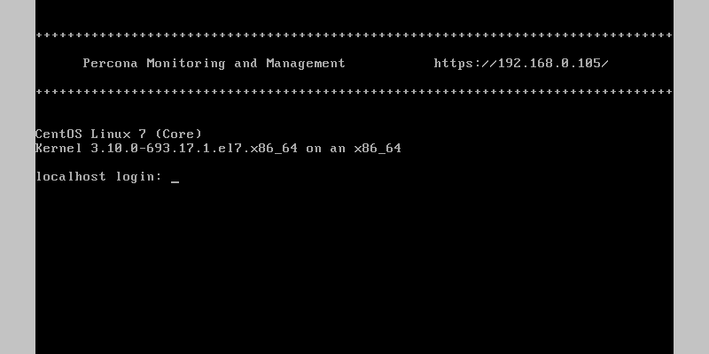
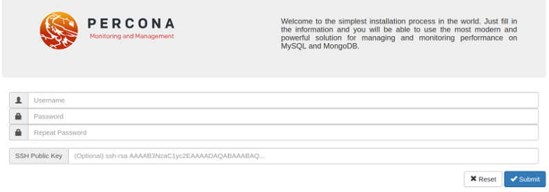

.. _pmm/deploying/server/virtual-appliance:

================================================================================
PMM Server as a Virtual Appliance
================================================================================

Percona provides a *virtual appliance* for running |pmm-server| in a virtual
machine.  It is distributed as an *Open Virtual Appliance* (OVA) package, which
is a :command:`tar` archive with necessary files that follow the *Open
Virtualization Format* (OVF).  OVF is supported by most popular virtualization
platforms, including:

* `VMware - ESXi 6.5`_
* `Red Hat Virtualization`_
* `VirtualBox`_
* `XenServer`_
* `Microsoft System Center Virtual Machine Manager`_

Supported Platforms for Running the |pmm-server| Virtual Appliance
================================================================================

The virtual appliance is ideal for running |pmm-server| on an enterprise
virtualization platform of your choice. This page explains how to run the
appliance in |virtualbox| and VMware Workstation Player. which is a good choice
to experiment with |pmm| at a smaller scale on a local machine.  Similar
procedure should work for other platforms (including enterprise deployments on
VMware ESXi, for example), but additional steps may be required.

The virtual machine used for the appliance runs |centos| 7.

.. warning:: The appliance must run in a network with DHCP, which will
   automatically assign an IP address for it.  Currently, it is not possible to
   run it in a network without DHCP and manually assign a static IP for the
   appliance.

.. rubric:: Instructions for setting up the virtual machine for different
            platforms
   
.. toctree::
   :maxdepth: 1
   :glob:
      
   deploying.server.ova.*

.. _pmm/deploying/server/virtual-appliance/root-password/set:

Setting the Root Password
================================================================================

With your virtual appliance set up, you need to set the root password for your
|pmm-server|. By default, the virtual machine is configured to enforce changing
the default password upon the first login.

   Set the root password when logging in for the first time

Run your virtual machine and when requested to log in, use the following
credentials:

:User: root
:Password: percona

The system immediately requests that you change your password. Note that, for
the sake of security, your password must not be trivial and pass at least the
dictionary check. If you do not provide your password within sixty seconds you
are automatically logged out. In this case use the default credentials to log in
again.

.. figure:: .res/graphics/png/command-line.login.3.png

   Set a new password and have full access to your system

After the new password is set you control this system as a superuser and
can make whaterver changes required.

.. important::

   You cannot access the root account if you access |pmm-server| using
   SSH or via the Web interface.

Opening the |pmm-server| Web Interface
================================================================================

To run the |pmm-server|, start the virtual machine and open in your browser the
URL that appears at the top of the terminal when you are logging in to the
virtual machine.

   The URL to open in the browser appears at the top of the terminal when
   running the virtual machine.

If you run |pmm-server| in your browser for the first time, you are requested to
supply the user and a new password. Optionally, you may also provide your SSH publish key.

   Set the user and password to access the |pmm-server| web interface.

Click |gui.submit| and enter your user name in the dialog window that pops
up. The |pmm-server| is now ready and the home page opens.

.. figure:: .res/graphics/png/pmm.home-page.png

Accessing the Virtual Machine
================================================================================

To access the VM with the *PMM Server* appliance via SSH,
provide your public key:

1. Open the URL for accessing PMM in a web browser.

   The URL is provided either in the console window or in the appliance log.

#. Submit your **public key** in the PMM web interface.

After that you can use ``ssh`` to log in as the ``admin`` user.
For example, if *PMM Server* is running at 192.168.100.1
and your **private key** is :file:`~/.ssh/pmm-admin.key`,
use the following command::

 ssh admin@192.168.100.1 -i ~/.ssh/pmm-admin.key

Next Steps
================================================================================

:ref:`Verify that PMM Server is running <deploy-pmm.server.verifying>`
by connecting to the PMM web interface using the IP address
assigned to the virtual appliance,
then :ref:`install PMM Client <install-client>`
on all database hosts that you want to monitor.

.. include:: .res/replace/name.txt
.. include:: .res/replace/program.txt
.. include:: .res/replace/option.txt
.. include:: .res/replace/url.txt
