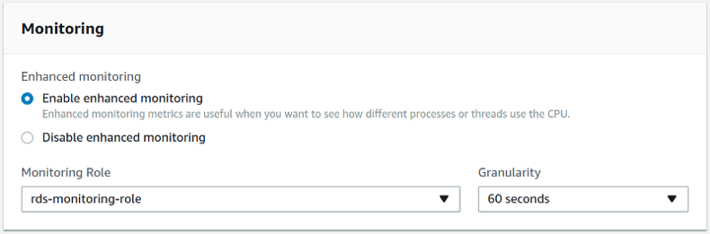

:orphan: true

.. _pmm/exporter/rds:

================================================================================
|amazon-rds| Exporter (rds_exporter)
================================================================================

The |amazon-rds| exporter makes the |amazon-cloudwatch| metrics available to
|pmm|. |pmm| uses this exporter to obtain metrics from any |amazon-rds| node
that you choose to monitor.

.. seealso::

   Repository on Github
      https://github.com/percona/rds_exporter
   Adding monitoring services
      :ref:`pmm-admin.add`
   Passing options to a monitoring service
      :ref:`pmm.pmm-admin.monitoring-service.pass-parameter`
   All exporter options
      :ref:`pmm/list.exporter`

.. _pmm/exporter/rds/metrics:

Metrics
================================================================================

The |amazon-rds| exporter has two types of metrics: basic and advanced. To be
able to use advanced metrics, make sure to set the
|gui.enable-enhanced-monitoring| option in the settings of your |amazon-rds| DB
instance.

   Set the |gui.enable-enhanced-monitoring| option in the settings of your
   |amazon-rds| DB instance.

.. seealso::

   |amazon-rds| Documentation: Modifying an Amazon RDS DB Instance
      https://docs.aws.amazon.com/AmazonRDS/latest/UserGuide/Overview.DBInstance.Modifying.html
   |amazon-rds| Documentation: More information about enhanced monitoring
   https://docs.aws.amazon.com/AmazonRDS/latest/UserGuide/USER_Monitoring.OS.html

--------------------------------------------------------------------------------

.. glossary::
   :sorted:

   aws_rds_bin_log_disk_usage_average (Basic rds_exporter metric)
   
      :Units: Bytes

      The amount of disk space occupied by binary logs on the master. Applies to
      MySQL read replicas. 
   
   aws_rds_cpu_credit_balance_average (Basic rds_exporter metric)

      :Units: Count
   
      T2 instances only. The number of CPU credits available for the instance to burst
      beyond its base CPU utilization. Credits are stored in the credit balance
      after they are earned and removed from the credit balance after they
      expire. Credits expire 24 hours after they are earned. CPU credit metrics are
      available only at a 5 minute frequency. 
   
   aws_rds_cpu_credit_usage_average (Basic rds_exporter metric)

      :Units: Count
   
      T2 instances only. The number of CPU credits consumed by the instance. One
      CPU credit equals one vCPU running at 100 percent utilization for one
      minute or an equivalent combination of vCPUs, utilization, and time (for
      example, one vCPU running at 50 percent utilization for two minutes or two
      vCPUs running at 25 percent utilization for two minutes). CPU credit
      metrics are available only at a 5 minute frequency. If you specify a
      period greater than five minutes, use the Sum statistic instead of the
      Average statistic.
   
   aws_rds_database_connections_average (Basic rds_exporter metric)

      :Units: Count
   
      The number of database connections in use
   
   aws_rds_disk_queue_depth_average (Basic rds_exporter metric)

      :Units: Count
   
      The number of outstanding IOs (read/write requests) waiting to access the
      disk. 
   
   aws_rds_network_receive_throughput_average (Basic rds_exporter metric)

      :Units: Bytes per second
   
      The incoming (Receive) network traffic on the DB instance, including both
      customer database traffic and Amazon RDS traffic used for monitoring and
      replication. 
   
   aws_rds_network_transmit_throughput_average (Basic rds_exporter metric)

      :Units: Bytes per second
   
      The outgoing (Transmit) network traffic on the DB instance, including both
      customer database traffic and Amazon RDS traffic used for monitoring and
      replication. 
   
   aws_rds_read_iops_average (Basic rds_exporter metric)

      :Units: Count per Second
   
      The average number of disk I/O operations per second. 
   
   aws_rds_read_latency_average (Basic rds_exporter metric)

      :Units: Seconds
   
      The average amount of time taken per disk I/O operation. 
   
   aws_rds_read_throughput_average (Basic rds_exporter metric)

      :Units: Bytes/Second
   
      The average number of bytes read from disk per second. 
   
   aws_rds_swap_usage_average (Basic rds_exporter metric)

      :Units: Bytes
   
      The amount of swap space used on the DB instance. 
   
   aws_rds_write_iops_average (Basic rds_exporter metric)

      :Units: Count per Second
   
      The average number of disk I/O operations per second. 
   
   aws_rds_write_latency_average (Basic rds_exporter metric)

      :Units: Seconds
   
      The average amount of time taken per disk I/O operation. 
   
   aws_rds_write_throughput_average (Basic rds_exporter metric)

      :Units: Bytes per Second
   
      The average number of bytes written to disk per second. 
   
   node_cpu_average (Basic rds_exporter metric)

      :Units: Percentage
   
      The percentage of CPU utilization. 
   
   node_filesystem_free (Basic rds_exporter metric)

      :Units: Bytes
   
      The amount of available storage space. 
   
   node_memory_Cached (Basic rds_exporter metric)

      :Units: Bytes
   
      The amount of available random access memory. 
   
   rds_exporter_erroneous_requests (Basic rds_exporter metric)

      :Unit: Count
   
      The number of erroneous API requests made to CloudWatch.
   
   rds_exporter_requests_total (Basic rds_exporter metric)

      :Unit: Count
   
      API requests made to |amazon-cloudwatch|
   
   rds_exporter_scrape_duration_seconds (Basic rds_exporter metric)

      :Unit: Seconds
   
      Time this RDS scrape took
   
   rds_latency (Basic rds_exporter metric)
   
      The difference between the current time and timestamp in the metric itself
   
   node_cpu_average (Enhanced rds_exporter metric)
   
      :Units: Percentage
   
      The percentage of CPU utilization.
   
   node_load1 (Enhanced rds_exporter metric)
   
      The number of processes requesting CPU time over the last minute.
   
   node_memory_Active (Enhanced rds_exporter metric)
   
      The amount of assigned memory, in kilobytes.
   
   node_memory_Buffers (Enhanced rds_exporter metric)
   
      The amount of memory used for buffering I/O requests prior to writing to
      the storage device, in kilobytes.
   
   node_memory_Cached (Enhanced rds_exporter metric)
   
      The amount of memory used for caching file system–based I/O.
   
   node_memory_Inactive (Enhanced rds_exporter metric)

      :Units: Kilobytes
   
      The amount of least-frequently used memory pages.
   
   node_memory_Mapped (Enhanced rds_exporter metric)
   
      :Units: Kilobytes

      The total amount of file-system contents that is memory mapped inside a
      process address space
   
   node_memory_MemFree (Enhanced rds_exporter metric)

      :Units: Kilobytes   
   
      The amount of unassigned memory
   
   node_memory_MemTotal (Enhanced rds_exporter metric)

      :Units: Kilobytes   
   
      The total amount of memory, in kilobytes.
   
   node_memory_PageTables (Enhanced rds_exporter metric)

      :Units: Kilobytes   
   
      The amount of memory used by page tables
   
   node_memory_Slab (Enhanced rds_exporter metric)

      :Units: Kilobytes   
   
      The amount of reusable kernel data structures
   
   node_memory_SwapFree (Enhanced rds_exporter metric)

      :Units: Kilobytes   
   
      The total amount of swap memory free
   
   node_memory_SwapTotal (Enhanced rds_exporter metric)

      :Units: Kilobytes   
   
      The total amount of swap memory available
   
   node_memory_nr_dirty (Enhanced rds_exporter metric)

      :Units: Kilobytes   
   
      The amount of memory pages in RAM that have been modified but not written to
      their related data block in storage, 
   
   node_procs_blocked (Enhanced rds_exporter metric)
   
      The number of tasks that are blocked.
   
   node_procs_running (Enhanced rds_exporter metric)
   
      The number of tasks that are running.
   
   node_vmstat_pswpin (Enhanced rds_exporter metric)
   
      The number of kilobytes the system has swapped in from disk per second (disk
      reads).
   
   node_vmstat_pswpout (Enhanced rds_exporter metric)
   
      The number of kilobytes the system has swapped out to disk per second (disk
      writes).
   
   rds_exporter_erroneous_requests (Enhanced rds_exporter metric)
   
      The number of erroneous API request made to |amazon-cloudwatch|.
   
   rds_exporter_requests_total (Enhanced rds_exporter metric)
   
      API requests made to |amazon-cloudwatch|
   
   rds_exporter_scrape_duration_seconds (Enhanced rds_exporter metric)

      :Units: Seconds
   
      Time this RDS scrape took
   
   rds_latency (Enhanced  rds_exporter metric)
   
      The difference between the current time and timestamp in the metric itself
   
   rdsosmetrics_General_numVCPUs (rds_exporter metric)
   
      The number of virtual CPUs for the DB instance.
   
   rdsosmetrics_General_version (Enhanced rds_exporter metric)
   
      The version of the OS metrics stream JSON format.
   
   rdsosmetrics_diskIO_await (Enhanced rds_exporter metric)
   
      The number of milliseconds required to respond to requests, including queue
      time and service time. This metric is not available for |amazon-aurora|.
   
   rdsosmetrics_diskIO_tps (Enhanced rds_exporter metric)
   
      The number of I/O transactions per second. This metric is not available for
      |amazon-aurora|.
   
   rdsosmetrics_fileSys_maxFiles (Enhanced rds_exporter metric)
   
      The maximum number of files that can be created for the file system.
   
   rdsosmetrics_fileSys_usedFilePercent (Enhanced rds_exporter metric)
   
      The percentage of available files in use.
   
   rdsosmetrics_loadAverageMinute_fifteen (Enhanced rds_exporter metric)
   
      The number of processes requesting CPU time over the last 15 minutes.
   
   rdsosmetrics_loadAverageMinute_five (Enhanced rds_exporter metric)
   
      The number of processes requesting CPU time over the last 5 minutes.
   
   rdsosmetrics_memory_hugePagesFree (Enhanced rds_exporter metric)
   
      The number of free huge pages. Huge pages are a feature of the Linux kernel.
   
   rdsosmetrics_memory_hugePagesRsvd (Enhanced rds_exporter metric)
   
      The number of committed huge pages.
   
   rdsosmetrics_memory_hugePagesSize (Enhanced rds_exporter metric)

      :Units: Kilobytes   
   
      The size for each huge pages unit
   
   rdsosmetrics_memory_hugePagesSurp (Enhanced rds_exporter metric)
   
      The number of available surplus huge pages over the total.
   
   rdsosmetrics_memory_hugePagesTotal (Enhanced rds_exporter metric)
   
      The total number of huge pages for the system.
   
   rdsosmetrics_memory_writeback (Enhanced rds_exporter metric)

      :Units: Kilobytes   
      
      The amount of dirty pages in RAM that are still being written to the
      backing storage
   
   rdsosmetrics_processList_cpuUsedPc (Enhanced rds_exporter metric)
   
      The percentage of CPU used by the process.
   
   rdsosmetrics_processList_id (Enhanced rds_exporter metric)
   
      The identifier of the process.
   
   rdsosmetrics_processList_parentID (Enhanced rds_exporter metric)
   
      The process identifier for the parent process of the process.
   
   rdsosmetrics_processList_rss (Enhanced rds_exporter metric)

      :Units: Kilobytes   
   
      The amount of RAM allocated to the process
   
   rdsosmetrics_processList_tgid (Enhanced rds_exporter metric)
   
      The thread group identifier, which is a number representing the process ID
      to which a thread belongs.This identifier is used to group threads from
      the same process.
   
   rdsosmetrics_processList_vss (Enhanced rds_exporter metric)

      :Units: Kilobytes   
   
      The amount of virtual memory allocated to the process
   
   rdsosmetrics_swap_cached (Enhanced rds_exporter metric)
   
      The amount of swap memory, in kilobytes, used as cache memory.
   
   rdsosmetrics_tasks_sleeping (Enhanced rds_exporter metric)
   
      The number of tasks that are sleeping.
   
   rdsosmetrics_tasks_stopped (Enhanced rds_exporter metric)
   
      The number of tasks that are stopped.
   
   rdsosmetrics_tasks_total (Enhanced rds_exporter metric)
   
      The total number of tasks.
   
   rdsosmetrics_tasks_zombie (Enhanced rds_exporter metric)
   
      The number of child tasks that are inactive with an active parent task.
   
.. include:: .res/replace/name.txt
