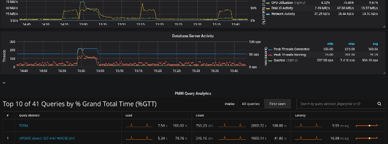
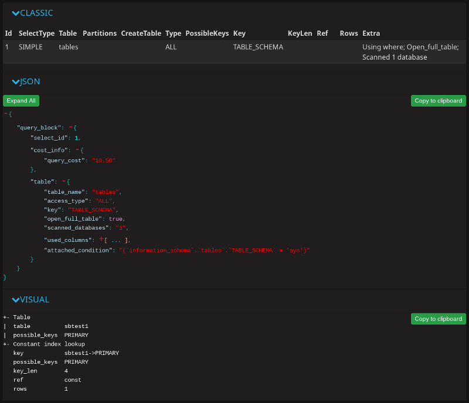
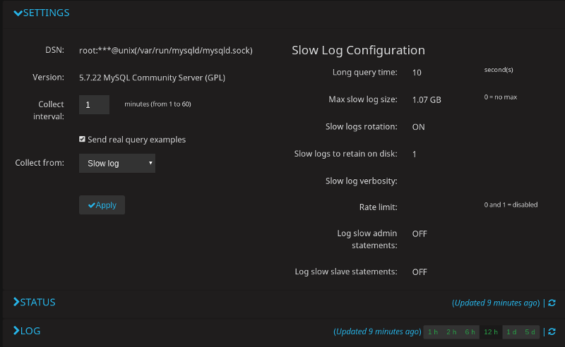

.. _pmm.qan:

|qan.name|
********************************************************************************

.. warning:: You are viewing documentation for PMM 1.x, did you need `PMM 2.x documentation <https://www.percona.com/doc/percona-monitoring-and-management/2.x/qan-intro.html>`_?"

.. raw:: html

	

The |qan| is a special dashboard which enables database administrators and
application developers to |qan.what-is|. |qan| helps you optimize database
performance by making sure that queries are executed as expected and within the
shortest time possible.  In case of problems, you can see which queries may be
the cause and get detailed metrics for them.

	    
   |qan| helps analyze database queries over periods of time and find
   performance problems.

.. important::
   
   |qan.name| supports |mysql| and |mongodb|. The minimum requirements
   for |mysql| are:

   * |mysql| 5.1 or later (if using the slow query log)
   * |mysql| 5.6.9 or later (if using Performance Schema)
 
   .. tell about 8.0 |qan| 

|qan| displays its metrics in both visual and numeric form: the performance
related characteristics appear as plotted graphics with summaries. 
.. rubric:: |section.toc|

.. contents::
   :local:

.. seealso::

   A |metrics-monitor.what-is|
      :ref:`pmm.metrics-monitor`

   Overview of |pmm| Components
      :ref:`using`

.. _pmm.qan.home-page.opening:

:ref:`Opening QAN from the PMM Home Page <pmm.qan.home-page.opening>`
================================================================================
   
To start working with |qan|, open the list of dashboards on the |pmm| home
page. Then, proceed to the |gui.host| field at the top of the page and select a
host where the |pmm-client| is installed from the list of database instances.

The |qan| dashboard will show a summary of the selected host and database
activity metrics followed by the list of queries in a summary table. By
default, |qan| shows the top *ten* queries ranked by :ref:`%GTT <GTT>` (Grand total
time). Each query displays three essential metrics: *Load*, *Count*, and
*Latency*. Also queries which are newly seen within the the time range selected
are highlighted with a blue color for quicker identification.

Also it worth to mention that |qan| data come in with typical 1-2 min delay,
though it is possible to be delayed more because of specific network condition
and state of the monitored object. In such situations |qan| reports "no data"
situation, using sparkline to and showing a gap in place of the time interval,
for which data are not available yet.

.. figure:: .res/graphics/png/qan.query-summary-table.sparkline.png

   Showing intervals for which data are unavailable yet.

To view more queries, click the :guilabel:`Load next 10 queries` button below
the query summary table.

.. figure:: .res/graphics/png/qan.query-summary-table.default.1.png

   The query summary table shows the monitored queries from the selected
   database.

.. _pmm.qan.query.filtering:

:ref:`Filtering Queries <pmm.qan.query.filtering>`
================================================================================

If you need to limit the list of available queries to only those that you are
interested in, use the |gui.query-filter| field located above the query summary
table.

In the |gui.query-filter| field, you can enter a query ID, query abstract, or
query fingerprint.  The ID is a unique signature of a query and looks like a
long hexadecimal number. Note that each query in the summary table displays its
ID in the *ID* column.

The query fingerprint is a simplified form of a query: all specific values are
replaced with placeholders. You may enter only a fragment of the fingerprint to
view all queries that contain that fragment in their fingerprints.

The query abstract is the portion of the query fingerprint which contains the
type of the query, such as *SELECT* or *FIND*, and the attributes from the
projection (a set of requested columns in case of |mysql| database, for example).

When you apply a filter, the query summary table changes to display only the
queries which match your criterion. Note that the TOTAL row which runs above the
list of queries in the summary table does not change its values. These are
always calculated based on all queries run within the selected time or date
range.

.. figure:: .res/graphics/png/qan.query-summary-table.1.png

   A list of queries

.. _pmm.qan.time-date-range.selecting:

.. rubric:: Selecting Time or Date Range

The query metrics that appear in |qan| are computed based on a time period or a
range of dates. The default value is *the last hour*. To set another range use
the *range selection tool* located at the top of the |qan| page.

.. figure:: .res/graphics/png/qan.range-selection.1.png

   |qan| displays query metrics for the time period or date range that you
   specify.

The tool consists of two parts. The *Quick ranges* offers frequently used time
ranges.. The date picker sets a range of dates.

.. _pmm.qan.query-summary.total:

:ref:`Totals of the Query Summary <pmm.qan.query-summary.total>`
--------------------------------------------------------------------------------

The first line of the query summary contains the totals of the *load*, *count*,
and *latency* for all queries that were run on the selected database server
during the time period that you've specified.

.. figure:: .res/graphics/png/qan.query-summary-table.totals.1.png
	   
   The totals appear at the top of the query summary table.

The *load* is the amount of time that the database server spent during the
selected time or date range running all queries.

The *count* is the average number of requests to the server during the specified
time or date range.

The *latency* is the average amount of time that it took the database server to
retrieve and return the data.

.. _pmm.qan.query-summary.query:

:ref:`Queries in the Query Summary Table <pmm.qan.query-summary.query>`
--------------------------------------------------------------------------------

Each row in the query summary contains information about a single
query. Each column is query attribute. The *Abstract* attribute is an essential
part of the fingerprint which informs the type of query, such as INSERT, or
UPDATE, and the queried tables, or collections. The *ID* attribute is a unique
hexadecimal number associated with the given query.

The *Load*, *Count*, and *Latency* attributes refer to the essential metrics of
each query. Their values are plotted graphics and summary values in the numeric
form. The summary values have two parts. The average value of the metric and its
percentage with respect to the corresponding total value at the top of the query
summary table.

.. _pmm.qan.metric.value.viewing:

:ref:`Viewing a Specific Value of a Metric <pmm.qan.metric.value.viewing>`
--------------------------------------------------------------------------------

If you hover the cursor over one of the metrics in a query, you can see a
concrete value at the point where your cursor is located. Move the cursor along
the plotted line to watch how the value is changing.

.. figure:: .res/graphics/png/qan.query-summary-table.1.png

   *Hover the cursor to see a value at the point.*

.. _pmm.qan.query.zooming:

:ref:`Zooming into a Query <pmm.qan.query.zooming>`
================================================================================

Click one of the queries to zoom it in. QAN displays detailed information about
the query in the :ref:`Query Metrics Summary Table <Query-Metrics-Summary-Table>`
below the :ref:`Query Summary Table <Query-Summary-Table>`. The detailed
information includes the query type specific metrics. It also contains details
about the database and tables which are used in the query.

.. figure:: .res/graphics/png/qan.query-metrics.1.png

   Select a query from the query summary table to open its metrics.

.. _pmm.qan.query.selecting:

:ref:`Query Section <pmm.qan.query.selecting>`
--------------------------------------------------------------------------------
   
In addition to the metrics in the :ref:`Query Metrics Summary Table <Query-Metrics-Summary-Table>`,
:program:`QAN` displays more information about the query itself. The ``Query``
section contains the :ref:`fingerprint <Query-Fingerprint>` and an example of
the query.

.. figure:: .res/graphics/png/qan.query.1.png

   The Query section shows the SQL statement for the selected query.

.. _pmm.qan.explain-section:

:ref:`Explain Section <pmm.qan.explain-section>`
--------------------------------------------------------------------------------

The |gui.explain| section enables you to run |sql.explain| on the selected query
directly from the PMM web interface (simply specify the database).

.. image:: .res/graphics/png/qan-realtime-explain.png

The output appears in three forms: classic, |json| and visual. The classic form
presents the attributes of the |sql.explain| command as columns of a table. The
JSON format presents the output of |sql.explain| as a |json| document. To help
you better understand how the query has been optimized, the visual form shows
how the query accesses the tables it includes. The output of the visual form is
identical to that of |pt-visual-explain|.

.. note::

   The |gui.copy-to-clipboard| button available in Explain, Fingerprint,
   Example, and Tables sections is useful to save the output and pass it to
   external tools, such as |pt-visual-explain|.

   The three output formats of the |sql.explain| command.

Note that the |sql.explain| command only works with the following statements:

- |sql.select|
- |sql.delete|
- |sql.insert|
- |sql.replace|
- |sql.update|
	    
If you are viewing the details of a query of another type, the
|gui.explain| section will not contain any data.

.. admonition:: Related information

   |pt-visual-explain|: a tool to show the query plan based on the output of the |sql.explain| command
      https://www.percona.com/doc/percona-toolkit/LATEST/pt-visual-explain.html

.. _pmm.qan.table-info-section:

:ref:`Table Info Section <pmm.qan.table-info-section>`
--------------------------------------------------------------------------------

At the bottom, you can run Table Info for the selected query.  This
enables you to get ``SHOW CREATE TABLE``, ``SHOW INDEX``, and ``SHOW
TABLE STATUS`` for each table used by the query directly from the PMM
web interface.

.. image:: .res/graphics/png/qan-create-table.png

.. _pmm.qan.configuring:

:ref:`Configuring QAN <pmm.qan.configuring>`
================================================================================

All |qan.name| settings are available from the |query-analytics-settings|
dashboard. To open this dashboard, use the |pmm| menu group.

.. _figure.pmm.qan.configuring.metrics-monitor.menu.pmm:

.. figure:: .res/graphics/png/metrics-monitor.menu.pmm.png

   The |pmm| group in the |metrics-monitor| navigation menu

.. _pmm.qan.configuring.settings-tab:

:ref:`Settings Tab <pmm.qan.configuring.settings-tab>`
--------------------------------------------------------------------------------

The |gui.settings| tab displays the essential configuration settings of
the database server selected from the |gui.databases| list. From this tab
you can see which :ref:`DSN` is being used as well as the :ref:`database
server version <Version>`.

This tab contains several settings which influence how the monitored data are
collected. Note that these settings cannot be changed directly in |qan|. You
need to set the appropriate options by using the tools from the database server
itself. You can, however, select where the database server mentrics are
collected from, such as |slow-log|, or |perf-schema|. For this, change the value
of the |gui.collect-from| field accordingly.

.. _figure.pmm.qan.configuring.pmm.qan.tab.settings:

	   
   The |gui.settings| tab to view the essential settings of the selected
   database server.

When you choose to collect |mysql| data from |slow-log|, a group of read only
values becomes available. Note that these settings cannot be set in |pmm|
directly. These are essential parameters of |mysql| that affect the operation of
|slow-log|. If you need to change these settings refer to the appropriate sections
of |mysql| documentation.

.. seealso::

   |percona-server| Documentation:
      `Slow Query Log Rotation and Expiration
      <https://www.percona.com/doc/percona-server/LATEST/flexibility/slowlog_rotation.html>`_

   |mysql| Documentation:
      `The Slow Query Log
      <https://dev.mysql.com/doc/refman/5.7/en/slow-query-log.html>`_

.. _pmm.qan.configuring.status-tab:

:ref:`Status Tab <pmm.qan.configuring.status-tab>`
--------------------------------------------------------------------------------

The |gui.status| tab contains detailed information about the current status of
the monitored database server. |qan| collects this information from the database
server directly. For example, in case of a |mysql| server, the |sql.show-status|
command is used.

.. _pmm.qan.configuring.log-tab:

:ref:`Log Tab <pmm.qan.configuring.log-tab>`
--------------------------------------------------------------------------------

The |gui.log| tab contains the latest version of the monitored log, such
as |slow-log|. At the top of this tab, you may notice when exactly the snapshot
was taken.

.. _pmm.qan.mongodb:

:ref:`QAN for MongoDB <pmm.qan.mongodb>`
================================================================================

|mongodb| is conceptually different from relational database management systems,
such as |mysql| or |mariadb|. Relational database management systems store data
in tables that represent single entities. In order to represent complex objects
you may need to link records from multiple tables. |mongodb|, on the other hand,
uses the concept of a document where all essential information pertaining to a
complex object is stored together.

.. _figure.pmm.qan.mongodb.query-summary-table.mongodb:

.. figure:: .res/graphics/png/qan.query-summary-table.mongodb.1.png

   A list of queries from a |mongodb| host

|qan| supports monitoring |mongodb| queries. Although |mongodb| is not a relational
database management system, you analyze its databases and collections in the
same interface using the same tools. By using the familiar and intuitive
interface of :ref:`QAN <QAN>` you can analyze the efficiency of your application
reading and writing data in the collections of your |mongodb| databases.

.. seealso:: 

   What |mongodb| versions are supported by |qan|?
      :ref:`See more information about how to configure MongoDB <pmm.conf.mongodb.supported-version>`

.. _figure.pmm.qan.mongodb.query-metrics:

.. figure:: .res/graphics/png/qan.query-metrics.mongodb.1.png

   Analyze |mongodb| queries using the same tools as relational database
   management systems.

.. include:: .res/replace.txt
