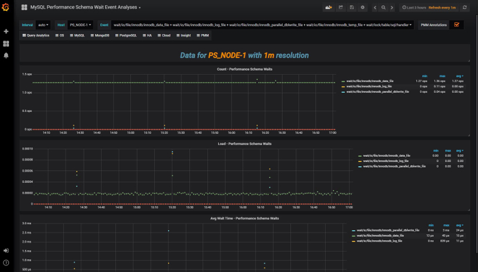

.. _1.14.0:

================================================================================
Percona Monitoring and Management 1.14.0
================================================================================

:Date: September 5, 2018

*PMM* (`Percona Monitoring and Management <https://www.percona.com/doc/percona-monitoring-and-management/index.html>`_) is a free and open-source platform for managing and monitoring |MySQL| and |MongoDB| performance. You can run *PMM* in your own environment for maximum security and reliability. It provides thorough time-based analysis for |MySQL| and |MongoDB| servers to ensure that your data works as efficiently as possible.

We\'ve included a plethora of visual improvements in this release, including:

* PostgreSQL Metrics Collection - Visualize PostgreSQL performance!
* Identify New Queries in Query Analytics
* New Dashboard: Compare System Parameters
* New Dashboard: PERFORMANCE_SCHEMA Wait Events Analysis
* Dashboard Updates - Advanced Data Exploration, MyRocks, TokuDB, InnoDB Metrics
* Disable SSL between Prometheus and Exporters
* Dashboards grouped by Folder - We\'ve organized the Dashboard drop-down to present a cleaner interface

We addressed 16 new features and improvements, and fixed 20 bugs.

PostgreSQL Metrics Collection
================================================================================

The PMM team is very proud to bring you native support for PostgreSQL! We\'ve shipped a new dashboard called PostgreSQL Overview, and we now provide the ability to add PostgreSQL instances as native, first-class citizens as part of PMM.  This means you can add PostgreSQL + Linux monitoring capabilities through the standard ``pmm-admin add postgresql`` syntax, see our documentation links for more details!

.. image:: 1.14.0-1.png

Identify New Queries in Query Analytics
================================================================================

A long-awaited feature is the ability to visually identify new queries that have appeared in Query Analytics - those queries who\'s first seen time is within the selected time range. New queries will be highlighted in a soft blue band for quick identification, and we\'ve provided a button called First Seen which you can toggle to display only those newly seen queries.  A common use case for this feature is potentially during code release / deployments, where you want to review which new queries have been deployed and to review their performance characteristics.

.. image:: 1.14.0-2.jpg

New Dashboard: Compare System Parameters
================================================================================

We\'ve introduced a new dashboard to let you compare System Parameters across multiple servers so at a glance you can understand provisioning or configuration differences.  This might be of help when comparing a pool of identical slaves or other logical groups of instances.

.. image:: 1.14.0-3.jpg

New Dashboard: PERFORMANCE_SCHEMA Wait Events Analysis
================================================================================

We\'ve added a new dashboard that lets you drill down into great detail on one or several PERFORMANCE_SCHEMA wait event categories in order to visualize them over time.

Dashboards grouped by Folder
================================================================================

At long last we\'ve addressed the sprawl of the long list of 30+ Dashboards, and grouped them into categories which match the pre-existing right-side navigation system.  This should leave you with a more organized, less cluttered list of Dashboards.

.. image:: 1.14.0-5.jpg

Dashboard Updates - Advanced Data Exploration, MyRocks, TokuDB, InnoDB Metrics
================================================================================

We\'ve improved four dashboards with minor but helpful improvements:

* Advanced Data Exploration dashboard with the addition of a graph element plotting the Metric Rates, which will help you understand the scraping efficiency of this metric series, or whether scrapes have failed / are failing.  
* InnoDB Metrics to present the graph elements in two columns - previously we\'d inconsistently use three columns or two columns, making it hard to visualize trends across graphs.
* MyRocks formulas were improved to be more precise
* TokuDB has many new graphs to expand our coverage of this Storage Engine

Disable SSL between PMM Server and Exporters
================================================================================

Lastly, we\'ve delivered on a feature request from a Percona Customer to optionally disable SSL between PMM Server and Exporters, with the advantage that if you do not need encrypted traffic for your metric series, you can reduce the CPU overhead on PMM Server.  We\'d love to hear your feedback on this feature!

.. code-block:: bash

   pmm-admin add mysql --disable-ssl ...

New Features & Improvements
================================================================================

* :pmmbug:`1362`: Update descriptions on MySQL InnoDB Metrics (Advanced) Dashboard - thanks to Yves Trudeau
* :pmmbug:`2304`: New Dashboard: Compare System Parameters
* :pmmbug:`2331`: Advanced Data Exploration: add graph for showing exporter scrapers over time intervals
* :pmmbug:`2356`: Grouping dashboards in folders with Grafana5
* :pmmbug:`2472`: Identify new queries in QAN
* :pmmbug:`2486`: Allow the disabling of SSL by means of an option - thanks to Dongchan Sung
* :pmmbug:`2597`: Improve MyRocks dashboard - thanks to Przemek Malkowski for the valuable ideas
* :pmmbug:`2704`: PostgreSQL Metrics Collection
* :pmmbug:`2772`: Display InnoDB Metrics dashboard using consistent two column view
* :pmmbug:`2775`: Display PERFORMANCE_SCHEMA Wait Events Analysis
* :pmmbug:`2769`: Display TokuDB Dashboard Improvements
* :pmmbug:`2797`: MySQL Performance Schema - Filter HOSTS
* :pmmbug:`2798`: Filter hosts on NUMA dashboard
* :pmmbug:`2833`: Added granularity interval for scraping AWS API - thanks to Aleksandr Stepanov
* :pmmbug:`2846`: Increase MySQL Max Connections in PMM Server 

Fixed Bugs
================================================================================

* :pmmbug:`946`: QAN sparklines drop to zero when data is not available
* :pmmbug:`1987`: pt-archiver rule for agent_log is not correct - thanks to Yves Trudeau for providing a fix
* :pmmbug:`2013`: Styling of QAN allows overlapping content
* :pmmbug:`2028`: nginx shows "414 Request-URI Too Large" for 150 hosts - thanks to Nickolay Ihalainen for the bug report and fix
* :pmmbug:`2166`: Add RDS instance page refresh will head to "Page Not Found" error
* :pmmbug:`2457`: Improve External Exporter help documentation for duration interval
* :pmmbug:`2459`: Cross-Graph Crosshair not enabled on the PXC/Galera Cluster
* :pmmbug:`2477`: Frequent Access Denied prompts while using AWS Marketplace image
* :pmmbug:`2566`: CPU busy graph shows incorrect values
* :pmmbug:`2763`: Unknown version is available on Update widget
* :pmmbug:`2784`: What\'s new link on Update widget has wrong URL
* :pmmbug:`2793`: Network Overview needs to be in OS menu, not insights
* :pmmbug:`2796`: Overview NUMA Metrics dashboard should be renamed to NUMA Overview
* :pmmbug:`2801`: Prometheus Exporters Overview - CPU metrics are strange
* :pmmbug:`2804`: Prometheus Graph is empty with PMM 1.13
* :pmmbug:`2811`: SQL to get Hosts in QAN - thanks to Forums member Fan
* :pmmbug:`2821`: Clean local storage if status is "You are up to date" and use animation for refresh button
* :pmmbug:`2828`: Weird Latency Graphs
* :pmmbug:`2841`: Change memory defaults for Prometheus 1.8 and use additional environment variable
* :pmmbug:`2856`: RDS/Aurora disk related graphs are empty
* :pmmbug:`2885`: System Overview dashboard has incorrect values
