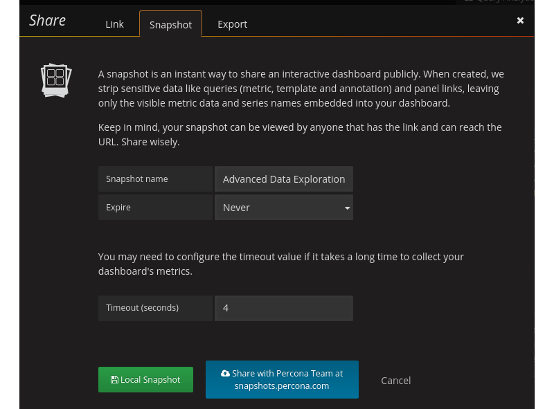

.. _1.9.0:

================================================================================
|pmm.name| |release|
================================================================================

:Date: April 4, 2018

There are a number of significant updates in |release| that we hope you
will like, some of the key highlights include:

- Faster loading of the index page: We have enabled performance
  optimizations using |gzip| and |http2|.
- AWS improvements: We have added metrics from CloudWatch RDS to 6
  dashboards, as well as changed our |aws| add instance workflow, and
  made some changes to credentials handling.
- |percona| Snapshot Server: If you are a |percona| Customer you can now
  securely share your dashboards with |percona| Engineers.
- Exporting |pmm-server| logs: Retrieve logs from |pmm-server| for
  troubleshooting using single button-click, avoiding the need to log
  in manually to the docker container.
- Low RAM support: We have reduced the memory requirement so
  |pmm-server| will run on systems with 512MB
- Dashboard improvements: We ave changed |mongodb| instance
  identification for |mongodb| graphs, and set maximum graph Y-axis on
  Prometheus Exporter Status dashboard

|aws| Improvements
================================================================================

CloudWatch RDS metrics
--------------------------------------------------------------------------------

Since we are already consuming |amazon-cloudwatch| metrics and persisting them in
|prometheus|, we have improved 6 node-specific dashboards to now display
|amazon-rds| node-level metrics:

- Cross_Server (Network Traffic)
- Disk Performance (Disk Latency)
- Home Dashboard (Network IO)
- MySQL Overview (Disk Latency, Network traffic)
- Summary Dashboard (Network Traffic)
- System Overview (Network Traffic)

AWS Add Instance changes
--------------------------------------------------------------------------------

We have changed our |aws| add instance interface and workflow to be more clear on
information needed to add an |amazon-aurora| |mysql| or |amazon-rds| |mysql|
instance. We have provided some clarity on how to locate your |aws| credentials.

.. image:: 1-9-0.2.png

.. image:: 1-9-0.3.png

|aws| Settings
--------------------------------------------------------------------------------

We have improved our documentation to highlight connectivity best practices, and
authentication options - IAM Role or IAM User Access Key.

.. rubric:: Enabling Enhanced Monitoring

.. image:: 1-9-0.4.png

.. rubric:: Credentials Screen

.. image:: 1-9-0.1.png

Low RAM Support
================================================================================

You can now run PMM Server on instances with memory as low as 512MB RAM, which
means you can deploy to  the free tier of many cloud providers if you want to
experiment with PMM.  Our memory calculation is now:

.. code-block:: bash

    METRICS_MEMORY_MULTIPLIED=$(( (${MEMORY_AVAIABLE} - 256*1024*1024) / 100 * 40 ))
    if [[ $METRICS_MEMORY_MULTIPLIED < $((128*1024*1024)) ]]; then
        METRICS_MEMORY_MULTIPLIED=$((128*1024*1024))
    fi

|percona| Snapshot Server
================================================================================    

Snapshots are a way of sharing |pmm| dashboards via a link to individuals who do
not normally have access to your |pmm-server|.  If you are a |percona| Customer
you can now securely share your dashboards with |percona| Engineers.  We have
replaced the button for sharing to the |grafana| publicly hosted platform onto one
administered by |percona|.  Your dashboard will be written to |percona|
snapshots and only |percona| Engineers will be able to retrieve the data.  We
will be expiring old snapshots automatically at 90 days, but when sharing you
will have the option to configure a shorter retention period.

Export of |pmm-server| Logs
================================================================================

In this release, the logs from |pmm-server| can be exported using single
button-click, avoiding the need to log in manually to the docker container.
This simplifies the troubleshooting process of a |pmm-server|, and especially for
Percona Customers, this feature will provide a more consistent data gathering
task that you will perform on behalf of requests from |percona| Engineers.

.. image:: 1-9-0.6.png

Faster Loading of the Index Page
================================================================================

In version 1.8.0, the index page was redesigned to reveal more useful
information about the performance of your hosts as well an immediate access to
essential components of PMM, however the index page had to load much data
dynamically resulting in a noticeably longer load time. In this release we
enabled |gzip| and |http2| to improve the load time of the index page. The
following screenshots demonstrate the results of our tests on webpagetest.org
where we reduce page load time by half.  We will continue to look for
opportunities to improve the performance of the index page and expect that when
we upgrade to Prometheus 2 we will see another improvement.

.. rubric:: The load time of the index page of |pmm| version 1.8.0

.. image:: 1-9-0.7.png 

.. rubric:: The load time of the index page of |pmm| version 1.9.0

.. image:: 1-9-0.8.png

Issues in this release
================================================================================	   

New Features
--------------------------------------------------------------------------------

- :pmmbug:`781`: Plot new PXC 5.7.17, 5.7.18 status variables on new graphs for
  PXC Galera, PXC Overview dashboards
- :pmmbug:`1274`: Export |pmm-server| logs as zip file to the browser
- :pmmbug:`2058`: |percona| Snapshot Server

Improvements
--------------------------------------------------------------------------------

- :pmmbug:`1587`: Use :option:`mongodb_up` variable for the |mongodb| Overview
  dashboard to identify if a host is |mongodb|.
- :pmmbug:`1788`: |aws| Credentials form changes
- :pmmbug:`1823`: |aws| Install wizard improvements
- :pmmbug:`2010`: System dashboards update to be compatible with RDS nodes
- :pmmbug:`2118`: Update grafana config for metric series that will not go above 1.0
- :pmmbug:`2215`: |pmm| Web speed improvements
- :pmmbug:`2216`: |pmm| can now be started on systems without memory limit
  capabilities in the kernel
- :pmmbug:`2217`: |pmm-server| can now run in |docker| with 512 Mb memory
- :pmmbug:`2252`: Better handling of variables in the navigation menu

Bug fixes
--------------------------------------------------------------------------------

- :pmmbug:`605`: :program:`pt-mysql-summary` requires additional configuration
- :pmmbug:`941`: ParseSocketFromNetstat finds an incorrect socket
- :pmmbug:`948`: Wrong load reported by |qan| due to mis-alignment of time intervals
- :pmmbug:`1486`: |mysql| passwords containing the dollar sign ($) were not
  processed properly.
- :pmmbug:`1905`: In |qan|, the Explain command could fail in some cases.
- :pmmbug:`2090`: Minor formatting issues in |qan|
- :pmmbug:`2214`: Setting Send real query examples for Query Analytic
  OFF still shows the real query in example.
- :pmmbug:`2221`: no Rate of Scrapes for |mysql| & |mysql| Errors
- :pmmbug:`2224`: Exporter CPU Usage glitches 
- :pmmbug:`2227`: Auto Refresh for dashboards 
- :pmmbug:`2243`: Long host names in |grafana| dashboards are not displayed correctly
- :pmmbug:`2257`: PXC/galera cluster overview Flow control paused time has a percentage glitch 
- :pmmbug:`2282`: No data is displayed on dashboards for OVA images
- :pmmbug:`2296`: The |opt.mysql-metrics| service will not start on Ubuntu LTS 16.04
  
.. |release| replace:: 1.9.0
		       
.. include:: ../.res/replace.txt
