.. _using:

====================================================
Using the Percona Monitoring and Management Platform
====================================================

You can access the PMM web interface using the IP address of the host
where *PMM Server* is running.
For example, if *PMM Server* is running on a host with IP 192.168.100.1,
access the following address with your web browser: ``http://192.168.100.1``.

The landing page has links to corresponding PMM tools:

.. contents::
   :local:
   :depth: 1

These tools provide comprehensive insight
into the performance of a MySQL host.

.. _using-qan:

Query Analytics
===============

The *Query Analytics* tool enables database administrators and application
developers to analyze database queries over periods of time and find performance
problems.  Query Analytics helps you optimize database performance by making
sure that queries are executed as expected and within the shortest time
possible.  In case of problems, you can see which queries may be the cause and
get detailed metrics for them. 

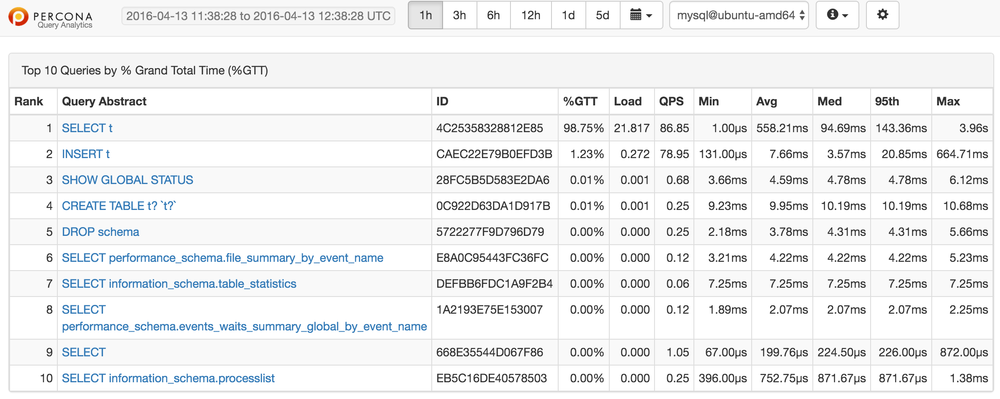
	    
   QAN helps analyze database queries over periods of time and find performance
   problems.

QAN displays its metrics in both visual and numeric form: the performance
related characteristics appear as plotted graphics with summaries.

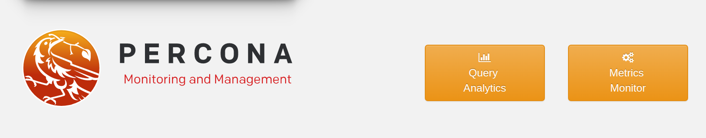

   :term:`QAN` is available from the home page of :term:`PMM`. Click the *Query
   Analytics* button to access :term:`QAN`.

.. rubric:: Open :term:`QAN` from the :term:`PMM` home page
   
To start working with :term:`QAN`, click the *Query Analytics* button on the PMM
home page. Then, select a database at the top of the page from the list of
database instances where the :term:`PMM client` is installed.

The list of queries opens below in a summary table. Be default, QAN shows the
top ten queries ranked by :term:`%GTT` (Grand total time) as a result of
monitoring your database server for the last hour. Each query displays three
essential metrics: *Load*, *Count*, and *Latency*.

To view more queries, click the *Load next 10 queries* button below the query
summary table.

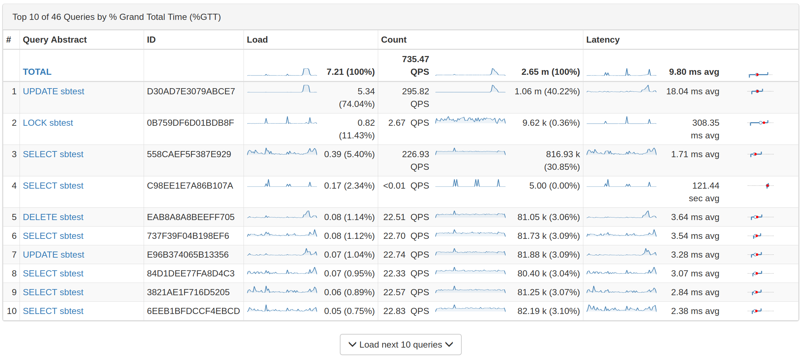

   The query summary table shows the monitored queries from the selected
   database.

.. rubric:: Filtering Queries

If you need to limit the list of available queries to only those that you are
interested in, use the *Query Filter* field located above the query summary
table.

In the *Query Filter* field, you can enter a query ID, query abstract, or query
fingerprint.  The ID is a unique signature of a query and looks like a long
hexadecimal number. Note that each query in the summary table displays its ID in
the *ID* column.

The query fingerprint is a simplified form of a query: all specific values are
replaced with placeholders. You may enter only a fragment of the fingerprint to
view all queries that contain that fragment in their fingerprints.

The query abstract is the portion of the query fingerprint which contains the
type of the query, such as *SELECT* or *FIND*, and the attributes from the
projection (a set of requested columns in case of MySQL database, for example).

When you apply your filter, the query summary table changes to display only
the queries which match your criterion. Note that the TOTAL row which runs above
the list of queries in the summary table does not change its values. These are
always calculated based on all queries run within the selected time or date
range.

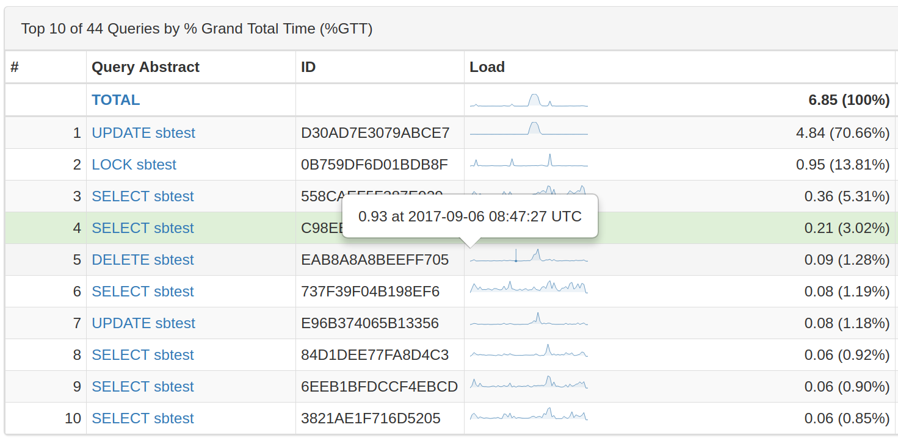

   A list of queries

.. rubric:: Selecting Time or Date Range

The query metrics that appear in *QAN* are computed based on a time period or a
range of dates. The default value is *the last hour*. To set another range use
the *range selection tool* located at the top of your *QAN* page.

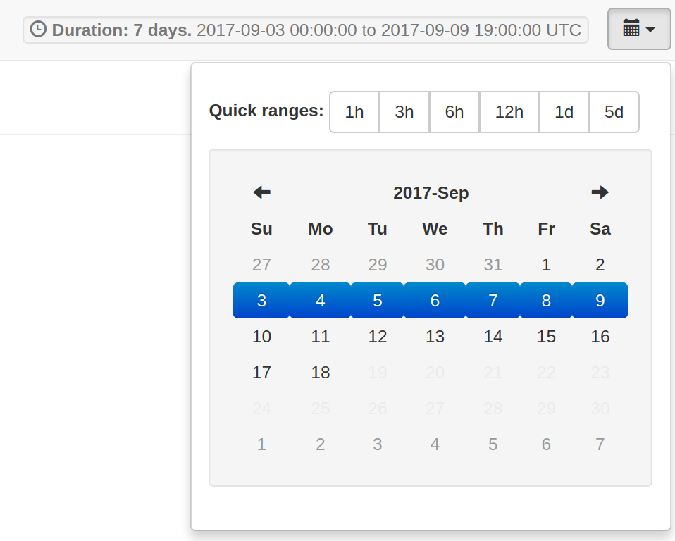

   QAN displays query metrics for the time period or date range that you specify.

The tool consists of two parts. The *Quick ranges* offers frequently used time
ranges: from 1 hour to 5 days. Use the date picker to set a range of dates.

.. rubric:: Totals of the Query Summary

The first line of the summary table contains the totals of the *load*, *count*, and
*latency* for all queries that were run on the selected database server during
the time period that you've specified.

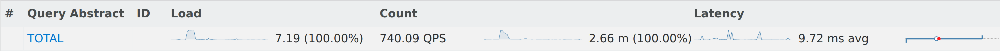
	   
   The totals appear at the top of the query summary table.

The *load* is the amount of time that the database server spent during the
selected time or date range running all queries.

The *count* is the average number of requests to the server during the specified
time or date range.

The *latency* is the average amount of time that it took the database server to
retrieve and return the data.

.. rubric:: Queries in the Query Summary Table

Each row in the query summary table contains information about a single
query. Each column is query attribute. The *Abstract* attribute is an essential
part of the fingerprint which informs the type of query, such as INSERT, or
UPDATE, and the queried tables, or collections. The *ID* attribute is a unique
hexadecimal number associated with the given query.

The *Load*, *Count*, and *Latency* attributes refer to the essential metrics of
each query. Their values are plotted graphics and summary values in the numeric
form. The summary values have two parts. The average value of the metric and its
percentage with respect to the corresponding total value at the top of the query
summary table.

.. rubric:: Viewing a Specific Value of a Metric

If you hover the cursor over one of the metrics in a query, you can see a
concrete value at the point where your cursor is located. Move the cursor along
the plotted line to watch how the value is changing.

   Hover the cursor to see a value at the point.

.. rubric:: Zooming into a Query

Click one of the queries to zoom it in. QAN displays detailed information about
the query in the :term:`query metrics summary table` below the :term:`query summary
table`. The detailed information includes the query type specific metrics. It
also contains details about the database and tables which are used in the query.

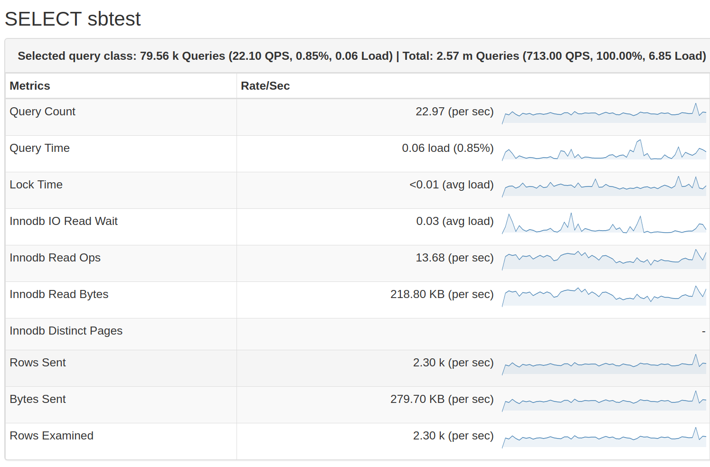

   Select a query from the query summary table to open its metrics.

.. rubric:: Query Section
   
In addition to the metrics in the :term:`query metrics summary table`,
:program:`QAN` displays more information about the query itself. The ``Query``
section contains the :term:`fingerprint <Query Fingerprint>` and an example of
the query.

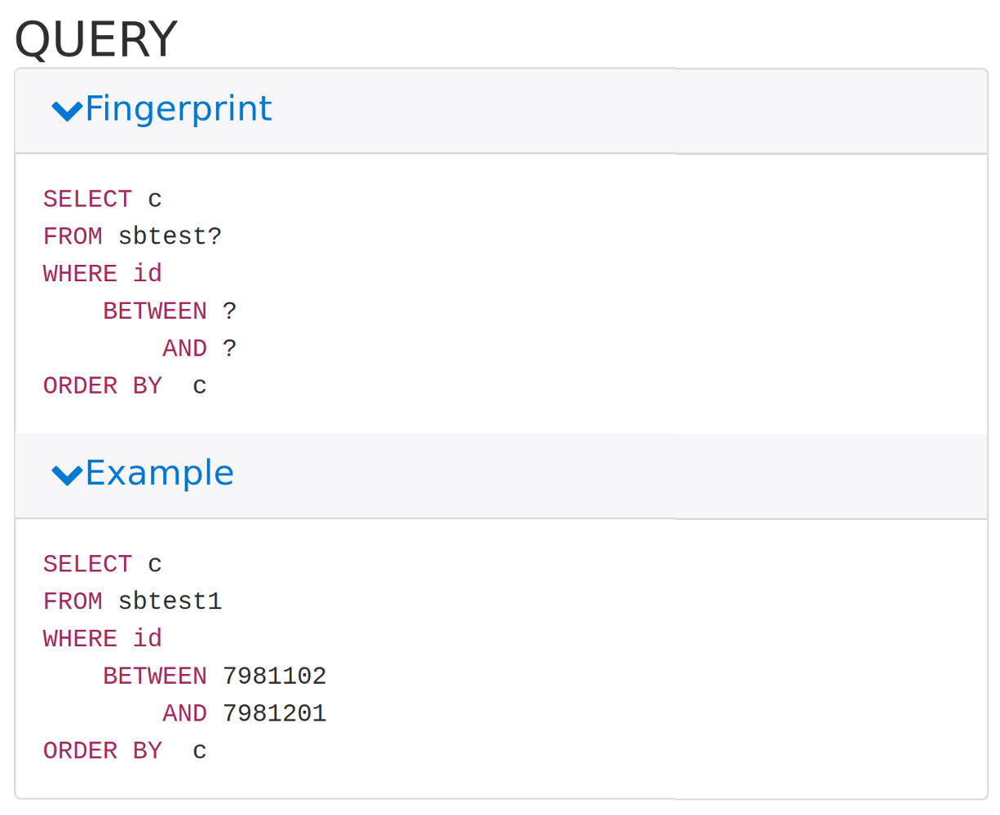

   The Query section shows the SQL statement for the selected query.
	    

.. rubric:: Explain Section

The ``Explain`` section enables you to run :command:`EXPLAIN` on the selected query
directly from the PMM web interface (simply specify the database).

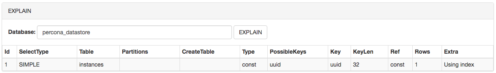

The output appears in two forms: classic and JSON. The classic form presents the
attributes of the :command:`EXPLAIN` command as columns of a table. The JSON
format presents the output of :command:`EXPLAIN` as a JSON document.

.. figure:: images/pmm.qan.explain.1.png
   :width: 50%

   The two output formats of the EXPLAIN command.
	    

.. rubric:: Table Info Section

At the bottom, you can run Table Info for the selected query.
This enables you to get ``SHOW CREATE TABLE``, ``SHOW INDEX``,
and ``SHOW TABLE STATUS`` for each table used by the query
directly from the PMM web interface.

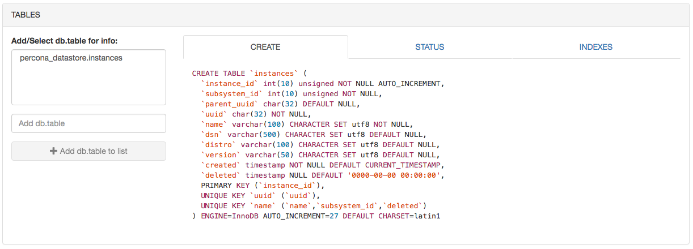

Configuring Query Analytics
--------------------------------------------------------------------------------

The :guilabel:`Configure Query Analytics` button located next to the list of
database instances opens a page with settings, status, and log for the selected
database instance.

.. rubric:: Settings Tab

The :guilabel:`Settings` tab displays the essential configuration settings of
the database server selected from the :guilabel:`Databases` list. From this tab
you can see which :term:`DSN` is being used as well as the :term:`database
server version <Version>`. This tab contains several settings which influence
how the monitored data are collected. Note that these settings cannot be changed
directly in *QAN*. You need to set the appropriate options by using the tools
from the database server itself. You can, however, select where the database
server mentrics are collected from, such as *slow log*, or *performance
schema*. For this, change the value of the *Collect from* field accordingly.

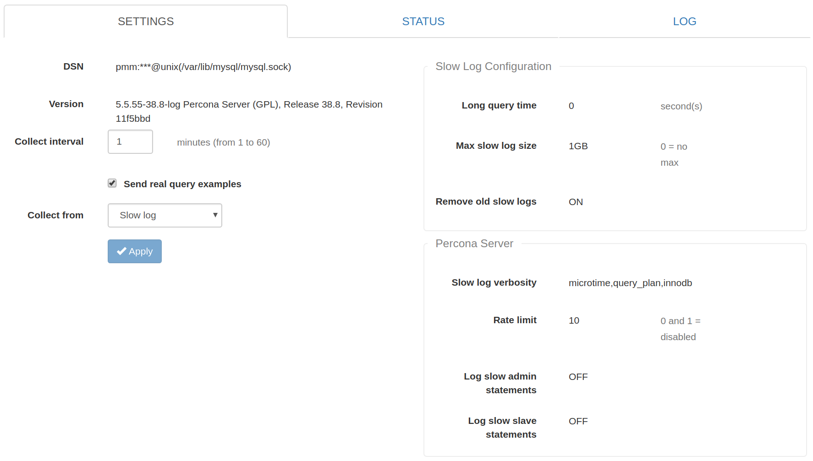
	   
   The Settings tab to view the essential settings of the selected database
   server.

.. rubric:: Status Tab

The :guilabel:`Status` tab contains detailed information about the current
status of the monitored database server. QAN collects this information from the
database server directly. For example, in case of a MySQL server, the
:program:`SHOW STATUS` command is used.

.. note:: **Viewing Database and Server Summary Information**

   The :guilabel:`View database and server summary info` button that appears
   next to the :guilabel:`Configure Query Analytics` button shows detailed
   infromation about the selected database as well as the platform where it is
   deployed. When clicked, this button reveals two sections. The
   :guilabel:`System Summary` section contains details about the platform while
   the :guilabel:`Database Summary` offers detailed statistics about the
   database server.

   .. figure:: images/pmm.qan.view-database-and-server-summary-info.1.png
      :width: 50%

      The System summary and Database summary (showing only fragments of both
      sections)

.. rubric:: Log Tab

The :guilabel:`Log` tab contains the latest version of the monitored log, such
as *slow log*. At the top of this tab, you may notice when exactly the snapshot
was taken.

.. _perf-schema:

Performance Schema
------------------

The default source of query data for PMM is the slow query log.
It is available in MySQL 5.1 and later versions.
Starting from MySQL 5.6 (including Percona Server 5.6 and later),
you can select to parse query data from the Performance Schema.
Starting from MySQL 5.6.6, Performance Schema is enabled by default.

Performance Schema is not as data-rich as the slow query log,
but it has all the critical data and is generally faster to parse.
If you are running Percona Server,
a :ref:`properly configured slow query log <slow-log-settings>`
will provide the most amount of information with the lowest overhead.
Otherwise, using :ref:`Performance Schema <perf-schema-settings>`
will likely provide better results.

.. rubric:: To use Performance Schema:

1. Make sure that the ``performance_schema`` variable is set to ``ON``:

   .. code-block:: sql

      mysql> SHOW VARIABLES LIKE 'performance_schema';
      +--------------------+-------+
      | Variable_name      | Value |
      +--------------------+-------+
      | performance_schema | ON    |
      +--------------------+-------+

   If not, add the the following lines to :file:`my.cnf` and restart MySQL:

   .. code-block:: sql

      [mysql]
      performance_schema=ON

   .. note:: Performance Schema instrumentation is enabled by default
      in MySQL 5.6.6 and later versions.
      It is not available at all in MySQL versions prior to 5.6.

2. Configure QAN agent to collect data from Performance Schema:

   If the instance is already running:

   a. Open the **Settings** section in the Query Analytics web UI.
   b. Select **Performance Schema** in the **Collect from** drop-down list.
   c. Click **Apply** to save changes.

   If you are adding a new monitoring instance with the ``pmm-admin`` tool,
   use the ``--query-source perfschema`` option.
   For example:

   .. code-block:: bash

      sudo pmm-admin add mysql --user root --password root --create-user --query-source perfschema

For more information, run ``pmm-admin add mysql --help``.

QAN for MongoDB
--------------------------------------------------------------------------------

MongoDB is conceptually different from relational database management systems,
such as MySQL or MariaDB. Relational database management systems store data in
tables that represent single entities. In order to represent complex objects you
may need to link records from multiple tables. MongoDB, on the other hand, uses
the concept of a document where all essential information pertaining to a
complex object is stored together.

.. figure:: images/pmm.qan.query-summary-table.mongodb.1.png
   :width: 50%

   A list of queries from a MongoDB host

QAN supports monitoring MongoDB queries. Although MongoDB is not a relational
database management system, you analyze its databases and collections in the
same interface using the same tools. By using the familiar and intuitive
interface of :term:`QAN` you can analyze the efficiency of your application
reading and writing data in the collections of your MongoDB databases.

.. note:: **Suppored MongoDB versions**

   PMM supports `MongoDB`_ version 3.2 or higher. 

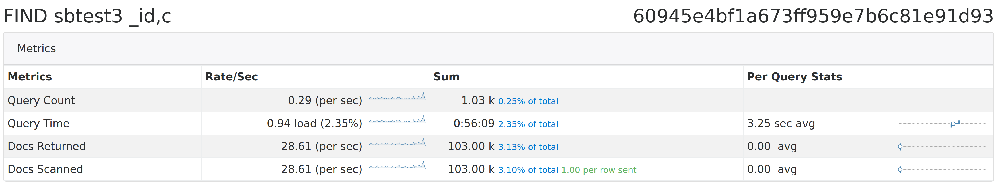

   Analyze MongoDB queries using the same tools as relational database
   management systems.

.. _using-mm:

Metrics Monitor
===============

The *Metrics Monitor* tool provides a historical view of metrics
that are critical to a database server.
Time-based graphs are separated into dashboards by themes:
some are related to MySQL or MongoDB, others provide general system metrics.

When you open *Metrics Monitor* for the first time,
it loads the **Cross Server Graphs** dashboard.
The credentials used to sign in to Grafana depend on the options
that you specified when :ref:`starting PMM Server <deploy-pmm.server.installing>`:

* If you did not specify either ``SERVER_USER`` or ``SERVER_PASSWORD``,
  you will be signed in anonymously.
  You can change to a different existing Grafana user.

* If you specified both ``SERVER_USER`` and ``SERVER_PASSWORD``,
  then these credentials will be used to sign in to Grafana.

* If you specified only ``SERVER_PASSWORD``,
  a single user (``pmm``) will be used to sign in to all components
  (including QAN, Prometheus, Grafana, etc.).
  You will not be able to change to a different Grafana user.

* If you specified only ``SERVER_USER``,
  this parameter will be ignored.

.. warning:: Do not include the ``#`` or ``:`` symbols in ``SERVER_USER``.

To access the dashboards, provide default user credentials:

* User: ``admin``
* Password: ``admin``

On the Home screen, select a dashboard
from the list of available Percona Dashboards.
For example, the following image shows the **MySQL Overview** dashboard:

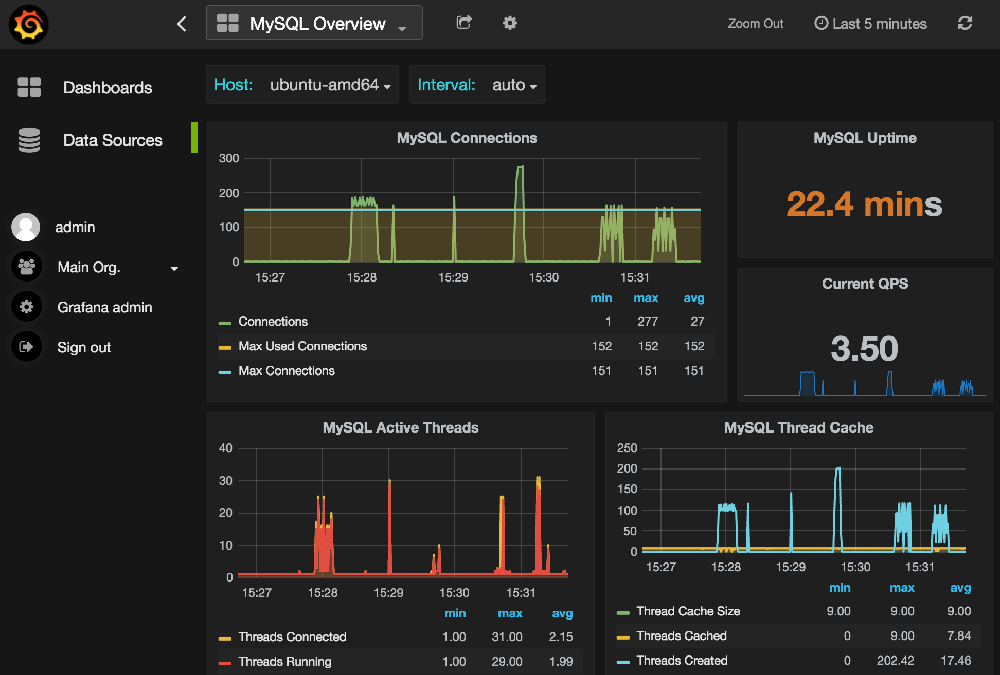

Each graph has a graph descriptions to display more information about the
monitored data without cluttering the interface.

These are on-demand descriptions in the tooltip format that you can find by
hovering the mouse pointer over the *More information* icon at the top left
corner of a graph. When you move the mouse pointer away from the *More
information* button the description disappears.

.. figure:: images/pmm.metrics-monitor.description.1.png
   :width: 50%

   Graph descriptions provide more information about a graph without claiming
   any space in the interface.

MySQL MyRocks dashboard
--------------------------------------------------------------------------------

The MyRocks_ storage engine developed by Facebook based on the RocksDB storage
engine is applicable to systems which primarily interact with the database by
writing data to it rather than reading from it. MyRocks also features a good
level of compression, higher than that of the InnoDB storage engine, which makes
it especially valuable when optimizing the usage of hard drives.

PMM collects statistics on the MyRocks storage engine for MySQL in the metrics
monitor as a separate dashboard titled |graph.mysql.myrocks|. The main sourse of
information for this dashboard comes from the *information schema* tables.

.. figure:: images/pmm.metrics-monitor.mysql-myrocks-metrics.1.png
   :width: 50%
	    
   The MySQL MyRocks metrics dashboard

.. seealso::

   `Information schema <https://github.com/facebook/mysql-5.6/wiki/MyRocks-Information-Schema>`_

.. _pmm/using.orchestrator:

Orchestrator
============

:program:`Orchestrator` is a MySQL replication topology management and visualization tool.
If it is enabled, you can access it using the ``/orchestrator`` URL after *PMM Server* address.
Alternatively, you can click the **MySQL Replication Topology Manager** button
on the main *PMM Server* landing page.

To use it, create a MySQL user for Orchestrator on all managed instances::

 GRANT SUPER, PROCESS, REPLICATION SLAVE, RELOAD ON *.* TO 'orc_client_user'@'%' IDENTIFIED BY 'orc_client_password’;

.. note:: The credentials in the previous example are default.
   If you use a different user name or password,
   you have to pass them when
   :ref:`running PMM Server <deploy-pmm.server.installing>`
   using the following options::

    -e ORCHESTRATOR_USER=name -e ORCHESTRATOR_PASSWORD=pass

Then you can use the **Discover** page in the Orchestrator web interface
to add the instances to the topology.

.. note:: **Orchestrator not enabled by default starting with PMM 1.3.0**

   :program:`Orchestrator` was included into PMM for experimental purposes.  It
   is a standalone tool, not integrated with PMM other than that you can access
   it from the landing page.

   In version 1.3.0 and later, :program:`Orchestrator` is not enabled
   by default. To enable it, see
   :ref:`pmm/docker.additional_parameters` in the
   :ref:`run-server-docker` section.

.. include:: replace.txt
.. include:: url.txt

.. |graph.mysql.myrocks| replace:: *MySQL MyRocks Metrics*
