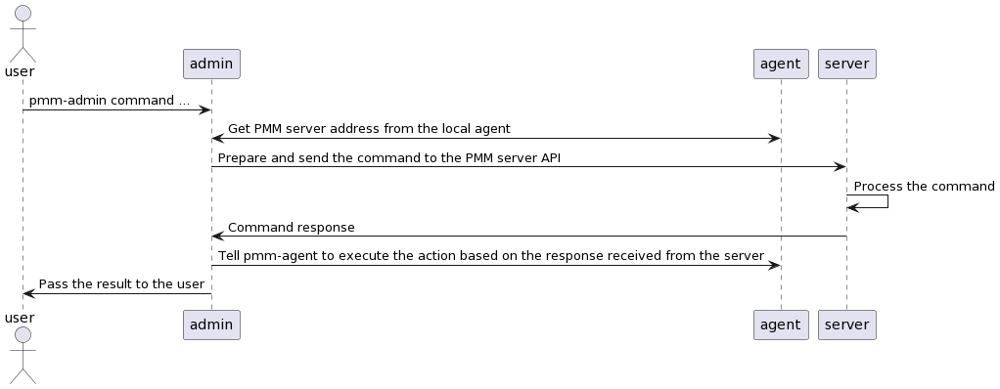

# Architecture

## pmm-admin - server communication workflow.

`pmm-admin` is a command line utility used to send commands to the pmm-server in order to execute actions on clients. Those actions could be to configure the client itself, add or remove monitored instances, etc. 

The communication flow is:
1. pmm-admin gets PMM server URL from the local pmm-agent. 
2. pmm-admin translates the command into a PMM server message and sends it to the server (pmm-managed API).
3. pmm-managed process the command and sends the response back to pmm-admin.
4. pmm-admin intructs the pmm-agent to run an action based on the PMM server response.

### Communication flow diagram.

