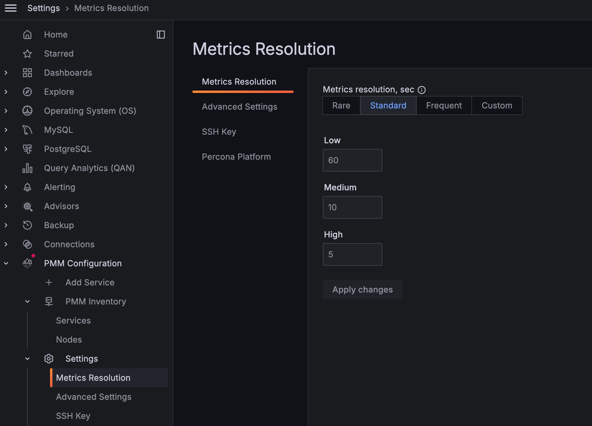

# Configure PMM

!!! note alert alert-primary "Note"
    This section provides the instructions to configure your PMM instance after you have installed PMM.
   
The **Settings** page is where you configure PMM.

Open the **Settings** page from the [main menu](../details/interface.md#main-menu) with <i class="uil uil-cog"></i> **Configuration** → <i class="uil uil-setting"></i> **Settings**. The page opens with the **Metrics Resolution** settings tab selected.

On the left are the selector tabs:

* [Metrics resolution](metrics_res.md)
* [Advanced Settings](advanced_settings.md)
    * [Data Retention](advanced_settings.md#data-retention)
    * [Telemetry](advanced_settings.md#telemetry)
    * [Check for updates](advanced_settings.md#check-for-updates)
    * [Advisors](advanced_settings.md#advisors)
* [Public address](public-address.md)
    * [Alerting](public-address.md#alerting)
    * [Microsoft Azure Monitoring](public-address.md#microsoft-azure-monitoring)
    * [Public Address {: #public-address-1 }](public-address.md#public-address--public-address-1-)
* [SSH Key](ssh.md)
* [Alertmanager integration](alertmanager.md)
* [Percona Platform](percona_platform.md)
    * [Connect PMM to Percona Platform](percona_platform.md#connect-pmm-to-percona-platform)
    * [Password Reset](percona_platform.md#password-reset)
      * [Password Forgotten](percona_platform.md#password-forgotten)
      * [Change Password after Login](percona_platform.md#change-password-after-login)

!!! hint alert alert-success "Tip"
    Click **Apply changes** to save any changes made here.
