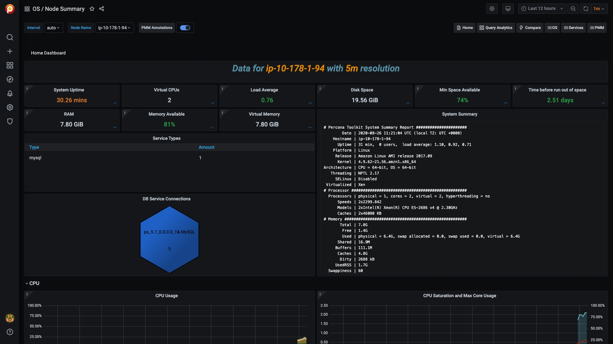

# Node Summary

- System Uptime
- Virtual CPUs
- Load Average
- Disk Space
- Min Space Available
- Time before run out of space
- RAM
- Memory Available
- Virtual Memory
- DB Service Connections
- Service Types

## CPU

- CPU Usage
- CPU Saturation and Max Core Usage
- Interrupts and Context Switches
- Processes

## Memory

- Memory Utilization
- Virtual Memory Utilization
- Swap Space
- Swap Activity

## Disk

- I/O Activity
- Global File Descriptors Usage
- Disk IO Latency
- Disk IO Load

## Network

- Network Traffic
- Network Utilization Hourly
- Local Network Errors
- TCP Retransmission
