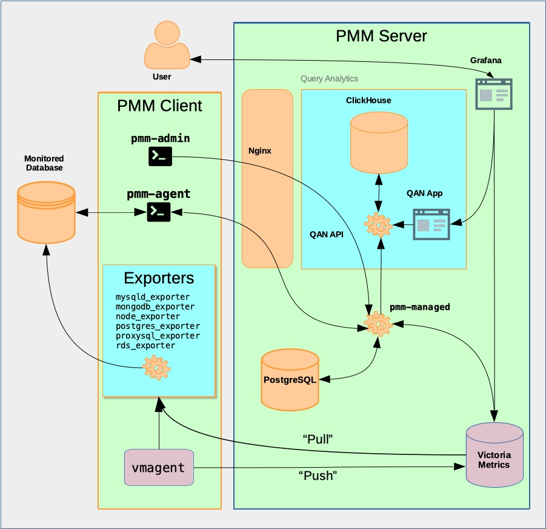

# Architecture

PMM is a client/server application built by us with our own and third-party open-source tools.

```plantuml
@startuml "1 - PMM Context"
!include https://raw.githubusercontent.com/plantuml-stdlib/C4-PlantUML/master/C4_Context.puml
!include docs/_images/plantuml_styles.puml
HIDE_STEREOTYPE()
'title PMM Context
caption PMM's client/server architecture
Person_Ext(user, "User")
System_Ext(monitored, "Monitored systems", "Servers, databases, services or applications")
System(pmm_client, "PMM Client", "Runs on every monitored host to extract metrics data from databases and services and forwards it to PMM Server")
System(pmm_server, "PMM Server", "Receives, stores and organizes metrics data from PMM Clients, presents it in web UI as graphs, charts, and tables")
System_Ext(platform, "Percona Platform", "Value-added services:\n- Security Threat Tool\n- DBaaS (Coming soon)")
Lay_D(user, pmm_client)
Lay_D(user, pmm_server)
Rel_R(monitored, pmm_client, "Metrics")
BiRel_R(pmm_client, pmm_server, " ")
BiRel_R(pmm_server, platform, " ")
Rel(user, pmm_server, " ")
Rel(user, pmm_client, " ")
@enduml
```

## PMM Server

PMM Server is the heart of PMM. It receives data from clients, collates it and stores it. Metrics are drawn as tables, charts and graphs within [*dashboards*](dashboards/), each a part of the web-based [user interface](../using/interface.md).

## PMM Client

PMM Client is a collection of agents and exporters that run on the host being monitored.

PMM Client runs on every database host or node you want to monitor. The client collects server metrics, general system metrics, and query analytics data, and sends it to the server. Except when monitoring AWS RDS instances, a PMM Client must be running on the host to be monitored.

## Percona Platform

[Percona Platform](../using/platform/) (in development) provides value-added services for PMM.

## PMM context

The PMM Client package provides:

- Exporters for each database and service type. When an exporter runs, it connects to the database or service instance, runs the metrics collection routines, and sends the results to PMM Server.
- `pmm-agent`: Run as a daemon process, it starts and stops exporters when instructed.
- `vmagent`: A VictoriaMetrics daemon process that sends metrics data (*pushes*) to PMM Server.

The PMM Server package provides:

- `pmm-managed`;
- Query Analytics;
- Grafana;
- VictoriaMetrics.

### PMM Server



PMM Server includes the following tools:

- Query Analytics (QAN) enables you to analyze MySQL query performance over periods of time. In addition to the client-side QAN agent, it includes the following:

    - QAN API is the back-end for storing and accessing query data collected by the QAN agent running on a PMM Client.
    - QAN Web App is a web application for visualizing collected Query Analytics data.

- Metrics Monitor provides a historical view of metrics that are critical to a MySQL or MongoDB server instance. It includes the following:

    - [VictoriaMetrics](https://github.com/VictoriaMetrics/VictoriaMetrics), a scalable time-series database. (Replaced [Prometheus](https://prometheus.io) in [PMM 2.12.0](../release-notes/2.12.0.md).)
    - [ClickHouse](https://clickhouse.tech/) is a third-party column-oriented database that facilitates the Query Analytics functionality.
    - [Grafana](http://docs.grafana.org/) is a third-party dashboard and graph builder for visualizing data aggregated (by VictoriaMetrics or Prometheus) in an intuitive web interface.
    - Percona Dashboards is a set of dashboards for Grafana developed by us.

### PMM Client


The PMM Client package consist of the following:

- `pmm-admin` is a command-line tool for managing PMM Client, for example, adding and removing database instances that you want to monitor. ([Read more](../details/commands/pmm-admin.md)).

- `pmm-agent` is a client-side component a minimal command-line interface, which is a central entry point in charge for bringing the client functionality: it carries on client’s authentication, gets the client configuration stored on the PMM Server, manages exporters and other agents.

- `node_exporter` is an exporter that collects general system metrics.

- `mysqld_exporter` is an exporter that collects MySQL server metrics.

- `mongodb_exporter` is an exporter that collects MongoDB server metrics.

- `postgres_exporter` is an exporter that collects PostgreSQL performance metrics.

- `proxysql_exporter` is an exporter that collects ProxySQL performance metrics.

- `rds_exporter` is an exporter that collects Amazon RDS performance metrics.

- `azure_database_exporter` is an exporter that collects Azure database performance metrics.

To make data transfer from PMM Client to PMM Server secure, all exporters are able to use SSL/TLS encrypted connections, and their communication with the PMM server is protected by the HTTP basic authentication.

```plantuml
@startuml "2 - PMM Containers"
!include https://raw.githubusercontent.com/plantuml-stdlib/C4-PlantUML/master/C4_Container.puml
!include docs/_images/plantuml_styles.puml
HIDE_STEREOTYPE()
title PMM Client-Server interactions
caption PMM Client/PMM Server connections

System_Ext(monitored, "Monitored system", "Database, node or service")

Boundary(pmm_client, "PMM Client") {
    System(exporters, "exporters", "Collection of programs, one for each monitored system type")
    System(pmm_agent, "pmm-agent", "Invokes appropriate exporter on command")
    System(vmagent, "vmagent", "VictoriaMetrics agent")
}

Person_Ext(user, "User")

Boundary(pmm_server, "PMM Server") {
    System(pmm_managed, "pmm-managed", "Manages configuration, exposes API for other components")
    System(query_analytics, "Query Analytics", "Detailed database query data application")
    System(victoriametrics, "VictoriaMetrics", "Receives and stores metrics data (Prometheus-compatible)")
    System(grafana, "Grafana", "Data presentation")
}

Rel(user, grafana, "Uses")
Rel_R(monitored, pmm_agent, "Query Analytics metrics")
Rel(monitored, exporters, "Exports Metrics from")
BiRel_R(pmm_agent, pmm_managed, "Control API")
Rel(exporters, vmagent, " ")
Rel(pmm_agent, exporters, "Controls")
Rel(pmm_managed, query_analytics, " ")
Rel(pmm_managed, victoriametrics, " ")
Rel(query_analytics, grafana, " ")
Rel(victoriametrics, exporters, "Pulls from")
Rel(vmagent, victoriametrics, "Pushes to")

Lay_D(grafana, query_analytics)
Lay_R(pmm_managed, grafana)

@enduml
```
