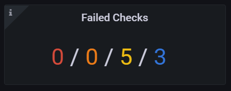
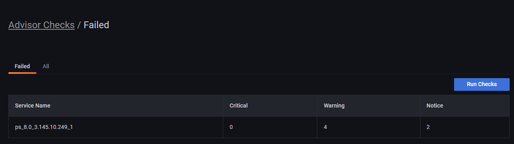

# Version 2 advisor checks for PMM 2.28 and newer
 PMM 2.28 upgraded Advisor Checks to version 2, which uses a slightly different structure than version 1 checks, created in 2.7 and older. This is because, compared to version 1 checks, checks created in 2.28 and later offer additional support for:

- Multiple queries
- Victoria Metrics as a data source
- Database **Family** field

## Format for v.2 checks
Advisor checks for PMM 2.28 and later use the following format:

??? note alert alert-info "Version 2 Checks Format"

    
    ```yaml
    ---
    checks:
      - version: 2
        name: exampleV2
        summary: Check format V2
        description: Checks something important
        interval: standard
        family: MYSQL
        category: configuration
        queries:
          - type: MYSQL_SHOW
            query: VARIABLES

          - type: METRICS_INSTANT
            query: mysql_global_status_uptime{service_name=~"{{.ServiceName}}"}

          - type: METRICS_INSTANT
            query: mysql_global_status_uptime{service_name=~"{{.ServiceName}}"}
            parameters:
              lookback: 5m

          - type: METRICS_RANGE
            query: avg by (node_name) (avg_over_time(node_load1{node_name=~"{{.NodeName}}"}[5m]))
            parameters:
              range: 15m
              step: 5m

          - type: METRICS_RANGE
            query: avg by (node_name) (avg_over_time(node_load1{node_name=~"{{.NodeName}}"}[5m]))
            parameters:
              lookback: 5m
              range: 15m
              step: 5m

        script: |
          def check_context(docs, context):
              # `docs` is a frozen (deeply immutable) list where each item represents single query results. Order of results
              # matches order of queries in check file. Each query result is list of dicts where each item where each dict
              # represents a single document in result set.
              #
              # `context` is a dict with additional functions.
              #
              # Global `print` and `fail` functions are available.
              #
              # `check_context` function is expected to return a list of dicts that are then converted to alerts;
              # in particular, that list can be empty.
              # Any other value (for example, string) is treated as script execution failure
              # (Starlark does not support Python exceptions);
              # it is recommended to use global function `fail` for that instead.

              results = []

              for row in docs[0]:
                  name, value = row["Variable_name"], row["Value"]
                  if name == "version":
                      results.append({
                          "summary": "MySQL has version {}".format(value),
                          "description": "Current version is {}".format(value),
                          "read_more_url": "",
                          "severity": "warning",
                          "labels": {},
                      })

              uptimeNow = int(int(docs[1][0]["value"][1])/60)
              results.append({
                  "summary": "MySQL uptime {} min".format(uptimeNow),
                  "description": "Current uptime is {} min".format(uptimeNow),
                  "read_more_url": "",
                  "severity": "warning",
                  "labels": {},
              })

              uptimeFiveMinAgo = int(int(docs[2][0]["value"][1])/60)
              results.append({
                  "summary": "MySQL uptime 5 min ago was {} min".format(uptimeFiveMinAgo),
                  "description": "5 min ago uptime was {} min".format(uptimeFiveMinAgo),
                  "read_more_url": "",
                  "severity": "warning",
                  "labels": {},
              })

              dataPoints = []
              for row in docs[3][0]["values"]:
                dataPoints.append(row[1])

              results.append({
                  "summary": "Node has load average for last 15 minutes {}".format(dataPoints),
                  "description": "Data points {}".format(dataPoints),
                  "read_more_url": "",
                  "severity": "warning",
                  "labels": {},
              })

              dataPoints = []
              for row in docs[4][0]["values"]:
                  dataPoints.append(row[1])

              results.append({
                  "summary": "Five minutes ago node had load average for 15 minutes {}".format(dataPoints),
                  "description": "Data points {}".format(dataPoints),
                  "read_more_url": "",
                  "severity": "warning",
                  "labels": {},
              })

              return results
    ```
    

## Checks script

The check script assumes that there is a function with `check_context`, that accepts a _list_ where each item represents the result of a single query specified in the check. Each result itself is a _list_ of _docs_ containing returned rows for SQL databases and documents for MongoDB. It returns zero, one, or several check results that are then converted to alerts.

## Check severity levels
PMM can display failed checks as **Critical**, **Major** or **Trivial**. These three severity levels correspond to the following severity types in the check source:

 - **Critical**: emergency, alert, critical
 - **Major**: warning
 - **Trivial**: notice, info, debug

## Check fields

Checks can include the following fields:

- **Version** (integer, required): defines what other properties are expected, what types are supported, what is expected from the script and what it can expect from the execution environment, etc.
- **Name** (string, required): defines machine-readable name (ID).
- **Summary** (string, required): defines short human-readable description.
- **Description** (string, required): defines long human-readable description.
- **Interval** (string/enum, optional): defines running interval. Can be one of the predefined intervals in the UI: Standard, Frequent, Rare.

- **Script** (string, required): contains a small Starlark program that processes query results, and returns check results. It is executed on the PMM Server side.
- **Family** (string, required): specifies one of the supported database families: MYSQL, POSTGRESQL, MONGODB. This field is only available for Advisor checks v.2, created for PMM 2.28 and later.
- **Category** (string, required): specifies a custom or a default advisor check category. For example: Performance, Security.
- **Queries** (array, required): contains items that specify queries.
  - **Type** (string/enum, required): defines the query type. Check the list of available types in the table below.
  - **Query** (string, can be absent if the type defines the whole query by itself): The query is executed on the PMM Client side and can contain multiple queries specific to the target DBMS.
  - **Parameters** (key-value, can be absent if query doesn't have required parameters)

## Query types

Expand the table below for the list of checks types that you can use to define your query type and the PMM Service type for which the check will run.

??? note alert alert-info "Check Types table"

    | Check type  |  Description | "query" required (must be empty if "No")   |
    |---|---|---|
    | MYSQL_SHOW |Executes 'SHOW …' clause against MySQL database. |Yes|
    | MYSQL_SELECT    |     Executes 'SELECT …' clause against MySQL database.  |Yes|
    | POSTGRESQL_SHOW     |    Executes 'SHOW ALL' command against PosgreSQL database.    |No|
    | POSTGRESQL_SELECT      | Executes 'SELECT …' clause against PosgreSQL database.  |Yes|
    | MONGODB_GETPARAMETER     | Executes db.adminCommand( { getParameter: "*" } ) against MongoDB's "admin" database. For more information, see [getParameter](https://docs.mongodb.com/manual/reference/command/getParameter/)| No|
    | MONGODB_BUILDINFO    | Executes db.adminCommand( { buildInfo:  1 } ) against MongoDB's "admin" database. For more information, see [buildInfo](https://docs.mongodb.com/manual/reference/command/buildInfo/) | No|
    | MONGODB_GETCMDLINEOPTS          |    Executes db.adminCommand( { getCmdLineOpts: 1 } ) against MongoDB's "admin" database. For more information, see [getCmdLineOpts](https://docs.mongodb.com/manual/reference/command/getCmdLineOpts/) |No|
    | MONGODB_REPLSETGETSTATUS     |   Executes db.adminCommand( { replSetGetStatus: 1 } ) against MongoDB's "admin" database. For more information, see  [replSetGetStatus](https://docs.mongodb.com/manual/reference/command/replSetGetStatus/) |No|
    | MONGODB_GETDIAGNOSTICDATA |Executes db.adminCommand( { getDiagnosticData: 1 } ) against MongoDB's "admin" database. For more information, see [MongoDB Performance](https://docs.mongodb.com/manual/administration/analyzing-mongodb-performance/#full-time-diagnostic-data-capture)| No|
    | METRICS_INSTANT |Executes instant [MetricsQL](https://docs.victoriametrics.com/MetricsQL.html) query. Query can use placeholders in query string  **{{.NodeName**}} and **{{}}.ServiceName}}**  . Both match target service/node names. To read more about instant queries see [Prometheus docs](https://prometheus.io/docs/prometheus/latest/querying/api/#instant-queries).|Yes|
    | METRICS_RANGE |Executes range [MetricsQL](https://docs.victoriametrics.com/MetricsQL.html) query. Query can use placeholders in query string  **{{.NodeName**}} and **{{}}.ServiceName}}**  . Both match target service/node names. To read more about range queries see [Prometheus docs](https://prometheus.io/docs/prometheus/latest/querying/api/#range-queries).|Yes|

## Query parameters
- `METRICS_INSTANT`
    - **lookback** (duration, optional): specifies how far in past to look back to metrics history. If this parameter is not specified, then query executed on the latest data. Example values: `30s`, `5m`, `8h`.
- `METRICS_RANGE`
    - **lookback** (duration, optional): specifies how far in past to look back to metrics history. If this parameter is not specified, then query executed on the latest data. Example values: `30s`, `5m`, `8h`.
    - **range** (duration, required): specifies time window of the query. This parameter is equal to [Prometheus API](https://prometheus.io/docs/prometheus/latest/querying/api/#range-queries).
    - **step** (duration, required): query resolution. This parameter is equal to [Prometheus API](https://prometheus.io/docs/prometheus/latest/querying/api/#range-queries).


## Develop version 2 checks
To develop custom checks for PMM 2.28 and later:


1. Install the latest PMM Server and PMM Client builds following the [installation instructions](https://www.percona.com/software/pmm/quickstart#).
2. Run PMM Server with special environment variables:

    - `PMM_DEBUG=1` to enable debug output that would be useful later;
    - `PERCONA_TEST_CHECKS_FILE=/srv/custom-checks.yml` to use checks from the local files instead of downloading them from Percona Platform.
    - `PERCONA_TEST_CHECKS_DISABLE_START_DELAY=true` to disable the default check execution start delay. This is currently set to one minute, so that checks run upon system start.
    - `PERCONA_TEST_CHECKS_RESEND_INTERVAL=2s` to define the frequency for sending the SA-based alerts to Alertmanager.

    ```sh
    docker run -p 80:80 -p 443:443 --name pmm-server \
    -e PMM_DEBUG=1 \
    -e PERCONA_TEST_CHECKS_FILE=/srv/custom-checks.yml \
    -e PERCONA_TEST_CHECKS_DISABLE_START_DELAY=true \
    -e PERCONA_TEST_CHECKS_RESEND_INTERVAL=2s \
    perconalab/pmm-server:dev-latest
    ```

3.  Log in to Grafana with credentials **admin/admin**.

4. Go to **Configuration > Settings > Advanced Settings** and make sure the **Advisors** option is enabled.

5.  Create `/srv/custom-checks.yml` inside the `pmm-server` container with the content of your check.

6.  The checks will run according to the time interval defined on the UI. You can see the result of running the check on the home dashboard:

    

7.  Click on the number of failed checks to open the Failed Checks dashboard:

    

8.  Go into Docker container to output the logs of pmm-managed and read check logs:

```sh
# get inside the container
docker exec -it pmm-server bash
# print and watch the logs
supervisorctl tail -f pmm-managed
```
