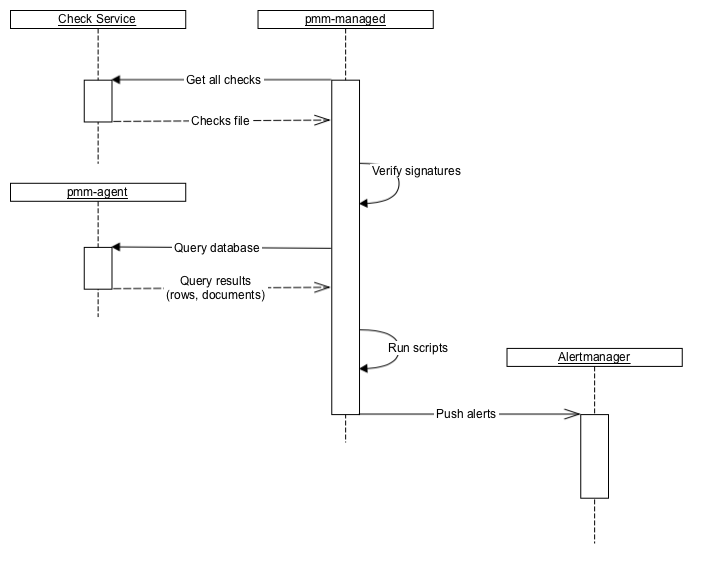

# Developing Advisor checks
PMM offers sets of checks that can detect common security threats, performance degradation, data loss and data corruption.

As a developer, you can create custom checks to cover additional use cases, relevant to your specific database infrastructure.

## Check components

A check is a combination of:

- A query for extracting data from the database.
- Python script for converting extracted data into check results. This is actually a [Starlark](https://github.com/google/starlark-go) script, which is a Python dialect that adds more imperative features than Python. The script's execution environment is sandboxed, and no I/O can be done from it.

All checks are self-contained in the first phase, as well as in most of the planned phases.

This means that extracted data is processed on the PMM side and not sent back to Percona Platform.

## Backend

1. pmm-managed checks that the installation is opted-in for checks.
2. pmm-managed downloads files with checks from Percona Platform.
3. pmm-managed verifies file signatures using a list of hard-coded public keys. At least one signature should be correct.
4. pmm-managed sends queries to pmm-agent and gathers results.
5. pmm-managed executes check scripts that produce alert information.
6. pmm-managed sends alerts to Alertmanager.
   - Due to Alertmanager design, pmm-managed has to send and re-send alerts to it much more often than the frequency with which checks are executed. This expected behavior is not important for using checks but is important for understanding how checks work.
   - Currently, Prometheus is not involved.

## Frontend
PMM uses Alertmanager API to get information about failed checks and show them on the UI:

## Advisor check format version 2
PMM 2.28 upgraded Advisor checks to version 2, to accommodate the following major enhancements introduced in this release:

- Support for multiple queries
- Support for Victoria Metrics as a data source
- Database **Family** field to specify one of the supported database families: MYSQL, POSTGRESQL, MONGODB.

The enhancements in version 2 enable you to create more intelligent advisor checks, that deliver more value to your connected PMM instances.

If you are creating checks for PMM version 2.28 and newer, see [Advisor checks v.2](checks-v2.md) for information on developing custom checks for PMM 2.28 and later.

## Advisor check format version 1
If you are creating checks for PMM version 2.27 and older, see [Advisor checks v.1](checks-v1.md), for information on creating custom checks for PMM 2.27 and older.

## Submit feedback
We welcome your feedback on the current process for developing and debugging checks. Send us your comments over [Slack](https://percona.slack.com) or post a question on the [Percona Forums](https://forums.percona.com/).

