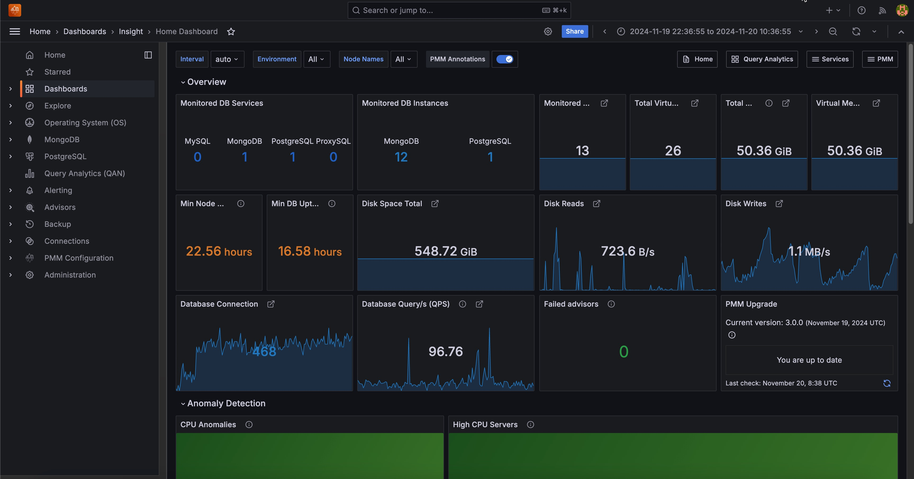

# Why PMM?

Percona Monitoring and Management (PMM) delivers:

* **Comprehensive monitoring** of MySQL, MariaDB, MongoDB, and PostgreSQL databases
* **Query performance insights** to identify and optimize slow queries for improved system efficiency
* **Database-specific features** tailored for deep monitoring of different database engines
* **Built-in security** with SSL encryption and robust authentication
* **Flexible customization** through custom dashboards, metrics, and exporters
* **Centralized management** of multiple database instances across different hosts
* **Active community support** with regular updates and improvements

