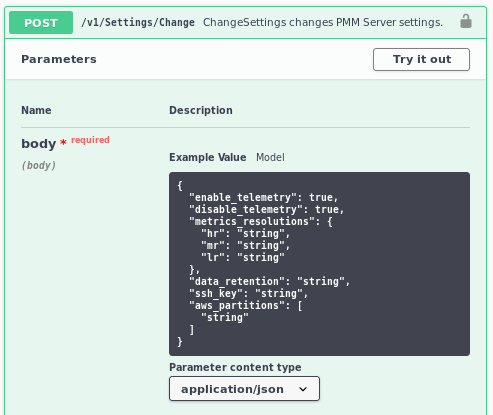

# FAQ

---

[TOC]

---

## How can I contact the developers?

The best place to discuss PMM with developers and other community members is the [community forum](https://www.percona.com/forums/questions-discussions/percona-monitoring-and-management).

To report a bug, visit the [PMM project in JIRA](https://jira.percona.com/projects/PMM).

## How can I contact the technical writers?

- Open a [Jira](https://jira.percona.com/secure/CreateIssue!default.jspa) ticket

- Open a [GitHub](https://github.com/percona/pmm-doc/issues/new) issue

## What are the minimum system requirements for PMM?

**PMM Server**

Any system which can run Docker version 1.12.6 or later.

It needs roughly 1 GB of storage for each monitored database node with data retention set to one week.

!!! alert alert-info "Note"

    By default, [retention](#how-to-control-data-retention-for-pmm) is set to 30 days for Metrics Monitor and for Query Analytics.  You can consider [disabling table statistics](how-to/optimize.md) to decrease the VictoriaMetrics database size.

You need at least 2 GB for one monitored database node.

!!! alert alert-info "Note"

    The increase in memory usage is not proportional to the number of nodes.  For example, data from 20 nodes should be easily handled with 16 GB.

**PMM Client**

Any modern 64-bit Linux distribution. It is tested on the latest versions of Debian, Ubuntu, CentOS, and Red Hat Enterprise Linux.

A minimum of 100 MB of storage is required for installing the PMM Client package.  With a good connection to PMM Server, additional storage is not required.  However, the client needs to store any collected data that it cannot dispatch immediately, so additional storage may be required if the connection is unstable or the throughput is low.
(Caching only applies to Query Analytics data; VictoriaMetrics data is never cached on the client side.)

## How can I upgrade from PMM version 1?

Because of the significant architectural changes between PMM1 and PMM2, there is no direct upgrade path.  The approach to making the switch from PMM version 1 to 2 is a gradual transition, outlined [in this blog post](https://www.percona.com/blog/2019/11/27/running-pmm1-and-pmm2-clients-on-the-same-host/).

In short, it involves first standing up a new PMM2 server on a new host and connecting clients to it.  As new data is reported to the PMM2 server, old metrics will age out during the course of the retention period (30 days, by default), at which point you'll be able to shut down your existing PMM1 server.

!!! alert alert-info "Note"

    Any alerts configured through the Grafana UI will have to be recreated due to the target dashboard id's not matching between PMM1 and PMM2.  In this instance we recommend moving to Alertmanager recipes in PMM2 for alerting which, for the time being, requires a separate Alertmanager instance. However, we are working on integrating this natively into PMM2 Server and expect to support your existing Alertmanager rules.

## How to control data retention for PMM?

By default, PMM stores time-series data for 30 days.
Depending on your available disk space and requirements, you may need to adjust the data retention time:

1. Go to *PMM > PMM Settings > Advanced Settings*.

2. Change the data retention value.

    

3. Click *Apply changes*.

## How often are NGINX logs in PMM Server rotated?

PMM Server runs `logrotate` on a daily basis to rotate NGINX logs and keeps up to ten of the most recent log files.

## What privileges are required to monitor a MySQL instance?

```sql
GRANT SELECT, PROCESS, SUPER, REPLICATION CLIENT, RELOAD ON *.* TO 'pmm'@'localhost';
```

## Can I monitor multiple service instances?

You can add multiple instances of MySQL or some other service to be monitored from one PMM Client. In this case, you must provide a unique port and IP address, or a socket for each instance, and specify a unique name for each.  (If a name is not provided, PMM uses the name of the PMM Client host.)

For example, to add complete MySQL monitoring for two local MySQL servers, the commands would be:

```sh
sudo pmm-admin add mysql --username root --password root instance-01 127.0.0.1:3001
sudo pmm-admin add mysql --username root --password root instance-02 127.0.0.1:3002
```

For more information, run:

```sh
pmm-admin add mysql --help
```

## Can I rename instances?

You can remove any monitoring instance and then add it back with a different name.

When you remove a monitoring service, previously collected data remains available in Grafana.  However, the metrics are tied to the instance name.  So if you add the same instance back with a different name, it will be considered a new instance with a new set of metrics.  So if you are re-adding an instance and want to keep its previous data, add it with the same name.

## Can I add an AWS RDS MySQL or Aurora MySQL instance from a non-default AWS partition?

By default, the RDS discovery works with the default `aws` partition. But you can switch to special regions, like the [GovCloud](https://aws.amazon.com/govcloud-us/) one, with the alternative [AWS partitions](https://docs.aws.amazon.com/sdk-for-go/api/aws/endpoints/#pkg-constants) (e.g. `aws-us-gov`) adding them to the *Settings* via the PMM Server [API](details/api.md).



To specify other than the default value, or to use several, use the JSON Array syntax: `["aws", "aws-cn"]`.

## How do I troubleshoot communication issues between PMM Client and PMM Server?

Broken network connectivity may be due to many reasons.  Particularly, when [using Docker](setting-up/server/docker.md), the container is constrained by the host-level routing and firewall rules. For example, your hosting provider might have default `iptables` rules on their hosts that block communication between PMM Server and PMM Client, resulting in *DOWN* targets in VictoriaMetrics. If this happens, check the firewall and routing settings on the Docker host.

PMM is also able to generate diagnostics data which can be examined and/or shared with Percona Support to help quickly solve an issue. You can get collected logs from PMM Client using the `pmm-admin summary` command.

Logs obtained in this way includes PMM Client logs and logs which were received from the PMM Server, stored separately in the `client` and `server` folders. The `server` folder also contains its own `client` subfolder with the self-monitoring client information collected on the PMM Server.

!!! alert alert-info "Note"

    Beginning with PMM version 2.4.0, there is an additional flag that enables the fetching of [pprof](https://github.com/google/pprof) debug profiles and adds them to the diagnostics data. To enable, run `pmm-admin summary --pprof`.

You can get PMM Server logs in two ways:

- In a browser, visit `https://<address-of-your-pmm-server>/logs.zip`.
- Go to *PMM > PMM Settings* and click *Download server diagnostics*. (See [Diagnostics in PMM Settings](how-to/configure.md#diagnostics).)

## What resolution is used for metrics?

The default values are:

* Low: 60 seconds
* Medium: 10 seconds
* High: 5 seconds

(See [Metrics resolution](how-to/configure.md#metrics-resolution).)

## How do I set up Alerting in PMM?

When a monitored service metric reaches a defined threshold, PMM Server can trigger alerts for it either using the Grafana Alerting feature or by using an external alert manager.

With these methods you must configure alerting rules that define conditions under which an alert should be triggered, and the channel used to send the alert (e.g. email).

Alerting in Grafana allows attaching rules to your dashboard panels.  Grafana Alerts are already integrated into PMM Server and may be simpler to get set up.

Alertmanager allows the creation of more sophisticated alerting rules and can be easier to manage installations with a large number of hosts. This additional flexibility comes at the expense of simplicity.

!!! alert alert-info "Note"

    We can only offer support for creating custom rules to Percona customers, so you should already have a working Alertmanager instance prior to using this feature.

!!! seealso "See also"
    [PMM Alerting with Grafana: Working with Templated Dashboards](https://www.percona.com/blog/2017/02/02/pmm-alerting-with-grafana-working-with-templated-dashboards/)

## How do I use a custom Prometheus configuration file inside PMM Server?

Normally, PMM Server fully manages the [Prometheus configuration file](https://prometheus.io/docs/prometheus/latest/configuration/configuration/).

However, some users may want to change the generated configuration to add additional scrape jobs, configure remote storage, etc.

From version 2.4.0, when `pmm-managed` starts the Prometheus file generation process, it tries to load the `/srv/prometheus/prometheus.base.yml` file first, to use it as a base for the `prometheus.yml` file.

The `prometheus.yml` file can be regenerated by restarting the PMM Server container, or by using the `SetSettings` API call with an empty body.

!!! seealso "See also"
    - [API](details/api.md)
    - [Percona blog: Extending PMM’s Prometheus Configuration](https://www.percona.com/blog/2020/03/23/extending-pmm-prometheus-configuration/)

## How to troubleshoot an Update?

If PMM server wasn't updated properly, or if you have concerns about the release, you can force the update process in 2 ways:

1. From the UI  -  Home panel: click with the Alt key on the reload icon in the Update panel (IMG needed) to make the Update Button visible even if you are on the same version as available for update. Pressing this button will force the system to rerun the update so that any broken or not installed components can be installed. In this case, you'll go through the usual update process with update logs and successful messages at the end.

2. By  API  call (if UI not available): You can call the Update API directly with:

    ```sh
    curl --user admin:admin --request POST 'http://PMM_SERVER/v1/Updates/Start'
    ```

    Replace `admin:admin` with your username/password, and replace `PMM_SERVER` with your server address.

    !!! alert alert-info "Note"

        You will not see the logs using this method.

Refresh The Home page in 2-5 min and you should see that PMM was updated.

## What are my login credentials when I try to connect to a Prometheus Exporter?

PMM protects an exporter's output from unauthorized access by adding an authorization layer. To access an exporter you can use "`pmm`" as a user name and the Agent ID as a password. You can find the Agent ID corresponding to a given exporter by running `pmm-admin list`.

## How to provision PMM Server with non-default admin password?

Currently there is no API available to change the `admin` password. If you're deploying through Docker you can use the following code snippet to change the password after starting the Docker container:

```sh
PMMPASSWORD="mypassword"
echo "Waiting for PMM to initialize to set password..."
until [ "`docker inspect -f {{ extra.STATE_HEALTH_STATUS }} pmm2-server`" = "healthy" ]; do sleep 1; done
docker exec -t pmm2-server bash -c  "ln -s /srv/grafana /usr/share/grafana/data; grafana-cli --homepath /usr/share/grafana admin reset-admin-password $PMMPASSWORD"
```
