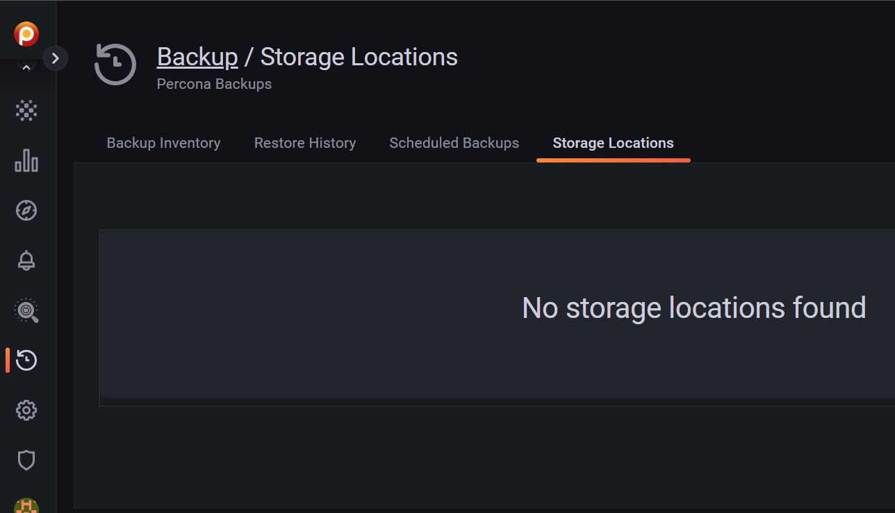
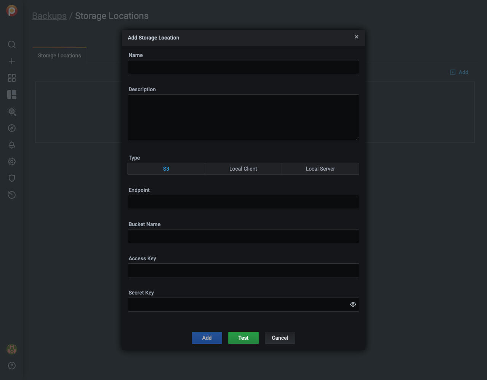

# Backup

1. Navigate to *PMM Settings-->Advanced Settings*
2. Activate *Backup Management*
3. Click *Apply changes*
4. In the left menu bar, click *{{icon.history}}-->Backup*

    

5. Click *Add*
6. Fill in the form fields

    

    - *Name*:
    - *Description*:
    - *Type:*
        - *S3*:
        - *Local Client:*
        - *Local Server:*
    - *Endpoint:*
    - *Bucket Name:*
    - *Access Key:*
    - *Secret Key:*

7. Click *Add* to add the location or *Test* to test the connection.
