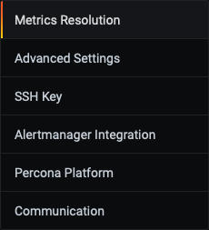
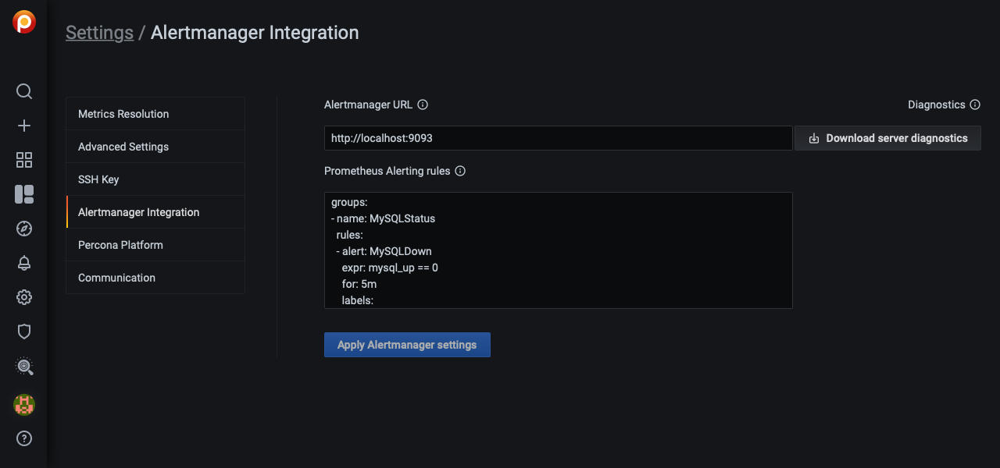
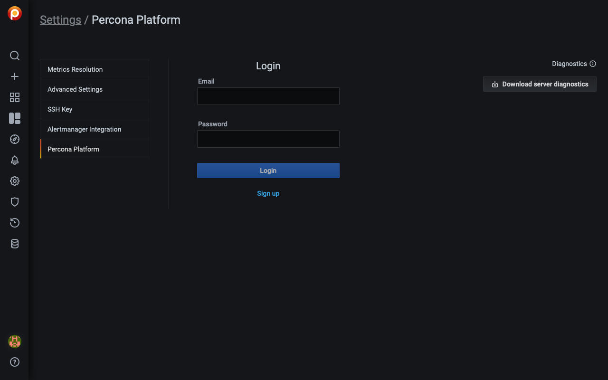
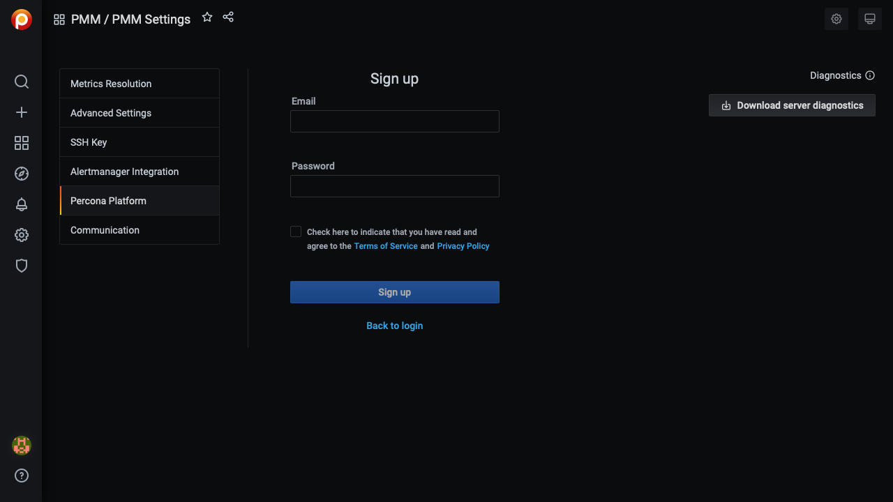
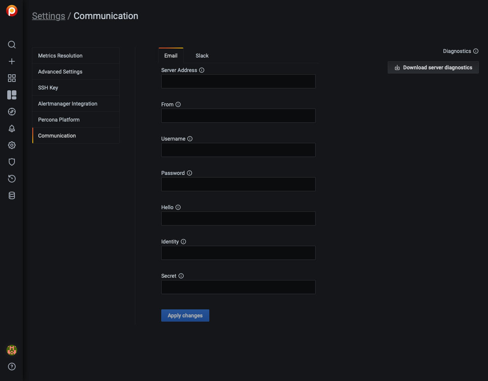

# Configure

The *PMM Settings* page lets you configure a number of PMM options.

---

[TOC]

---

Open the *PMM Settings* page with one of:

- the main menu: choose *PMM-->PMM Settings*
- search dashboards by name: type *PMM Settings* and click the search result

On the left of the page is a set of sub-page selector tabs.

(The [Communication](#communication) tab remains hidden until [Integrated Alerting](#integrated-alerting) is activated.)

!!! alert alert-success "Tip"
    Click *Apply changes* after changing settings.

## Diagnostics

Common to all sections is *Diagnostics*. PMM can generate a set of diagnostics data which can be examined and/or shared with Percona Support in case of some issue to solve it faster.  You can get collected logs from PMM Server by clicking *Download server diagnostics*.

## Metrics resolution

Metrics are collected at three intervals representing low, medium and high resolutions. Short time intervals are regarded as high resolution metrics, while those at longer time intervals are low resolution.

The *Metrics Resolution* radio button lets you select one of four presets.

- *Rare*, *Standard* and *Frequent* are fixed presets.
- *Custom* is an editable preset.

Each preset is a group of Low, Medium and High metrics resolution values.

- A low resolution interval *increases* the time between collection, resulting in low-resolution metrics and lower disk usage.

- A high resolution interval *decreases* the time between collection, resulting in high-resolution metrics and higher disk usage.

The default values (in seconds) for the fixed presets and their resolution names are:

| Preset    | Low  | Medium | High |
| --------- | ---- | ------ | ---- |
| Rare      | 300  | 180    | 60   |
| Standard  | 60   | 10     | 5    |
| Frequent  | 30   | 5      | 1    |

Values for the *Custom* preset can be entered as values, or changed with the arrows.

!!! alert alert-info "Note"
    If there is poor network connectivity between PMM Server and PMM Client, or between PMM Client and the database server it is monitoring, scraping every second may not be possible when the network latency is greater than 1 second.

## Advanced Settings

### Data Retention

*Data retention* specifies how long data is stored by PMM Server.

### Telemetry

The *Telemetry* switch enables gathering and sending basic **anonymous** data to Percona, which helps us to determine where to focus the development and what is the uptake of the various versions of PMM. Specifically, gathering this information helps determine if we need to release patches to legacy versions beyond support, determining when supporting a particular version is no longer necessary, and even understanding how the frequency of release encourages or deters adoption.

Currently, only the following information is gathered:

- PMM Version,
- Installation Method (Docker, AMI, OVF),
- the Server Uptime.

We do not gather anything that would make the system identifiable, but the following two things are to be mentioned:

1. The Country Code is evaluated from the submitting IP address before it is discarded.

2. We do create an "instance ID" - a random string generated using UUID v4.  This instance ID is generated to distinguish new instances from existing ones, for figuring out instance upgrades.

The first telemetry reporting of a new PMM Server instance is delayed by 24 hours to allow sufficient time to disable the service for those that do not wish to share any information.

There is a landing page for this service, available at [check.percona.com](https://check.percona.com), which clearly explains what this service is, what it’s collecting, and how you can turn it off.

Grafana’s [anonymous usage statistics](https://grafana.com/docs/grafana/latest/installation/configuration/#reporting-enabled) is not managed by PMM. To activate it, you must change the PMM Server container configuration after each update.

As well as via the *PMM Settings* page, you can also disable telemetry with the `-e DISABLE_TELEMETRY=1` option in your docker run statement for the PMM Server.

!!! alert alert-info "Notes"
    1. If the Security Threat Tool is enabled in PMM Settings, Telemetry is automatically enabled.
    2. Telemetry is sent immediately; the 24-hour grace period is not honored.

### Check for updates

When active, PMM will automatically check for updates and put a notification in the *Updates* dashboard if any are available.

### Security Threat Tool

The Security Threat Tool performs a range of security-related checks on a registered instance and reports the findings.

It is disabled by default.

It can be enabled in *PMM-->PMM Settings-->Settings-->Advanced Settings-->Security Threat Tool*.

The checks are re-fetched and re-run every 24 hours.

The results can be viewed in *PMM-->PMM Database Checks*.

### DBaaS

A read-only setting that shows whether DBaaS features are activated on this server.

!!! alert alert-warning "Caution"
    DBaaS functionality is a technical preview that must be turned on with a server feature flag. See [Setting up a development environment for DBaaS](../setting-up/server/dbaas.md).

### Integrated Alerting

Enables [Integrated Alerting](../using/alerting.md) and reveals the [Communication](#communication) tab.

### Public Address

Public address for accessing DBaaS features on this server.

## SSH Key

This section lets you upload your public SSH key to access the PMM Server via SSH (for example, when accessing PMM Server as a [virtual appliance](../setting-up/server/virtual-appliance.md)).

Enter your **public key** in the *SSH Key* field and click *Apply SSH Key*.

## Alertmanager integration

Alertmanager manages alerts, deduplicating, grouping, and routing them to the appropriate receiver or display component.

This section lets you configure integration of VictoriaMetrics with an external Alertmanager.

- The *Alertmanager URL* field should contain the URL of the Alertmanager which would serve your PMM alerts.
- The *Alerting rules* field is used to specify alerting rules in the YAML configuration format.

Fill both fields and click the *Apply Alertmanager settings* button to proceed.

## Percona Platform

This panel is where you create, and log into and out of your Percona Platform account.

### Login

If you have a *Percona Platform* account, enter your credentials and click *Login*.

Click *Sign out* to log out of your Percona Platform account.

### Sign up

To create a *Percona Platform* account:

1. Click *Sign up*
2. Enter a valid email address in the *Email* field
3. Choose and enter a strong password in the *Password* field
4. Select the check box acknowledging our terms of service and privacy policy
5. Click *Sign up*

A brief message will confirm the creation of your new account and you may now log in with these credentials.

!!! alert alert-info "Note"
    Your Percona Platform account is separate from your PMM User account.

## Communication

!!! alert alert-info "Note"
    This tab appears only when *Advanced Settings* --> *Integrated Alerting* is on.

Global communications settings for [Integrated Alerting](../using/alerting.md).

Integrated Alerting uses a separate instance of Alertmanager run by `pmm-managed`.

The descriptions for the settings here are reproduced from [Prometheus Alertmanager configuration](https://prometheus.io/docs/alerting/latest/configuration/).

### Email

Settings for the SMTP email server:

- *Server Address*: The default SMTP smarthost used for sending emails, including port number.
- *From*: The default SMTP From header field.
- *Username*: SMTP Auth using CRAM-MD5, LOGIN and PLAIN.
- *Password*: SMTP Auth using LOGIN and PLAIN.
- *Hello*: The default hostname to identify to the SMTP server.
- *Identity*: SMTP Auth using PLAIN.
- *Secret*: SMTP Auth using CRAM-MD5.

### Slack

Settings for Slack notifications:

- *URL*: The Slack webhook URL to use for Slack notifications.

!!! seealso "See also"
    - [Integrated Alerting](../using/alerting.md)
    - [Prometheus Alertmanager](https://prometheus.io/docs/alerting/alertmanager/)
