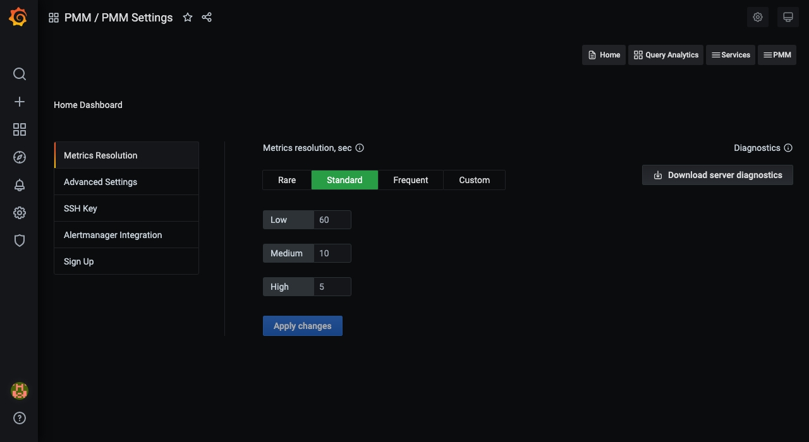
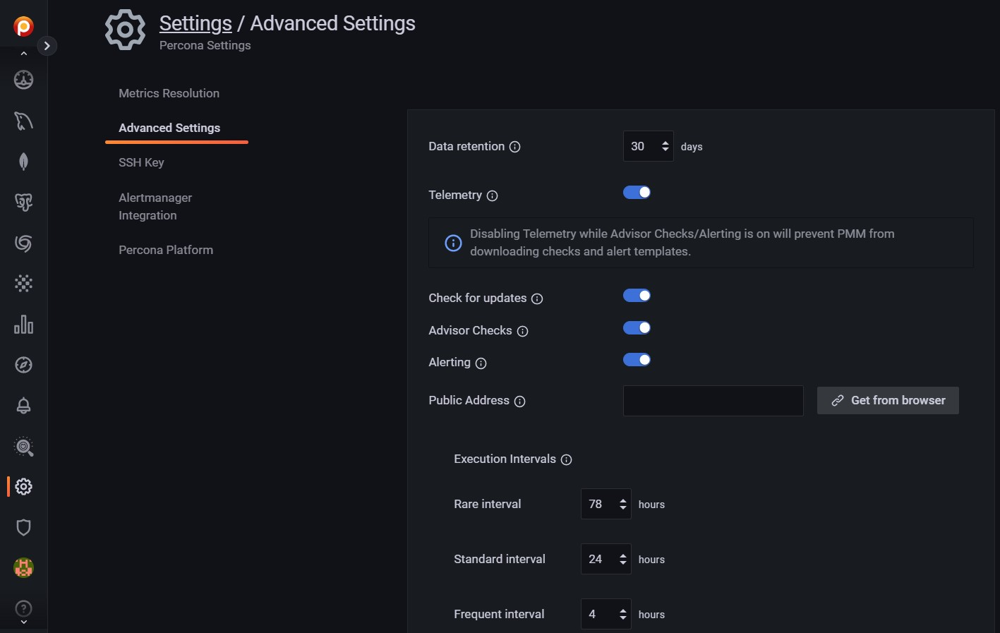
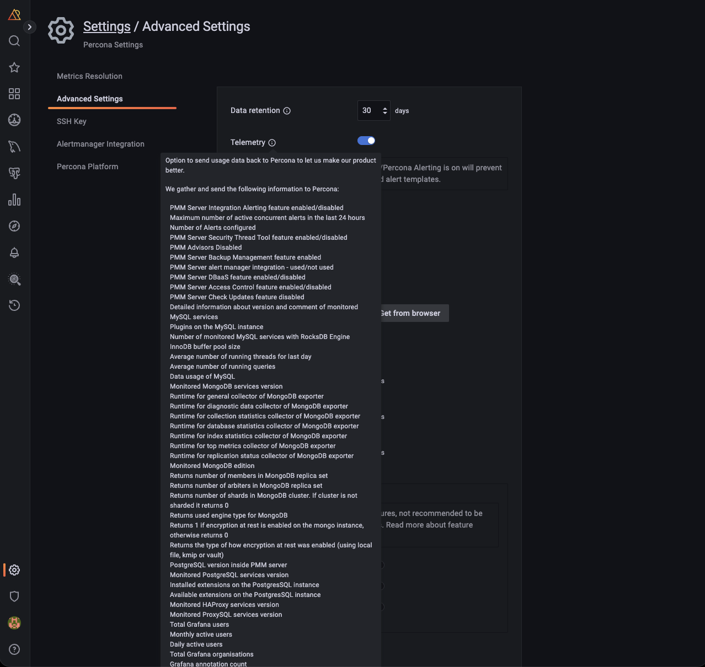
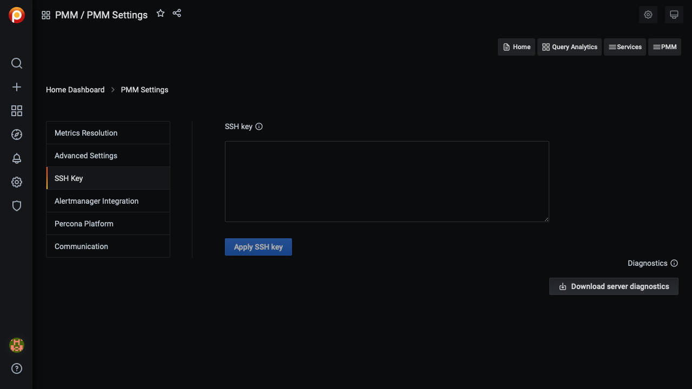

# Configure

The **Settings** page is where you configure PMM.

Open the **Settings** page from the [main menu](../details/interface.md#main-menu) with {{icon.configuration}} **Configuration** → <i class="uil uil-setting"></i> **Settings**. The page opens with the **Metrics Resolution** settings tab selected.

On the left are the selector tabs:

- [Configure](#configure)
  - [Metrics resolution](#metrics-resolution)
  - [Advanced Settings](#advanced-settings)
    - [Data Retention](#data-retention)
    - [Telemetry](#telemetry)
    - [Check for updates](#check-for-updates)
    - [Advisors](#advisors)
    - [Percona Alerting](#percona-alerting)
    - [Backup Management](#backup-management)
    - [Public Address](#public-address)
    - [Database as a Service (DBaaS)](#database-as-a-service-dbaas)
    - [Microsoft Azure monitoring](#microsoft-azure-monitoring)
  - [SSH Key](#ssh-key)
  - [Alertmanager integration](#alertmanager-integration)
  - [Percona Platform](#percona-platform)

!!! hint alert alert-success "Tip"
    Click *Apply changes* to save any changes made here.

## Metrics resolution

Metrics are collected at three intervals representing low, medium and high resolutions.

The *Metrics Resolution* settings tab contains a radio button with three fixed presets (*Rare*, *Standard* and *Frequent*) and one editable custom preset (*Custom*).

Each preset is a group of low, medium and high resolutions. The values are in seconds.

!!! note alert alert-primary "Time intervals and resolutions"
    Short time intervals are *high* resolution metrics. Longer time intervals are *low* resolution. So:

    - A low-resolution interval *increases* the time between collection, resulting in low-resolution metrics and lower disk usage.
    - A high-resolution interval *decreases* the time between collection, resulting in high-resolution metrics and higher disk usage.

The default values (in seconds) for the fixed presets and their resolution names are:

| Editable? | Preset            | Low  | Medium | High |
|-----------|-------------------|------|--------|------|
| No        | Rare              | 300  | 180    | 60   |
| No        | Standard          | 60   | 10     | 5    |
| No        | Frequent          | 30   | 5      | 1    |
| Yes       | Custom (defaults) | 60   | 10     | 5    |

Values for the *Custom* preset can be entered as values, or changed with the arrows.

!!! note alert alert-primary ""
    If there is poor network connectivity between PMM Server and PMM Client, or between PMM Client and the database server being monitored, scraping every second may not be possible when the network latency is greater than 1 second.

## Advanced Settings

### Data Retention

*Data retention* specifies how long data is stored by PMM Server. By default, time-series data is stored for 30 days. You can adjust the data retention time to balance your system's available disk space with your metrics history requirements.

### Telemetry

The *Telemetry* switch enables gathering and sending basic **anonymous** data to Percona, which helps us to determine where to focus the development and what is the uptake for each release of PMM. 
Specifically, gathering this information helps determine if we need to release patches to legacy versions beyond support, determine when supporting a particular version is no longer necessary, and understand the best frequency of releases.

PMM Telemetry is based on data collected by various PMM components and stored inside PMM server 

-!!! note alert alert-primary ""
    When PMM is installed, telemetry is not sent immediately. Before the first telemetry report is generated, PMM provides users with a 24-hour grace period to disable telemetry.

To see the metrics being collected by telemetry, from the [main menu](../details/interface.md#main-menu) navigate to {{icon.configuration}} *Configuration* → <i class="uil uil-setting"></i> *Settings* → *Advanced Settings* → *Telemetry* and hover over the exclamation mark.

We do not gather anything that can identify your system, but consider the following:

1. The Country Code is evaluated from the submitting IP address before being discarded.

2. We do create an "instance ID" - a random string generated using UUID v4.  This instance ID is generated to distinguish new instances from existing ones, for figuring out instance upgrades.

The first telemetry reporting of a new PMM Server instance is delayed by 24 hours to allow enough time to disable the service for those that do not wish to share any information.

The landing page for this service, [check.percona.com](https://check.percona.com), explains what this service is.

Grafana’s [anonymous usage statistics](https://grafana.com/docs/grafana/latest/administration/configuration/#reporting-enabled) is not managed by PMM. To activate it, you must change the PMM Server container configuration after each update.

As well as via the *PMM Settings* page, you can also disable telemetry with the `-e DISABLE_TELEMETRY=1` option in your docker run statement for the PMM Server.

For information on the various config parameters for telemetry, see the [config file](https://github.com/percona/pmm/blob/main/managed/services/telemetry/config.default.yml).

### Check for updates

When active, PMM will automatically check for updates and put a notification in the home page *Updates* dashboard if any are available.

### Advisors

Advisors are sets of checks grouped by functionality that run a range of database health checks on a registered PMM instance.

The findings are reported on the **Advisors > Advisor Insights** page, and an overview is displayed on the Home dashboard.

The Advisors option is enabled by default.  Checks are re-fetched and rerun at intervals.

See [Working with Advisor checks](../get-started/advisors.md).

### Percona Alerting

Enables [Percona Alerting](../get-started/alerting.md) and reveals the **Percona templated alerts** option on the **Alerting** page.

### Backup Management

Enables [Backup Management](../get-started/backup/index.md) option and reveals the **Backup** page from where you can:

- Create and restore MongoDB and MySQL backups
- Automate backup scheduling
- Set retention policies
- Monitor your backup and restore activity

### Public Address

The address or hostname PMM Server will be accessible at. Click **Get from browser** to have your browser detect and populate this field automatically.

### Database as a Service (DBaaS)

!!! caution alert alert-warning "Caution"
    DBaaS functionality is a technical preview that must be turned on with a server feature flag. See [DBaaS](../dbaas/index.md).

Enables/disables [DBaaS features](../dbaas/get-started.md) on this server.

!!! caution alert alert-warning "Important"
    Deactivating DBaaS ***does not*** suspend or remove running DB clusters.

### Microsoft Azure monitoring

!!! caution alert alert-warning "Caution"
    This is a technical preview feature.

Activates Microsoft Azure monitoring.

## SSH Key

This section lets you upload your public SSH key to access the PMM Server via SSH (for example, when accessing PMM Server as a [virtual appliance](../setting-up/server/virtual-appliance.md)).

Enter your **public key** in the *SSH Key* field and click *Apply SSH Key*.

## Alertmanager integration

Alertmanager manages alerts, de-duplicating, grouping, and routing them to the appropriate receiver or display component.

This section lets you configure how VictoriaMetrics integrates with an external Alertmanager.

!!! hint alert alert-success "Tip"
    If possible, use [Integrated Alerting](../get-started/alerting.md) instead of Alertmanager.

- The *Alertmanager URL* field should contain the URL of the Alertmanager which would serve your PMM alerts.
- The *Prometheus Alerting rules* field is used to specify alerting rules in the YAML configuration format.

Fill in both fields and click the *Apply Alertmanager settings* button to proceed.

## Percona Platform

This is where you connect your PMM server to your Percona Platform Account.

To learn how to connect your PMM servers to Percona Platform and leverage Platform services that boost the monitoring capabilities of your PMM installations, see [Integrate PMM with Percona Platform](integrate-platform.md).

!!! note alert alert-primary ""
    Your Percona Platform Account is separate from your PMM User account.