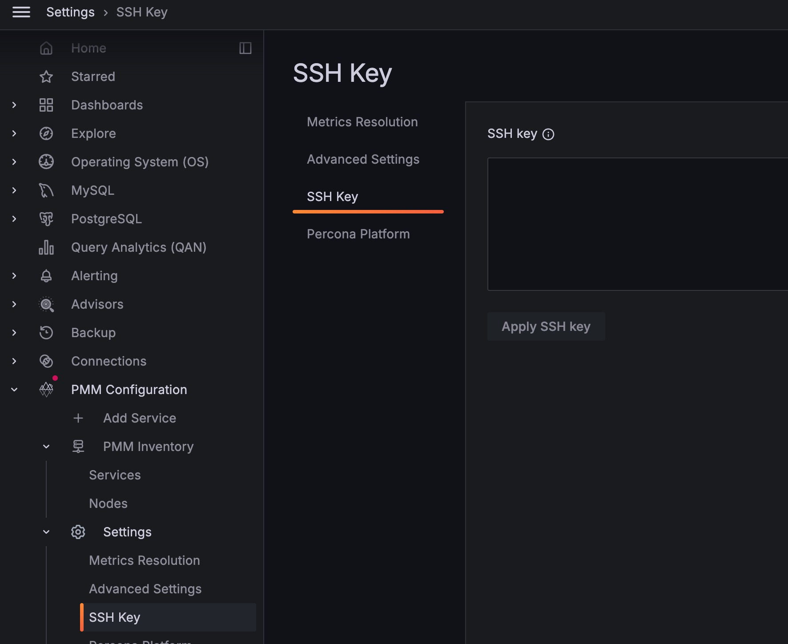

# Configure

The *Settings* page is where you configure PMM.

Open the *Settings* page from the [main menu](../details/interface.md#main-menu) with {{icon.cog}} *Configuration-->Settings*. The page opens with the *Metrics Resolution* settings tab selected.

On the left are the selector tabs:

- [Metrics Resolution](#metrics-resolution)
- [Advanced Settings](#advanced-settings)
- [SSH Key](#ssh-key)
- [Alertmanager Integration](#alertmanager-integration)
- [Percona Platform](#percona-platform)
- [Communication](#communication) (This tab remains hidden until [Integrated Alerting](#integrated-alerting) is activated in the *Advanced Settings* tab.)

> <b style="color:goldenrod">Important</b> Click *Apply changes* to save any changes made here.

**Diagnostics**

On all tabs is a *Diagnostics* section (top-right). Click *Download server diagnostics* to retrieve PMM diagnostics data which can be examined and/or shared with our support team should you need help.

## Metrics resolution

Metrics are collected at three intervals representing low, medium and high resolutions.

The *Metrics Resolution* settings tab contains a radio button with three fixed presets (*Rare*, *Standard* and *Frequent*) and one editable custom preset (*Custom*).

Each preset is a group of low, medium and high resolutions. The values are in seconds.

> Short time intervals are *high* resolution metrics. Longer time intervals are *low* resolution. So:
>
> - A low resolution interval *increases* the time between collection, resulting in low-resolution metrics and lower disk usage.
>
> - A high resolution interval *decreases* the time between collection, resulting in high-resolution metrics and higher disk usage.

The default values (in seconds) for the fixed presets and their resolution names are:

| Editable? | Preset            | Low  | Medium | High |
|:---------:|-------------------|:----:|:------:|:----:|
| No        | Rare              | 300  | 180    | 60   |
| No        | Standard          | 60   | 10     | 5    |
| No        | Frequent          | 30   | 5      | 1    |
| Yes       | Custom (defaults) | 60   | 10     | 5    |

Values for the *Custom* preset can be entered as values, or changed with the arrows.

> If there is poor network connectivity between PMM Server and PMM Client, or between PMM Client and the database server it is monitoring, scraping every second may not be possible when the network latency is greater than 1 second.

## Advanced Settings

### Data Retention

*Data retention* specifies how long data is stored by PMM Server. By default, time-series data is stored for 30 days. You can adjust the data retention time to balance your system's available disk space with your metrics history requirements.

### Telemetry

The *Telemetry* switch enables gathering and sending basic **anonymous** data to Percona, which helps us to determine where to focus the development and what is the uptake of the various versions of PMM. Specifically, gathering this information helps determine if we need to release patches to legacy versions beyond support, determining when supporting a particular version is no longer necessary, and even understanding how the frequency of release encourages or deters adoption.

Currently, only the following information is gathered:

- PMM Version,
- Installation Method (Docker, AMI, OVF),
- the Server Uptime.

We do not gather anything that would make the system identifiable, but the following two things are to be mentioned:

1. The Country Code is evaluated from the submitting IP address before it is discarded.

2. We do create an "instance ID" - a random string generated using UUID v4.  This instance ID is generated to distinguish new instances from existing ones, for figuring out instance upgrades.

The first telemetry reporting of a new PMM Server instance is delayed by 24 hours to allow sufficient time to disable the service for those that do not wish to share any information.

There is a landing page for this service, available at [check.percona.com](https://check.percona.com), which clearly explains what this service is, what it’s collecting, and how you can turn it off.

Grafana’s [anonymous usage statistics](https://grafana.com/docs/grafana/latest/installation/configuration/#reporting-enabled) is not managed by PMM. To activate it, you must change the PMM Server container configuration after each update.

As well as via the *PMM Settings* page, you can also disable telemetry with the `-e DISABLE_TELEMETRY=1` option in your docker run statement for the PMM Server.

> - If the Security Threat Tool is enabled in PMM Settings, Telemetry is automatically enabled.
>
> - Telemetry is sent immediately; the 24-hour grace period is not honored.

### Check for updates

When active, PMM will automatically check for updates and put a notification in the home page *Updates* dashboard if any are available.

### Security Threat Tool

The [Security Threat Tool](../using/platform/security-threat-tool.md) performs a range of security-related checks on a registered instance and reports the findings. It is off by default.

> To see the results of checks, select {{icon.checks}} *PMM Database Checks* to open the *Security Checks/Failed Checks* dashboard, and select the *Failed Checks* tab.

Checks are re-fetched and re-run at intervals. There are three named intervals:

| Interval name                 | Value (hours)  |
|------------------------------ |:--------------:|
| *Rare interval*               | 78             |
| *Standard interval* (default) | 24             |
| *Frequent interval*           | 4              |

> The values for each named interval are fixed.

Checks use the *Standard* interval by default. To change a check's interval:

- Go to {{icon.checks}} *PMM Database Checks*
- Select *All Checks*
- In the *Actions* column, select the {{icon.history}} icon

    

- Select an interval and click *Save*

    

(Read more at [Security Threat Tool](../using/platform/security-threat-tool.md).)

## Public address

The address or hostname PMM Server will be accessible at. Click *Get from browser* to have your browser detect and populate this field automatically.

### DBaaS

Enables DBaaS features on this server.

> <b style="color:goldenrod">Caution</b> DBaaS functionality is a technical preview that must be turned on with a server feature flag. See [DBaaS](../setting-up/server/dbaas.md).

### Integrated Alerting

Enables [Integrated Alerting](../using/alerting.md) and reveals the [Communication](#communication) tab.

### Microsoft Azure Monitoring

> <b style="color:goldenrod">Caution</b> This is a technical preview feature.

Activates Microsoft Azure monitoring.

### Backup Management {: #backup-management }

> <b style="color:goldenrod">Caution</b> This is a technical preview feature.

Activates backup management.

### Public Address

Public address for accessing DBaaS features on this server.

## SSH Key

This section lets you upload your public SSH key to access the PMM Server via SSH (for example, when accessing PMM Server as a [virtual appliance](../setting-up/server/virtual-appliance.md)).

Enter your **public key** in the *SSH Key* field and click *Apply SSH Key*.

## Alertmanager integration

Alertmanager manages alerts, de-duplicating, grouping, and routing them to the appropriate receiver or display component.

This section lets you configure integration of VictoriaMetrics with an external Alertmanager.

- The *Alertmanager URL* field should contain the URL of the Alertmanager which would serve your PMM alerts.
- The *Prometheus Alerting rules* field is used to specify alerting rules in the YAML configuration format.

Fill both fields and click the *Apply Alertmanager settings* button to proceed.

## Percona Platform

This panel is where you create, and log into and out of your Percona Platform account.

### Login

If you have a *Percona Platform* account, enter your credentials and click *Login*.

Click *Sign out* to log out of your Percona Platform account.

### Sign up

To create a *Percona Platform* account:

1. Click *Sign up*
2. Enter a valid email address in the *Email* field
3. Choose and enter a strong password in the *Password* field
4. Select the check box acknowledging our terms of service and privacy policy
5. Click *Sign up*

A brief message will confirm the creation of your new account and you may now log in with these credentials.

> Your Percona Platform account is separate from your PMM User account.

## Communication

Global communications settings for [Integrated Alerting](../using/alerting.md).

> If there is no *Communication* tab, go to the *Advanced Settings* tab and activate *Integrated Alerting*.

(Integrated Alerting uses a separate instance of Alertmanager run by `pmm-managed`.)

### Email

Settings for the SMTP email server:

- *Server Address*: The default SMTP smarthost used for sending emails, including port number.
- *Hello*: The default hostname to identify to the SMTP server.
- *From*: The sender's email address.
- *Auth type*: Authentication type. Choose from:
    - *None*
    - *Plain*
    - *Login*
    - *CRAM-MD5*
- *Username*: SMTP Auth using CRAM-MD5, LOGIN and PLAIN.
- *Password*: SMTP Auth using CRAM-MD5, LOGIN and PLAIN.

### Slack

Settings for Slack notifications:

- *URL*: The Slack webhook URL to use for Slack notifications.

> **See also**
>
> [Prometheus Alertmanager configuration](https://prometheus.io/docs/alerting/latest/configuration/)
