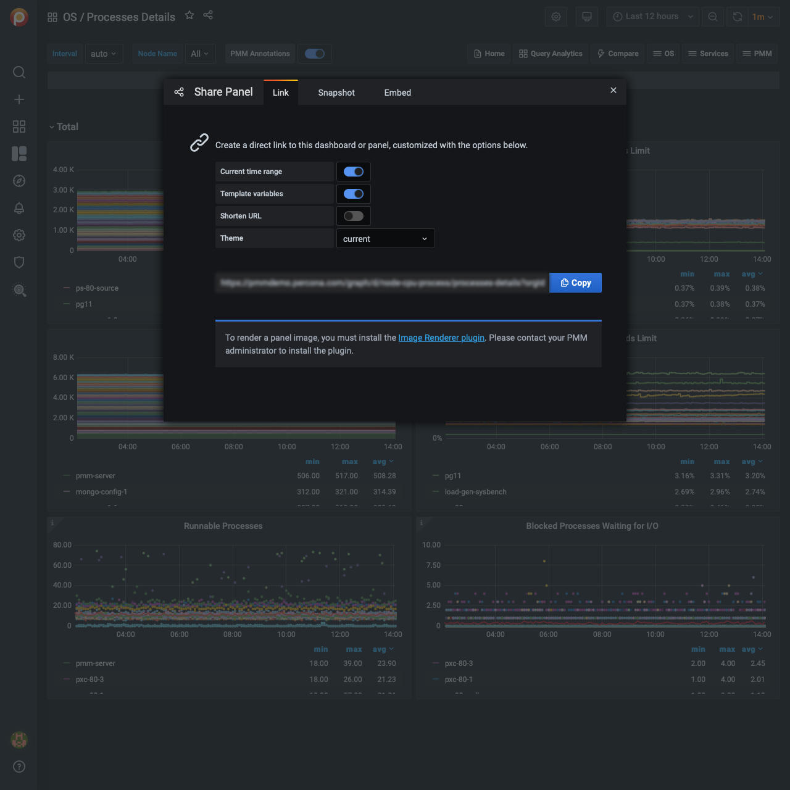
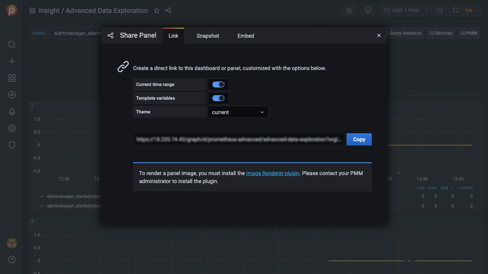

# Render dashboard images

At the moment, PMM Server can't render dashboard images exported by Grafana without these steps.

## Part 1: Install dependencies

1. Connect to your PMM Server Docker container.

    ```sh
    docker exec -it pmm-server bash
    ```

2. Install Grafana plugins.

    ```sh
    grafana-cli plugins install grafana-image-renderer
    ```

3. Restart Grafana.

    ```sh
    supervisorctl restart grafana
    ```

4. Install libraries.

    ```sh
    yum install -y libXcomposite libXdamage libXtst cups libXScrnSaver pango \
    atk adwaita-cursor-theme adwaita-icon-theme at at-spi2-atk at-spi2-core \
    cairo-gobject colord-libs dconf desktop-file-utils ed emacs-filesystem \
    gdk-pixbuf2 glib-networking gnutls gsettings-desktop-schemas \
    gtk-update-icon-cache gtk3 hicolor-icon-theme jasper-libs json-glib \
    libappindicator-gtk3 libdbusmenu libdbusmenu-gtk3 libepoxy \
    liberation-fonts liberation-narrow-fonts liberation-sans-fonts \
    liberation-serif-fonts libgusb libindicator-gtk3 libmodman libproxy \
    libsoup libwayland-cursor libwayland-egl libxkbcommon m4 mailx nettle \
    patch psmisc redhat-lsb-core redhat-lsb-submod-security rest spax time \
    trousers xdg-utils xkeyboard-config alsa-lib
    ```

## Part 2: Share the image

1. Navigate to the dashboard you want to share.

2. Open the panel menu.

3. Select *Share* to reveal the *Share Panel*.

    

4. Click *Direct link rendered image*.

5. A new browser tab opens. Wait for the image to be rendered then use your browser's image save function to download the image.

If the necessary plugins are not installed, a message in the Share Panel will say so.


