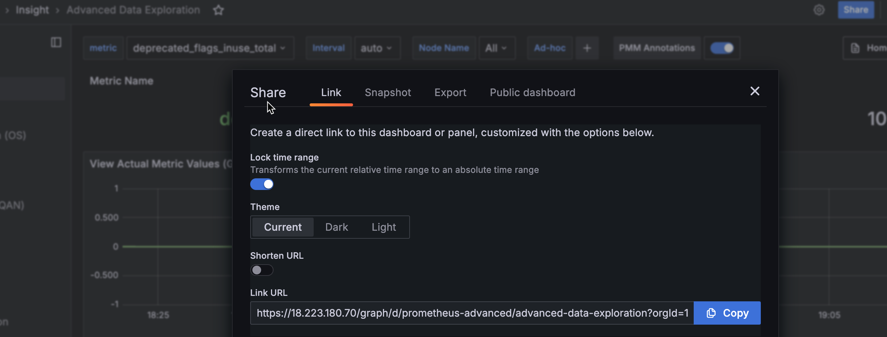
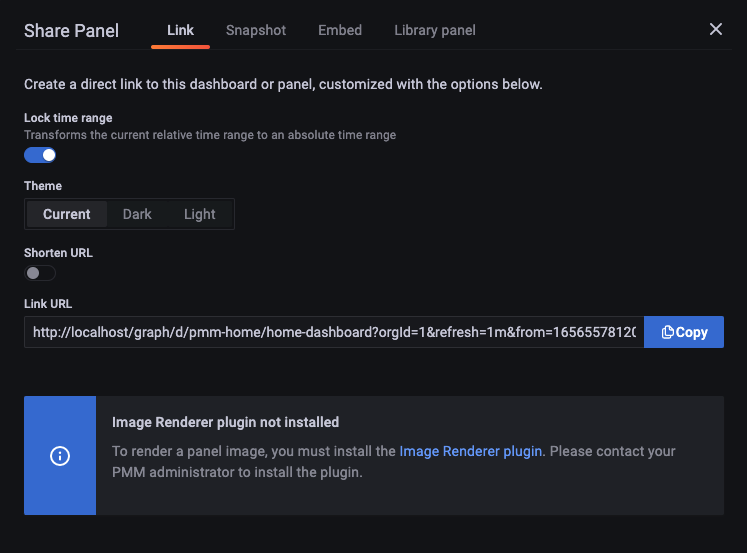

# Share dashboards and panels

When you need to share a dashboard with your team members, you can either send them a direct link to the dashboard, or render and send the dashboard as a .PNG image.

## Share as direct link
1. Go to the dashboard that you want to share.
2. Click at the top of the dashboard to display the panel menu.
3. Select **Share** to reveal the **Share Panel** and either:  
   - copy and send the full URL for the dashboard, OR
   - toggle the **Short URL** option to generate a simple link with a unique identifier

!!! hint alert alert-success "Tip"
       If your current domain is different than the one specified in the Grafana .INI configuration file, PMM will ask you to correct this mismatch before you can generate a short URL:
    
    To fix this 
## Share as a PNG file

Rendering images requires the Image Renderer plug-in. If your PMM Admin has not installed this for your PMM instance, you will see the following error message under **Share Panel > Link**.


To enable image rendering:

1. Deploy the Grafana Image Renderer container alongside PMM Server:

   ```sh
   docker run -d --name renderer --network=pmm-network grafana/grafana-image-renderer:latest
   ```

2. Stop your existing PMM Server container:

   ```sh 
   docker stop pmm-server
   docker rm pmm-server
   ```

3. Start a new PMM Server container with the required environment variables:

   ```sh
   docker run -d \
   --name pmm-server \
   --network=pmm-network \
   -p 8443:443 \
   -e GF_RENDERING_SERVER_URL=http://renderer:8081/render \
   -e GF_RENDERING_CALLBACK_URL=https://pmm-server:8443/graph/ \
   perconalab/pmm-server:3.0.0-beta
   ```

## Render Dashboard image

To Render the dashboard image:
{.power-number}

1. Go to the dashboard that you want to share.
2. Click at the top of the dashboard to display the panel menu.
3. Select **Share** to reveal the **Share Panel**.
4. Click **Direct link rendered image**. This opens a new browser tab.
5. Wait for the image to be rendered, then use your browser's Image Save function to download the image.