# Welcome

**Percona Monitoring and Management** (PMM) is a free, open-source monitoring tool for MySQL, PostgreSQL, MongoDB, and ProxySQL, and the servers they run on.

- PMM **collects** from databases and their hosts thousands of out-of-the-box performance **metrics**.

- The PMM [web UI](using/interface.md) **visualizes data** in [dashboards](details/dashboards/).

- Additional features include checking databases for [security threats](using/platform/security-threat-tool.md).

!!! alert alert-info ""
    This is for the latest release, **PMM {{release}}** ([Release Notes](release-notes/{{release}}.md)).

Percona Monitoring and Management helps you improve the performance of databases, simplify their management, and strengthen their security. It is efficient, quick to [set up](setting-up/index.md) and easy to use.

A minimal PMM set-up comprises one [server](details/architecture.md#pmm-server) and a [client agent](details/architecture.md#pmm-client) on every system you want to monitor. Clients send metrics to the server which stores, collates and displays them.

Here's how the web UI home page looks on our <a href='https://pmmdemo.percona.com/' target='_blank'>live demo system</a>. (It's free to use---why not try it?)

<a href='https://pmmdemo.percona.com/' target='_blank'></a>

PMM can run as a cloud service, on-prem, or across hybrid platforms. It's supported by our [legendary expertise][PERCONA_SERVICES] in open source databases, and by a vibrant developer and user [community].

## Next steps

The [Quickstart installation guide](https://www.percona.com/software/pmm/quickstart) shows how to run PMM Server as a Docker container, and how to install PMM Client on Ubuntu or Red Hat Linux hosts.

Full instructions for setting up are in:

- [Setting up PMM Server](setting-up/server/index.md)
- [Setting up PMM Client](setting-up/client/index.md)

## Reading guide

Links to popular sections.

```plantuml format="svg_object" width="90%" height="90%"
@startmindmap ""
skinparam svgLinkTarget _blank
skinparam defaultFontName Chivo
skinparam defaultFontSize 11
<style>
mindmapDiagram {
  node {
    ' Gap within nodes
    Padding 7
    ' Gap between nodes
    Margin 5
  }
}
</style>
' Absolute links - can be useful for exporting map as stand-alone image
' relative links make testing easier but must be changed for local vs hosting' Hosted
!$base = "https://www.percona.com/doc/percona-monitoring-and-management/2.x"
'!$base = "../2.x"
'!$base = "."
+[#lightblue] For Users <&person> <<user>>
++[#goldenrod] For Sys Admins <&star> <<admin>>
+++_ [[$base/setting-up/ Setting up]]
+++_ [[$base/how-to/configure.html How to configure]]
+++_ [[$base/how-to/upgrade.html How to upgrade]]
+++_ [[$base/details/commands/pmm-admin.html ""pmm-admin""]]
+++_ [[$base/details/architecture.html Architecture]]
--_ [[$base/using/interface.html User interface]]
--_ [[$base/using/query-analytics.html Using Query Analytics]]
--_ [[$base/using/alerting.html Using Integrated Alerting]]
--_ [[$base/using/platform/index.html Using Percona Platform]]
--_ [[$base/details/dashboards/ Dashboards reference]]
@endmindmap
```



??? note alert alert-info "Full section map (click to show/hide)"

    ```plantuml format="svg_object" width="100%" height="100%"
    @startwbs ""
    skinparam svgLinkTarget _blank
    skinparam defaultFontName Chivo
    skinparam defaultFontSize 12
    <style>
    wbsDiagram {
      node {
        BackgroundColor #lightblue
        Padding 5
        Margin 5
        RoundCorner 15
      }
    }
    </style>
    ' Absolute links - can be useful for exporting map as stand-alone image
    ' relative links make testing easier but must be changed for local vs hosting' Hosted
    !$base = "https://www.percona.com/doc/percona-monitoring-and-management/2.x"
    '!$base = "../2.x"
    ' !$base = ".."
+ <&home> [[$base/index.html Welcome]]
++ <&power-standby> [[$base/setting-up/ Setting up]]
--- <&heart> [[$base/setting-up/server/ Server]]
----_ [[$base/setting-up/server/docker.html Docker]]
----_ [[$base/setting-up/server/virtual-appliance.html Virtual\nAppliance]]
----_ [[$base/setting-up/server/aws.html AWS\nMarketplace]]
+++ <&laptop> [[$base/setting-up/client/ Client]]
++++_ [[$base/setting-up/client/docker.html Docker]]
++++_ [[$base/setting-up/client/mysql.html MySQL]]
++++_ [[$base/setting-up/client/percona-server.html Percona\nServer]]
++++_ [[$base/setting-up/client/mongodb.html MongoDB]]
++++_ [[$base/setting-up/client/postgresql.html PostgreSQL]]
++++_ [[$base/setting-up/client/proxysql.html ProxySQL]]
++++_ [[$base/setting-up/client/aws.html Amazon RDS]]
++++_ [[$base/setting-up/client/azure.html Microsoft Azure]]
++++_ [[$base/setting-up/client/google.html Google Cloud Platform]]
++++_ [[$base/setting-up/client/linux.html Linux]]
++++_ [[$base/setting-up/client/external.html External\nServices]]
++++_ [[$base/setting-up/client/haproxy.html HAProxy]]
++ <&wrench> [[$base/using/ Using]]
+++_ [[$base/using/interface.html User\ninterface]]
+++_ [[$base/using/alerting.html Integrated\nAlerting]]
+++_ [[$base/using/query-analytics.html Query\nAnalytics]]
+++ [[$base/using/platform/index.html Percona\nPlatform]]
++++_ [[$base/using/platform/security-threat-tool.html Security\nThreat Tool]]
++ <&task> [[$base/how-to/ How to]]
+++_ [[$base/how-to/configure.html Configure]]
+++_ [[$base/how-to/upgrade.html Upgrade]]
+++_ [[$base/how-to/secure.html Secure]]
+++_ [[$base/how-to/optimize.html Optimize]]
+++_ [[$base/how-to/render-dashboard-images.html Render\ndashboard\nimages]]
+++_ [[$base/how-to/troubleshoot.html Troubleshoot]]
++ <&magnifying-glass> [[$base/details/ Details]]
+++_ [[$base/details/architecture.html Architecture]]
+++_ [[$base/details/interface.html User Interface\ncomponents]]
--- <&graph> [[$base/details/dashboards/ Dashboards]]
----_ [[$base/details/dashboards/index.html#insight Insight]]
----_ [[$base/details/dashboards/index.html#pmm PMM]]
----_ [[$base/details/dashboards/index.html#os-dashboards OS]]
----_ [[$base/details/dashboards/index.html#prometheus-dashboards Prometheus]]
----_ [[$base/details/dashboards/index.html#mysql-dashboards MySQL]]
----_ [[$base/details/dashboards/index.html#mongodb-dashboards MongoDB]]
----_ [[$base/details/dashboards/index.html#postgresql-dashboards PostgreSQL]]
----_ [[$base/details/dashboards/index.html#proxysql-dashboards ProxySQL]]
----_ [[$base/details/dashboards/index.html#ha-dashboards HA]]
+++ <&code> [[$base/details/commands/ Commands]]
++++_ [[$base/details/commands/pmm-admin.html pmm-admin]]
++++_ [[$base/details/commands/pmm-agent.html pmm-agent]]
+++_ [[$base/details/api.html API]]
+++_ [[$base/details/victoria-metrics.html VictoriaMetrics]]
+++_ [[$base/details/glossary.html Glossary]]
    @endwbs
    ```

[PERCONA_SERVICES]: https://www.percona.com/services
[community]: https://www.percona.com/forums/questions-discussions/percona-monitoring-and-management
