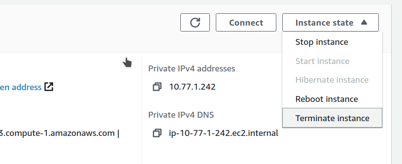

# Remove PMM Server

To remove PMM server:
{.power-number}

1. Find the instance in the EC2 Console.

    

2. Select **Instance state** menu and **Terminate instance**.

    

3. Confirm termination operation.

    .

!!! seealso alert alert-info "See also"
    [Improving Percona Monitoring and Management EC2 Instance Resilience Using CloudWatch Alarm Actions](https://www.percona.com/blog/2021/04/29/improving-percona-monitoring-and-management-ec2-instance-resilience-using-cloudwatch-alarm-actions/)