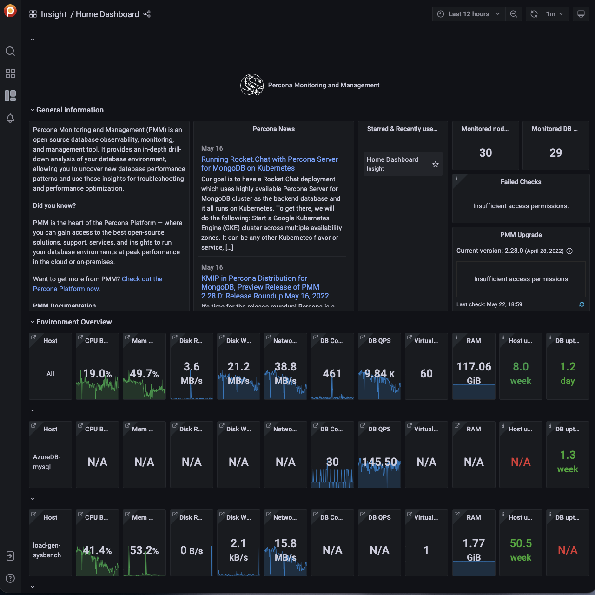

# Run the instance

After you add your new instance ,it will take some time to initialize it. When the AWS console reports that the instance is now in a running state, you may continue with configuration of PMM Server.

!!! note alert alert-primary "Note"
    When started the next time after rebooting, your instance may acquire another IP address. You may choose to set up an elastic IP to avoid this problem.

With your instance selected, open its IP address in a web browser. The IP address appears in the **IPv4 Public IP** column or as value of the **Public IP** field at the top of the **Properties** panel.


To run the instance, copy and paste its public IP address into the location bar of your browser. In the **Percona Monitoring and Management** welcome page that opens, enter the instance ID.


You can copy the instance ID from the **Properties** panel of your instance, select the **Description** tab back in the EC2 console. Click the **Copy** button next to the *Instance ID* field. This button appears as soon as you hover the cursor of your mouse over the ID.

Hover the cursor over the instance ID for the Copy button to appear.


Paste the instance in the **Instance ID** field of the **Percona Monitoring and Management** welcome page and click **Submit**.

PMM Server provides user access control, and therefore you will need user credentials to access it:


- Default user name: `admin`
- Default password: `admin`

You will be prompted to change the default password every time you log in.

The PMM Server is now ready and the home page opens.



You are creating a username and password that will be used for two purposes:
{.power-number}

1. authentication as a user to PMM - the credentials to log in to PMM.

2. authentication between PMM Server and PMM Clients - you will re-use these credentials on another host when configuring PMM Client for the first time on a server, for example (DO NOT RUN ON THIS PMM SERVER YOU JUST CREATED):

    ```sh
    pmm-admin config --server-insecure-tls --server-url=https://admin:admin@<IP Address>:443
    ```

    !!! note alert alert-primary ""
        For instructions about how to access your instances by using an SSH client, see [Connecting to Your Linux Instance Using SSH](https://docs.aws.amazon.com/AWSEC2/latest/UserGuide/AccessingInstancesLinux.html)

    Make sure to replace the user name `ec2-user` used in this document with `admin`.

## Resize the EBS Volume

Your AWS instance comes with a predefined size which can become a limitation. To make more disk space available to your instance, you need to increase the size of the EBS volume as needed and then your instance will reconfigure itself to use the new size.

The procedure of resizing EBS volumes is described in the Amazon documentation: [Modifying the Size, IOPS, or Type of an EBS Volume on Linux](https://docs.aws.amazon.com/AWSEC2/latest/UserGuide/ebs-modify-volume.html).

After the EBS volume is updated, PMM Server instance will auto-detect changes in approximately 5 minutes or less and will reconfigure itself for the updated conditions.