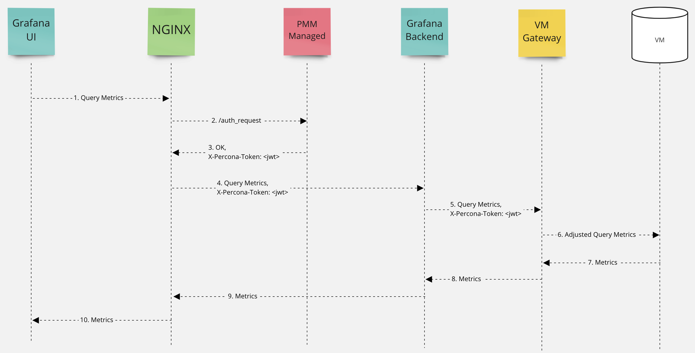

# Access Control

PMM Server supports managing access to individual metrics in VictoriaMetrics.  
[vmproxy](https://github.com/percona/pmm/tree/main/vmproxy) is placed in front of VictoriaMetrics and helps add extra filters to each query to filter access to metrics, such as `{env=~"prod|staging"}`.

Each Grafana user can be assigned multiple roles in PMM Server. A PMM Server role is different from Grafana roles (viewer, editor, admin).  
A PMM Server role defines extra filters to be applied to a query. This way access to metrics can be limited per role.

## Multiple roles for a user

Multiple roles are joined with a logical OR.  
For example:

| Role | Filter |
| - | - |
| QA | `env=QA` |
| Europe | `location=EU` |

If a user has both role QA and Europe assigned, it means the user has access to:
- All `QA` environments metrics and
- All `EU` location metrics

## Message flow diagram

