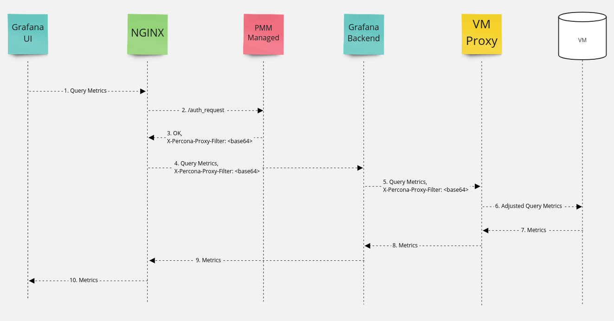

# Access Control

PMM Server supports managing access to individual metrics in VictoriaMetrics.  
[vmgateway](https://docs.victoriametrics.com/vmgateway.html) is placed in front of VictoriaMetrics and helps add extra filters to each query to filter access to metrics, such as `{env=~"prod|staging"}`.

Each Grafana user can be assigned a single role in PMM Server. A PMM Server role is different from  Grafana roles (viewer, editor, admin).  
A PMM Server role defines extra filters to be applied to a query. This way access to metrics can be limited per role.

## Message flow diagram

