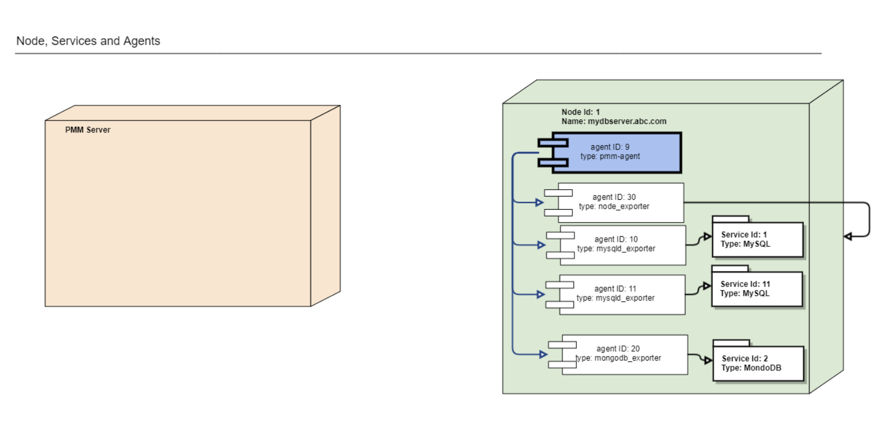
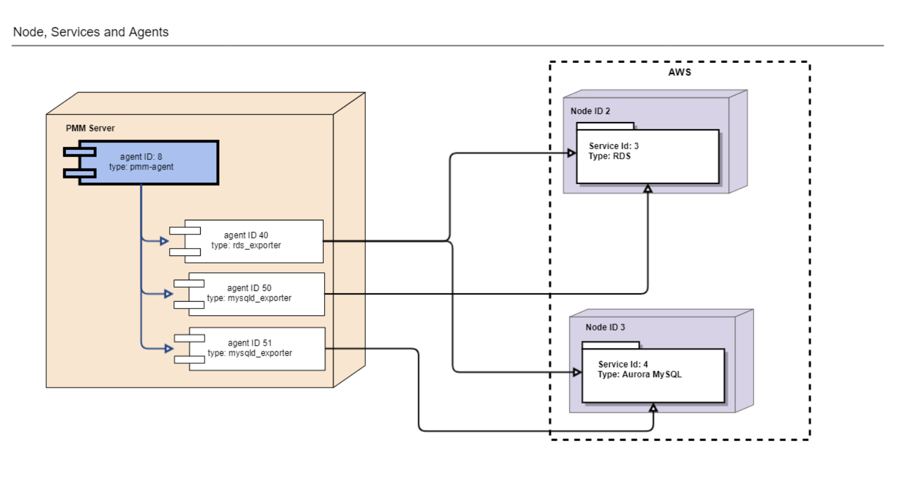
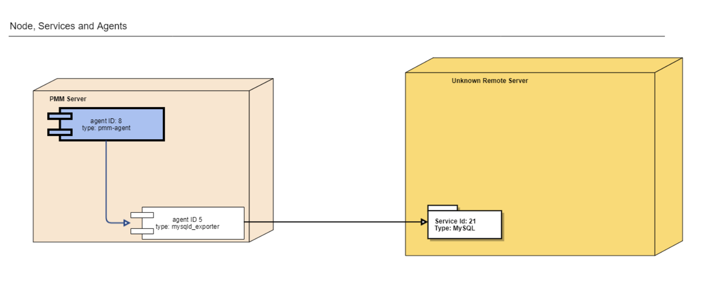
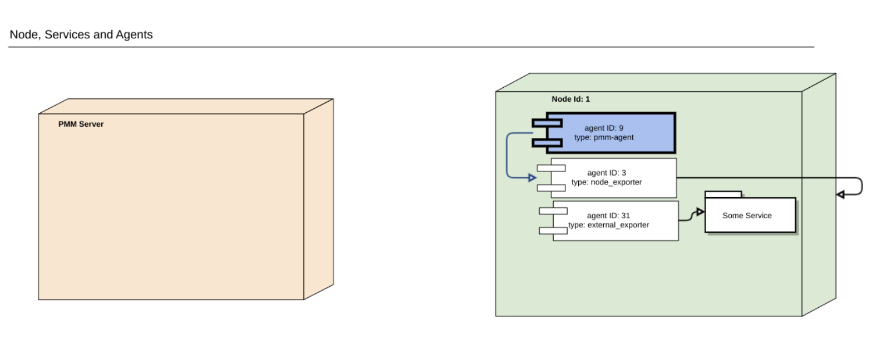
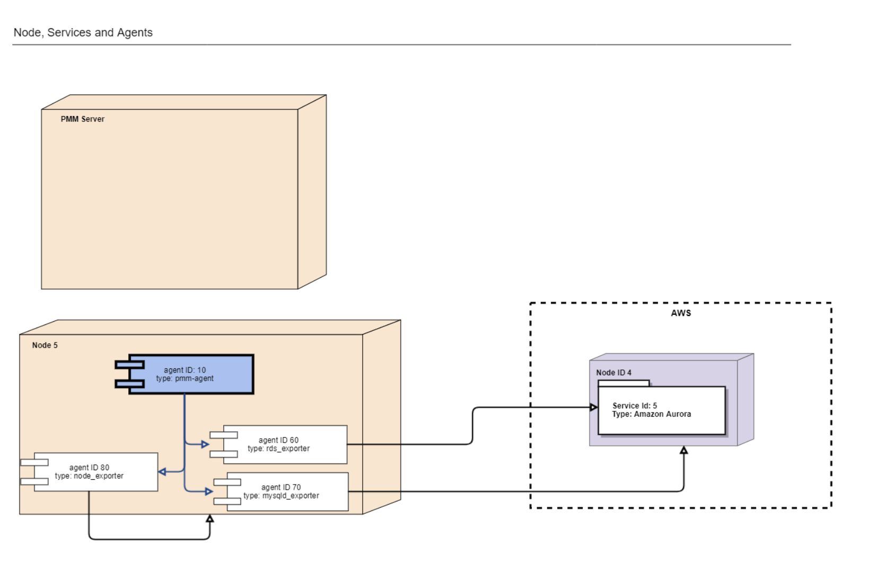

# Data Model

## Terms

- A Node represents a bare metal server, virtual machine or Docker container. It can also be of more specific type: one example is Amazon RDS Node. Node runs zero or more Services and Agents. It also has zero or more Agents providing insights for it.
- A Service represents something useful running on the Node: MySQL, MongoDB, PostgreSQL, etc. It runs on a single Node. It also has zero or more Agents providing insights for it.
- An Agent represents something that runs on the Node (via pmm-agent or not, see below), which is not useful itself but instead provides insights (metrics, query performance data, etc.) about Nodes and/or Services. Always runs on the single Node, provides insights for zero or more Services and Nodes.
  - pmm-agent can run other Agents but otherwise behaves like a normal Agent.
  - An External exporter is not run by pmm-agent but managed externally.
- Nodes, Services, and Agents have Types which define specific properties they have, and the specific logic they implement.

> Nodes and Services are external by nature – we do not manage them (create, delete), but merely maintain a list of them (add to inventory, remove from inventory) in pmm-managed. Most Agents, on the other hand, are started and stopped by pmm-agent. The only exception is the External exporter which is started externally, i.e. outside of the monitored node.

## Types and Properties

Property names are shared between API calls, database columns, and label values only for simplicity. In the future, we can lift that requirement.

### Node Types

**GenericNode** represents a bare metal server or virtual machine. Properties:

- `node_id` (required, label). Unique randomly generated instance identifier, can't be changed. Value format: "<uuid>".
- `node_name` (required, label). User-defined name, unique across all Nodes, can be changed.
- `machine_id` (optional, label). Linux machine-id. Can't be changed. Must be unique across all Generic Nodes if specified. Value format: "<machine-id>".
- `distro` (optional). Linux distribution (if any). Can be changed.
- `node_model` (optional). String containing an extra description for the node type, like "db.t2.medium".
- `region` (optional). Node's AWS region.
- `az` (optional) Node's AWS Availability Zone.
- `custom_labels` (optional) Custom map of labels (key/value pairs) provided by the user.

**ContainerNode** represents a Docker container. Properties:

- `node_id` (required, label). Unique randomly generated instance identifier, can't be changed. Value format: "<uuid>".
- `node_name` (required, label). User-defined name, unique across all Nodes, can be changed.
- `address` (required) DNS hostname or IP address.
- `machine_id` (optional, label). Linux machine-id of the Generic Node where this Container Node runs. If defined, Generic Node with that machine_id must exist. Can't be changed. Value format: "<machine-id>".
- `container_id` (optional, label). Container identifier. If specified, must be a unique Docker container identifier. Can't be changed. Value format: "/docker/<containerID>" (compatible with cAdvisor).
- `container_name` (optional, label). Container name. Can be changed.
- `node_model` (optional). String containing an extra description for the node type, like "db.t2.medium"
- `region` (optional). Node's AWS region.
- `az` (optional) Node's AWS Availability Zone.
- `custom_labels` (optional) Custom map of labels (key/value pairs) provided by the user.

**RemoteNode** represents generic remote Node. It's a node where we don't run pmm-agents. Only external exporters can run on Remote Nodes. Properties:

- `node_id` (required, label). Unique randomly generated instance identifier, can't be changed. Value format: "<uuid>".
- `node_name` (required, label). User-defined name, unique across all Nodes, can be changed.
- `address` (required). Node DNS hostname or IP address.
- `node_model` (optional). String containing an extra description for the node type, like "db.t2.medium"
- `region` (optional). Node's AWS region.
- `az` (optional) Node's AWS Availability Zone.
- `custom_labels` (optional) Custom map of labels (key/value pairs) provided by the user.

**RemoteAmazonRDSNode** represents a Remote Node for Amazon RDS. Agents can't run on Remote RDS Nodes. Properties:

- `node_id` (required, label). Unique randomly generated instance identifier, can't be changed. Value format: "<uuid>".
- `node_name` (required, label). User-defined name, unique across all Nodes, can be changed.
- `address` (required). Node DNS hostname or IP address.
- `node_model` (optional). String containing an extra description for the node type, like "db.t2.medium"
- `region` (required, label). Unique across all RemoteAmazonRDS Nodes in combination with instance. Can't be changed.
- `az` (optional) Node's AWS Availability Zone.
- `custom_labels` (optional) Custom map of labels (key/value pairs) provided by the user.

### Service Types

**MySQLService** represents a generic MySQL instance. Always runs on a single Generic, Container, or Remote Node. Properties:

- `service_id` (required, label). Unique randomly generated instance identifier, can't be changed. Value format: "<uuid>".
- `service_name` (required, label). Unique across all Services user-defined name, can be changed.
- `node_id` (required, label). Node identifier where this instance runs. Can be changed – service can be moved to another Node.
- `address` (optional). Access address (DNS name or IP). Required if unix_socket is absent. Can be changed.
- `port` (optional). Access port. Required if unix_socket is absent. Can be changed.
- `socket` (optional). Access Unix socket. Required if address and port are absent. Can be changed.
- `environment` (optional) Environment name.
- `cluster` (optional) Cluster name.
- `replication_set` (optional) Replication set (group) name.
- `custom_labels` (optional). key/value pairs of custom assigned labels.

**MongoDBService** represents a generic MongoDB instance. Properties:

- `service_id` (required, label). Unique randomly generated instance identifier, can't be changed. Value format: "<uuid>".
- `service_name` (required, label). Unique across all Services user-defined name, can be changed.
- `node_id` (required, label). Node identifier where this instance runs. Can be changed – service can be moved to another Node.
- `address` (required). Access address (DNS name or IP). Required if unix_socket is absent. Can be changed.
- `port` (required). Access port. Required if unix_socket is absent. Can be changed.
- `environment` (optional) Environment name.
- `cluster` (optional) Cluster name.
- `replication_set` (optional) Replication set (group) name.
- `custom_label`s (optional). key/value pairs of custom assigned labels.

**PostgreSQLService** represents a generic PostgreSQL instance. Properties:

- `service_id` (required, label). Unique randomly generated instance identifier, can't be changed. Value format: "<uuid>".
- `service_name` (required, label). Unique across all Services user-defined name, can be changed.
- `node_id` (required, label). Node identifier where this instance runs. Can be changed – service can be moved to another Node.
- `address` (required). Access address (DNS name or IP). Required if unix_socket is absent. Can be changed.
- `port` (required). Access port. Can be changed.
- `environment` (optional) Environment name.
- `cluster` (optional) Cluster name.
- `replication_set` (optional) Replication set (group) name.
- `custom_labels` (optional). key/value pairs of custom assigned labels.

**ProxySQLService** represents a generic ProxySQL instance. Properties:

- `service_id` (required, label). Unique randomly generated instance identifier, can't be changed. Value format: "<uuid>".
- `service_name` (required, label). Unique across all Services user-defined name, can be changed.
- `node_id` (required, label). Node identifier where this instance runs. Can be changed – service can be moved to another Node.
- `address` (required). Access address (DNS name or IP). Required if unix_socket is absent. Can be changed.
- `port` (required). Access port. Can be changed.
- `environment` (optional) Environment name.
- `cluster` (optional) Cluster name.
- `replication_set` (optional) Replication set (group) name.
- `custom_labels` (optional). key/value pairs of custom assigned labels.

**ExternalService** represents a generic External service instance. It's a service which are not supported by PMM as first class citizen. It can be any service. Properties:

- `service_id` (required, label). Unique randomly generated instance identifier, can't be changed. Value format: "<uuid>".
- `service_name` (required, label). Unique across all Services user-defined name.
- `node_id` (required, label). Node identifier where this instance runs.
- `environment` (optional) Environment name
- `cluster` (optional) Cluster name
- `replication_set` (optional) Replication set (group) name
- `custom_labels` (optional). key/value pairs of custom assigned labels.

### Agent Types

**PMMAgent** runs on Generic on Container Node. Properties:

- `agent_id` (required). Unique randomly generated instance identifier, can't be changed. Value format: "<uuid>".
- `runs_on_node_id` (required). Node identifier where this instance runs. Can't be changed.
- `custom_labels` (optional). key/value pairs of custom assigned labels.

**NodeExporter** runs on Generic on Container Node and exposes its metrics. Properties:

- `agent_id (required). Unique randomly generated instance identifier, can't be changed. Value format: "<uuid>".
- `pmm_agent_id. (required) PMM agent id controlling this exporter. Value format: "<uuid>".
- `AgentStatus. Current exporter status. See statuses list below.
- `custom_labels (optional). key/value pairs of custom assigned labels.
- `listen_port. Listen port for scraping metrics.

**MySQLdExporter** runs on Generic or Container Node and exposes MySQL and AmazonRDSMySQL Service metrics. Properties:

- `agent_id` (required). Unique randomly generated instance identifier, can't be changed. Value format: "<uuid>".
- `pmm_agent_id` (required). The pmm-agent identifier which runs this instance.
- `service_id` (required). Service identifier. Can't be changed.
- `username` (required). MySQL username for scraping metrics.
- `password` (optional). MySQL password for scraping metrics.
- `tls` Use TLS for database connections.
- `tls_skip_verify` Skip TLS certificate and hostname validation.
- `tablestats_group_table_limit` Tablestats group collectors will be disabled if there are more than that number of tables.
  - **0** means tablestats group collectors are always enabled (no limit).
  - **Negative** value means tablestats group collectors are always disabled.
- `custom_labels` (optional). key/value pairs of custom assigned labels.
- `skip_connection_check` Skip connection check.
- `status` (read only on responses) Current exporter status. See statuses list below.
- `listen_port` Listen port for scraping metrics.
- `tablestats_group_disabled` True if tablestats group collectors are currently disabled.

**MongoDBExporter** runs on Generic or Container Node and exposes MongoDB Service metrics.

- `agent_id` (required) Unique randomly generated instance identifier, can't be changed. Value format: "<uuid>".
- `pmm_agent_id` (required) The pmm-agent identifier which runs this instance
- `service_id` (required) Service identifier.
- `username` MongoDB authentication user
- `password` MongoDB authentication password.
- `tls` Use TLS for database connections.
- `tls_skip_verify` Skip TLS certificate and hostname validation.
- `custom_labels` key/value pairs of custom assigned labels
- `status` (read only on responses) Actual agent status. See statuses list below.
- `listen_port` Listen port for scraping metrics.

**PostgresExporter** runs on Generic or Container Node and exposes PostgreSQL Service metrics.

- `agent_id` (required) Unique randomly generated instance identifier, can't be changed. Value format: "<uuid>".
- `pmm_agent_id` (required) The pmm-agent identifier which runs this instance
- `service_id` (required) Service identifier.
- `username` MongoDB authentication user
- `password` MongoDB authentication password.
- `tls` Use TLS for database connections.
- `tls_skip_verify` Skip TLS certificate and hostname validation.
- `custom_labels` key/value pairs of custom assigned labels
- `status` (read only on responses) Actual agent status. See statuses list below.
- `listen_port` Listen port for scraping metrics.

**ProxySQLExporter** runs on Generic or Container Node and exposes ProxySQL Service metrics.

- `agent_id` (required) Unique randomly generated instance identifier, can't be changed. Value format: "<uuid>".
- `pmm_agent_id` (required) The pmm-agent identifier which runs this instance
- `service_id` (required) Service identifier.
- `username` MongoDB authentication user
- `password` MongoDB authentication password.
- `tls` Use TLS for database connections.
- `tls_skip_verify` Skip TLS certificate and hostname validation.
- `custom_labels` key/value pairs of custom assigned labels
- `status` (read only on responses) Actual agent status. See statuses list below.
- `listen_port` Listen port for scraping metrics.

**QANMySQLPerformanceSchemaAgent** runs within pmm-agent and sends MySQL Query Analytics data to the PMM Server.

- `agent_id` (required) Unique randomly generated instance identifier, can't be changed. Value format: "<uuid>".
- `pmm_agent_id` (required) The pmm-agent identifier which runs this instance
- `service_id` (required) Service identifier.
- `username` MongoDB authentication user
- `password` MongoDB authentication password.
- `tls` Use TLS for database connections.
- `tls_skip_verify` Skip TLS certificate and hostname validation.
- `query_examples_disabled` True if getting query examples from the DB are disabled.
- `custom_labels` key/value pairs of custom assigned labels
- `status` (read only on responses) Actual agent status. See statuses list below.

**QANMySQLSlowLogAgent** runs within pmm-agent and sends MySQL Query Analytics data to the PMM Server.

- `agent_id` (required) Unique randomly generated instance identifier, can't be changed. Value format: "<uuid>".
- `pmm_agent_id` (required) The pmm-agent identifier which runs this instance
- `service_id` (required) Service identifier.
- `username` MongoDB authentication user
- `password` MongoDB authentication password.
- `tls` Use TLS for database connections.
- `tls_skip_verify` Skip TLS certificate and hostname validation.
- `query_examples_disabled` True if getting query examples from the DB are disabled.
- `max_slow_log_file_size` Slowlog file is rotated at this size if > 0.
- `custom_labels` key/value pairs of custom assigned labels
- `status` (read only on responses) Actual agent status. See statuses list below.

**QANMongoDBProfilerAgent** runs within pmm-agent and sends MongoDB Query Analytics data to the PMM Server.

- `agent_id` (required) Unique randomly generated instance identifier, can't be changed. Value format: "<uuid>".
- `pmm_agent_id` (required) The pmm-agent identifier which runs this instance
- `service_id` (required) Service identifier.
- `username` MongoDB authentication user
- `password` MongoDB authentication password.
- `tls` Use TLS for database connections.
- `tls_skip_verify` Skip TLS certificate and hostname validation.
- `custom_labels` key/value pairs of custom assigned labels
- `status` (read only on responses) Actual agent status. See statuses list below.

**QANPostgreSQLPGStatementsAgent** runs within pmm-agent and sends PostgreSQL Query Analytics data to the PMM Server.

- `agent_id` (required) Unique randomly generated instance identifier, can't be changed. Value format: "<uuid>".
- `pmm_agent_id` (required) The pmm-agent identifier which runs this instance
- `service_id` (required) Service identifier.
- `username` MongoDB authentication user
- `password` MongoDB authentication password.
- `tls` Use TLS for database connections.
- `tls_skip_verify` Skip TLS certificate and hostname validation.
- `custom_labels` key/value pairs of custom assigned labels
- `status` (read only on responses) Actual agent status. See statuses list below.

**RDSExporter** runs on Generic or Container Node and exposes RemoteAmazonRDS Node and AmazonRDSMySQL Service metrics. Properties:

- `agent_id` (required). Unique randomly generated instance identifier, can't be changed. Value format: "<uuid>".
- `pmm_agent_id` (required) The pmm-agent identifier which runs this instance
- `node_id` (required). Node identifier where this instance runs. Can be changed – this Agent can be safely moved to the other Node.
- `aws_access_key` AWS Access Key.
- `aws_secret_key` AWS Secret Key.
- `custom_labels` key/value pairs of custom assigned labels
- `skip_connection_check` Do not verify the connection when the exporter starts.
- `disable_basic_metrics` Disable AWS basic metrics.
- `disable_enhanced_metrics` DIsable AWS enhanced metrics.

**ExternalExporter** runs on any Node type, including Remote Node. Properties:

- `agent_id` (required). Unique randomly generated instance identifier, can't be changed. Value format: "<uuid>".
- `runs_on_node_id` (required). Node identifier where this instance runs, if known to PMM.
- `service_id` (optional). Service identifier.
- `username` HTTP basic auth username for metrics collection.
- `password` HTTP basic auth password for metrics collection.
- `scheme` Scheme to generate URI to exporter metrics endpoints.
- `metrics_path` Path under which metrics are exposed, used to generate URI.
- `custom_labels` key/value pairs of custom assigned labels
- `listen_port` (required). Listen port for scraping metrics.

### Valid Agent Statuses

| Agent Status | Value |
| ------------ | ----- |
| STARTING     | 1     |
| RUNNING      | 2     |
| WAITING      | 3     |
| STOPPING     | 4     |
| DONE\*       | 5     |
| UNKNOWN\*\*  | 6     |

\*DONE is set when pmm-manged ↔ pmm-agent channel is closed → pmm-agent disconnected.

\*\*UNKNOWN is set for agents that has been just added, not started yet. Also we set all agents' status to UNKNOWN on pmm-managed startup. Then agents that are alive connect and set their real status. The rest stays as UNKNOWN.

As part of thetransition to UNKNOWN and DONE state we set listen_port to 0. It gets updated to the correct one once pmm-agent connects again.

## Relationships

| Node Type           | Service Type          |
| ------------------- | --------------------- |
| GenericNode         | MySQLService          |
| ContainerNode       | MySQLService          |
| RemoteNode          | MySQLService          |
| RemoteAmazonRDSNode | AmazonRDSMySQLService |

| Agent Type                     | Runs on Node Type          | Insights for Node Types                      | Insight for Service Types           |
| ------------------------------ | -------------------------- | -------------------------------------------- | ----------------------------------- |
| PMMAgent                       | GenericNode, ContainerNode |                                              | MySQLService, AmazonRDSMySQLService |
| NodeExporter                   | GenericNode, ContainerNode | GenericNode, ContainerNode (always the same) | -                                   |
| MySQLdExporter                 | GenericNode, ContainerNode | -                                            | MySQLService, AmazonRDSMySQLService |
| MongoDBExporter                | GenericNode, ContainerNode | GenericNode, ContainerNode                   |                                     |
| PostgresExporter               | GenericNode, ContainerNode | GenericNode, ContainerNode                   | PostgreSQLService                   |
| ProxySQLExporter               | GenericNode, ContainerNode | GenericNode, ContainerNode                   | MySQLService,PostgreSQLService      |
| QANMySQLPerfSchemaAgent        | GenericNode, ContainerNode |                                              | MySQLService                        |
| QANMySQLSlowlogAgent           | GenericNode, ContainerNode |                                              | MySQLService                        |
| QANMongoDBProfilerAgent        | GenericNode, ContainerNode |                                              | MongoDBService                      |
| QANPostgreSQLPgStatementsAgent | GenericNode, ContainerNode |                                              | PostgreSQLService                   |
| RDSExporter                    | GenericNode, ContainerNode | RemoteAmazonRDSNode                          | AmazonRDSMySQLService               |
| ExternalExporter               | Any                        | any                                          | any                                 |

## Mapping to Prometheus Metrics

> node_cpu{node_id="machine-id:d8f061de7eb36f626b0f3aae5bddfd7e", node_name="Some Node name"}

## Relationship Schemas. Examples

### Case 1. Typical installation with 3 Services (2 x MySQL and MongoDB) on one node

### Case 2. Monitoring AWS nodes/services

### Case 3. Remote node monitoring (Former "agentless")

### Case 4. External Exporter

### Case 5. Use Dedicated node to monitor AWS nodes/services

## APIs

List and Get APIs are straightforward: **List** returns all objects by type, **Get** returns a single object by type and ID.

> Note: Pagination is not planned yet, but can be added in the future.

Add, Change and Remove APIs work with groups of objects and contain validation logic. For example, there is no API to add a RDS Node. Instead, there is API to add RDS Node with related Service (Aurora MySQL, Aurora PostgreSQL or MySQL) and a set of Agents.

## Implementation details

### Data Storage

**PostgreSQL**. Nodes, Services, and Agents are stored in three separate tables. We use [Single Table Inheritance](https://www.martinfowler.com/eaaCatalog/singleTableInheritance.html) to store various types of Nodes/Services/Agents in the same table. There are two more tables for relationships between Agents and Nodes, and Agents and Services.

Whatever column should be defined as NOT NULL depends on whether unique index is required.
