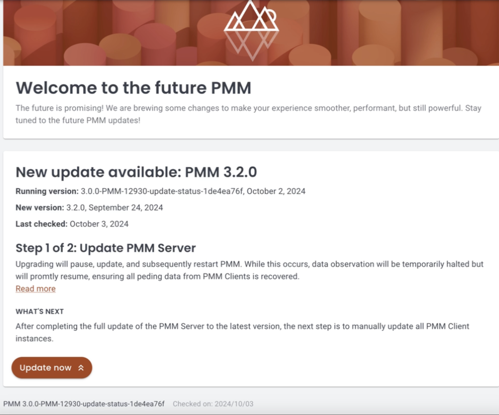
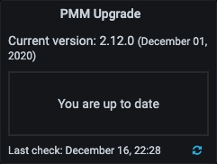

# Upgrade PMM v3 Server from the UI

PMM Server and Client components are installed and updated separately.

PMM v3 Server can run natively, as a Docker image, a virtual appliance, or an AWS cloud instance. While each environment has its own specific installation and update steps, the UI-based upgrade method is universal and recommended for most users.

## Upgrade process

The preferred and simplest way to update PMM v3 Server is via the **Updates** page:
{.power-number}

1. Go to **PMM Configuration > Updates** in your PMM web interface. Here you can check the current PMM Server version, the timestamp of the last update check and whether your instance is up-to-date.  

2. If an update is available, click the **Update now** button to install the latest version.

## Quick upgrade check

For a quick overview of your PMM v3 Server's update status, you can also check to the **Upgrade** panel on the **Home** page.

