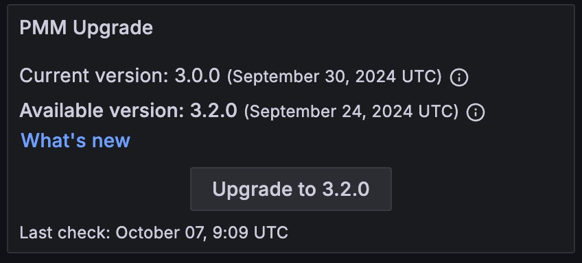

# Upgrade PMM server using the UI

!!! caution alert alert-warning "Caution"
    - While upgrading PMM to version 2.32.0, it fails. This issue has been resolved for PMM version 2.33.0. However, the issue persists on all the versions prior to 2.33.0. For solution, see the [troubleshooting](../troubleshoot/upgrade_issues.md) section.
    - PMM versions prior to 2.33.0 may not show the latest versions available with instances created from the AWS marketplace in specific environments, including AWS. For solution, see the [troubleshooting](../troubleshoot/upgrade_issues.md#pmm-server-not-showing-latest-versions-available-with-the-instances-created-from-aws) section.

Client and server components are installed and updated separately.

PMM Server can run natively, as a Docker image, a virtual appliance, or an AWS cloud instance. Each has its own installation and update steps.

The preferred and simplest way to update PMM Server is with the *PMM Upgrade* panel on the Home page.

The panel shows:

- the current server version and release date;
- whether the server is up to date;
- the last time a check was made for updates.

Click the refresh button to manually check for updates.

If one is available, click the update button to update to the version indicated.

!!! seealso alert alert-info "See also"
    [PMM Server Docker upgrade](upgrade_docker.md) and [Upgrade PMM agent](upgrade_agent.md)