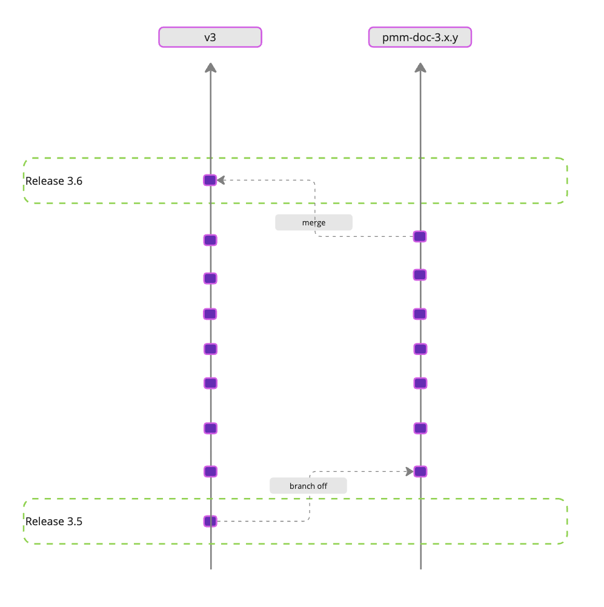

# PMM documentation Git workflow

This topic explains how we manage Percona Monitoring and Management (PMM) documentation across Git branches and product releases.

Our workflow ensures the [documentation site](https://docs.percona.com/percona-monitoring-and-management/) stays accurate, current, and aligned with each PMM release.

## Documentation branches

**v3** – Main production branch. This is the source for the live documentation site deployed via Render.com.

**pmm-doc-*** – Version-specific release branches (for example, `pmm-doc-3.2.0`, `pmm-doc-3.3.0`). Create these branches from `v3` to isolate documentation changes for specific releases. Once a release is finalized, merge the corresponding `pmm-doc-*` branch back into `v3`.

## Feature development workflow

The documentation team works alongside developers to ensure all updates are ready for release:

1. **Development branch**: Developers create a feature branch from `v3` (for example, `PMM-1234-feature`).

2. **Documentation branch**: The doc team creates a separate branch for the documentation updates related to the `PMM-1234-feature` PR. The doc PR is submitted to the corresponding `pmm-doc-*` release branch.

4. **Branch merges**: After review, the feature branches are merged into `v3` and documentation branches into the relevant `pmm-doc-*` branch.

This workflow keeps `v3` updated with completed code changes while keeping documentation for unreleased features separate until release.

## Documentation release workflow

We align documentation releases with PMM's product release cycle:

1. **Create doc release branch**: Create a `pmm-doc-*` branch from `v3` when preparing a new release (for example, `pmm-doc-3.2.0`).

2. **Submit doc PRs**: Target all doc PRs related to the release to the `pmm-doc-*` branch.

3. **Merge doc release branch**: When the release is complete, merge `pmm-doc-*` back into `v3`.

4. **Deploy content**: Render.com automatically deploys changes from `v3` to the [live documentation site](https://docs.percona.com/percona-monitoring-and-management/).

## Quick documentation fixes

For urgent or minor fixes:

1. Create a `quick-fix-*` documentation branch directly from `v3`.

2. Make the fix and merge directly back into `v3` for immediate deployment.

## Automation

**Release merges**: Automate merging of `pmm-doc-*` branches into `v3` during PMM releases.

**Continuous deployment**: Render.com automatically updates the live site whenever `v3` changes.

## Common issues

**Premature merges**: Merging development changes into `v3` too early causes unintended deployments. Make sure to alway6s use the appropriate `pmm-doc-*` branch for unreleased features.

## Documentation workflow diagram (v3.5+)
The diagram below shows how documentation moves through our Git workflow from initial development to production:

