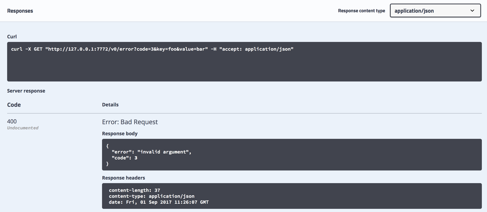

# Best practices

- Read more
  - [Tech stack](./tech_stack.md)
  - [Code style](#code-style)

- All gRPC errors are returned as status messages ([1](https://godoc.org/google.golang.org/grpc/status), [2](https://godoc.org/google.golang.org/genproto/googleapis/rpc/status)). They contain a [code](https://godoc.org/google.golang.org/grpc/codes), a developer-facing message, and, in some cases, details about that error. For example, for `InvalidArgument` code details contain invalid argument name and a type of failed validation. grpc-gateway converts gRPC errors to HTTP response with [some status code](https://github.com/grpc-ecosystem/grpc-gateway/blob/master/runtime/errors.go#L15) and JSON object in the body. The client should use code inside the body, not an HTTP status code.

  - Example:

    

- All incoming gRPC messages should be validated.
- Every long-running process (daemon) should have a special HTTP server (typically bound to 127.0.0.1) with the following debug endpoints:
  - `/debug/metrics` – Prometheus metrics with `promhttp.Handler()`. [go-grpc-prometheus](https://github.com/grpc-ecosystem/go-grpc-prometheus) with [EnableHandlingTimeHistogram](https://godoc.org/github.com/grpc-ecosystem/go-grpc-prometheus#EnableHandlingTimeHistogram) should be used to expose gRPC stats.
  - `/debug/vars` – default expvar values: command line and memory stats.
  - `/debug/requests` and `/debug/events` – [golang.org/x/net/trace](http://golang.org/x/net/trace) facility.
  - `/debug/pprof` – profiling endpoint from `net/http/pprof`.
- gRPC requests should be logged with [grpclog.SetLoggerV2](https://godoc.org/google.golang.org/grpc/grpclog#SetLoggerV2).
- All our software should handle termination signals: `SIGTERM`, `SIGINT`. The first time signal is received, the program should start graceful shutdown, typically by canceling parent context. It also should stop handling those termination signals, so the second time signal is received default handler is invoked, and the program is terminated.
- During program startup, most errors should be treated as fatal. If the program can't connect to an external resource, or can't bind to a port, or something like that, it should log an error and exit with non-zero status code. Process supervisor will restart it automatically.

  After startup, during normal program execution, most errors should be handled, logged and communicated to the user. For example, REST API call should return an appropriate HTTP status code with error details; full details should be logged. The caller can then handle the problem and retry the call. If an external resource becomes unavailable, the program should try to reconnect to it with proper backoff policy. The supervisor should still be used to handle crashes, panics, and bugs.

  - Issues detected at program initialization phase - such as a missing external dependency or a port, which is already in use - is either a configuration or an environment problem, or a programming bug. Neither can be fixed by simply continuing. Attempts to make startup "smart" (re-read configuration file, re-parse command-line flags, etc.) significantly complicate it. On the other hand, when an error happens during normal program execution, there is usually a proper way to communicate it back to the user so they can retry.
  - Supervisor-level dependencies between services are not strictly required (due to restarts everything will work eventually), but are nice to have: they help avoid scarry errors in logs.
  - The big exception is exporters: we should follow practices established by the Prometheus community and not fail if the system under monitoring is not available. Other startup errors, like a missing certificate file, should still terminate the exporter.

### Environment Variables
For consistency, environment variables should keep to the following suggestions:
- Use the `PMM_DEV_` prefix for any environment variable that is to be used for *only* development/test purposes i.e., 
variables that are not meant for end-users in any circumstance e.g., `PMM_DEV_PERCONA_PLATFORM_ADDRESS`
- Use the `PMM_TEST_` prefix for any variable that is not part of PMM GA functionality.
- Use the `PMM_` prefix for variables that is part of PMM GA functionality.
- Use a sub-prefix if a number of env vars relate to one component, e.g., `PMM_TEST_HA_`
- The use of PERCONA_ prefix is prohibited (exception: PMM_PERCONA_PLATFORM_URL, since it's part of a proper name, not a prefix)
## Code style

- `gofumpt -s ` (note the `-s`)
- `make format`
- Follow [Effective Go](https://golang.org/doc/effective_go.html) and [CodeReviewComments](https://github.com/golang/go/wiki/CodeReviewComments) wiki page.
- golangci-lint checks style too.
- Try to keep the code consistent
- Our own customizations:

  - Group imports like this (imports in each group are sorted alphabetically):

    ```go
    import (
        "stdlib/packages"

        "github.com/percona/something"
        "github.com/third-party/something"
        "golang.org/x/something"

        "imports/from/this/repo"
    )
    ```

- In addition, more specific variable naming conventions we try to follow are provided in this blogpost https://medium.com/@lynzt/variable-naming-conventions-in-go-89fe1ef17b0a:
  - Use [camelCase](https://en.wikipedia.org/wiki/Camel_case)
  - Acronyms should be all capitals, as in `ServeHTTP`
  - Single letter represents index: `i`, `j`, `k`
  - Short but descriptive names: `cust` not `customer`
  - Repeat letters to represent collection, slice, or array and use a single letter in loop (`var tt []*Thing`).
  - Avoid repeating the package name in the method name:
    - `log.Info() // good`
    - `log.LogInfo() // bad`
  - Don’t name methods like `getters` or `setters`
  - Follow the language rules when using compound nouns: `ApplicationServer` not `ApplicationsServer`. Exceptions to this rule may apply when the code is auto-generated.
  - Add `er` to Interface\* (Exception: when we use Interface as a template to generate mocks)
- If we need to make a set, it's better to use `map[string]struct{}` instead of `map[string]bool` or something else.
- In case we need enums, it's better to create a new custom type inherited from `string` or `iota`.
- To check if a string is empty or not, use `str != ""` instead of `len(str) != 0`
