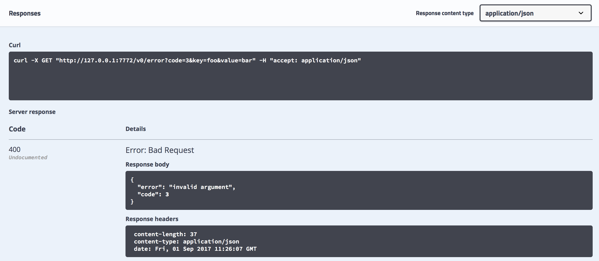

# Common tech, libraries and approaches

Currently, our development team has fewer people than components/repositories. It is important for us to have some shared libraries and tools between them to make our life easier. It's fine to use something else if there is a reason, but that reason/argument should be better than "let's try this new cool package" or "that's an overengineering". :) Also, if we decided to make a change in this list, it's better to change it in all components in a reasonable time. 

- [Common tech, libraries and approaches](#common-tech-libraries-and-approaches)
  - [Tech and libraries](#tech-and-libraries)
  - [Approaches](#approaches)
  - [Code style](#code-style)
  - [Open questions](#open-questions)

## Tech and libraries

* [protobuf v3](https://developers.google.com/protocol-buffers/) gives us [strongly-typed](https://developers.google.com/protocol-buffers/docs/proto3) serialization format with good [forward- and backward-compatibility](https://developers.google.com/protocol-buffers/docs/gotutorial#extending-a-protocol-buffer), [canonical mapping to and from JSON](https://developers.google.com/protocol-buffers/docs/proto3#json), and a large ecosystem of libraries and tools. We don't have to write code to work with it because there are code generators for a lot of languages.
* [gRPC](https://grpc.io/) extends protobuf with RPC mechanism. Both single requests/responses and bi-directional streams are supported. Error handling is built-in. Again, there are code generators for both client- and server-side code, so we don't have to write it by ourselves.
* [grpc-gateway](https://github.com/grpc-ecosystem/grpc-gateway) takes gRPC specification and generates code for HTTP JSON API server-side wrapper for it. It also generates [Swagger](https://swagger.io/) specification from protocol specification and annotations, with documentation from comments. In turn, it is used to generate client-side code for environments where gRPC is not yet supported natively (e.g. web browser). No manual writing of serialization and communication code, and documentation with examples and interactive tools – gRPC specification becomes the single source of truth.
* [logrus](https://github.com/sirupsen/logrus) or stdlib `log` package should be used for logging. Always log to unbuffered stderr, let process supervisor do the rest.
* [prometheus client](https://github.com/prometheus/client_golang) is used for exposing internal metrics of application and gRPC library.
* [testify](https://github.com/stretchr/testify) or stdlib `testing` package should be used for writing tests. Testify should be used only for `assert` and `require` packages – suites here have some problems with logging and parallel tests. Common setups and teardowns should be implemented with `testing` [subtests](https://golang.org/pkg/testing/#hdr-Subtests_and_Sub_benchmarks).
* [golangci-lint](https://github.com/golangci/golangci-lint) is used for static code checks.
* [gocov.io](http://gocov.io/) and [gocoverutil](https://github.com/AlekSi/gocoverutil) gather code coverage metrics.
* [Docker Compose](https://docs.docker.com/compose/) is used for a local development environment and in CI.
* [Kong](https://github.com/alecthomas/kong) for pmm CLI and [kingpin.v2](http://gopkg.in/alecthomas/kingpin.v2) for exporters and some other code. Use [Kong](https://github.com/alecthomas/kong) if you need some new CLI or need big changes in old `kingpin.v2` CLI.
* go modules for vendoring.

## Approaches

* All gRPC errors are returned as status messages ([1](https://godoc.org/google.golang.org/grpc/status), [2](https://godoc.org/google.golang.org/genproto/googleapis/rpc/status)). They contain a [code](https://godoc.org/google.golang.org/grpc/codes), a developer-facing message, and, in some cases, details about that error. For example, for `InvalidArgument` code details contain invalid argument name and a type of failed validation. grpc-gateway converts gRPC errors to HTTP response with [some status code](https://github.com/grpc-ecosystem/grpc-gateway/blob/master/runtime/errors.go#L15) and JSON object in the body. The client should use code inside the body, not an HTTP status code.
  * Example:

    

* All incoming gRPC messages should be validated.
* Every long-running process (daemon) should have a special HTTP server (typically bound to 127.0.0.1) with the following debug endpoints:
  * `/debug/metrics` – Prometheus metrics with `promhttp.Handler()`. [go-grpc-prometheus](https://github.com/grpc-ecosystem/go-grpc-prometheus) with [EnableHandlingTimeHistogram](https://godoc.org/github.com/grpc-ecosystem/go-grpc-prometheus#EnableHandlingTimeHistogram) should be used to expose gRPC stats.
  * `/debug/vars` – default expvar values: command line and memory stats.
  * `/debug/requests` and `/debug/events` – [golang.org/x/net/trace](http://golang.org/x/net/trace) facility.
  * `/debug/pprof` – profiling endpoint from `net/http/pprof`.
* gRPC requests should be logged with [grpclog.SetLoggerV2](https://godoc.org/google.golang.org/grpc/grpclog#SetLoggerV2).
* All out software should handle termination signals: `SIGTERM`, `SIGINT`. The first time signal is received, our program should start graceful shutdown, typically by canceling parent context. It also should stop handling those termination signals, so the second time signal is received default handler is invoked, and the program is terminated.
* During program startup, most errors should be treated as fatal. If the program can't connect to some external resource, or can't bind on a port, or something like that, it should log an error and exit with non-zero status code. Process supervisor will restart it automatically.

  After startup, during normal program execution, most errors should be handled, logged and communicated to the user. For example, REST API call should return appropriate HTTP status code with some error details; full details should be logged. The caller can then handle the problem and retry the call. If some external resource becomes unavailable, the program should try to reconnect to it with proper backoff policy. The supervisor should still be used to handle crashes, panics, and bugs.
  * The idea here that missing external dependency and already used port during startup is either a configuration or environment problem, or a programming bug. Neither can be fixed by simply continuing. Attempts to make startup "smart" (re-read configuration file, re-parse command-line flags, etc.) significantly complicate it. On the other hand, when an error happens during normal program execution, it typically has a proper way to communicate it to the user so they can retry.
  * Supervisor-level dependencies between services are not strictly required (due to restarts everything will work eventually) but are nice to have: they help to avoid scarry-looking errors in logs.
  * The big exception here is exporters: we should follow practices established by Prometheus team and not fail if the system under monitoring is not available. Other startup errors like missing certificate file should still terminate exporter.

## Code style

* `gofumpt -s ` (note the `-s`)
* `make format`
* Follow [Effective Go](https://golang.org/doc/effective_go.html) and [CodeReviewComments](https://github.com/golang/go/wiki/CodeReviewComments) wiki page.
* golangci-lint checks style too.
* Try to keep code consistent
* Our own customizations:
  * Group imports like this (imports in each group are sorted alphabetically):
    ```go
    import (
        "stdlib/packages"
        
        "github.com/percona/something"
        "github.com/third-party/something"
        "golang.org/x/something"
        
        "imports/from/this/repo"
    )
    ```
* In addition, the more specific variable naming conventions we try to follow are in this blogpost https://medium.com/@lynzt/variable-naming-conventions-in-go-89fe1ef17b0a:
  * Use [camelCase](https://en.wikipedia.org/wiki/Camel_case)
  * Acronyms should be all capitals, as in `ServeHTTP`
  * Single letter represents index: `i`, `j`, `k`
  * Short but descriptive names: `cust` not `customer`
  * repeat letters to represent collection, slice, or array and use single letter in loop (`var tt []*Thing`).
  * avoid repeating package name in method name (`log.Info() // good` ; `log.LogInfo() // bad`)
  * Don’t name like `getters` or `setters`
  * Add `er` to Interface* (with exceptions. For example when we use Interface as a template to generate mocks )
* If we need to make a set it's better to use `map[string]struct{}` instead of `map[string]bool` or something else.
* In case we need enums it's better to create a new custom type inherited from string or iota.
* To check if a string is empty or not, please use `str != ""` instead of `len(str) != 0` 

## Open questions

* Do we need something else for tracing?
* Do we need something for integration tests? Something like https://github.com/go-gophers/gophers?
* Configuration library? Files, flags, environment variables?
* Build system? Use promu so we don't have to copy&paste Makefiles everywhere? It also has nice cross-build, Docker build, license checking tools.
  * Go Releaser?
